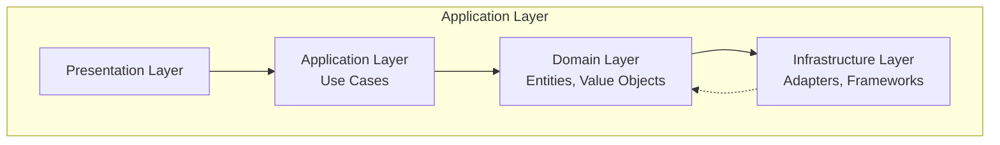
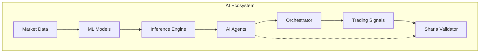
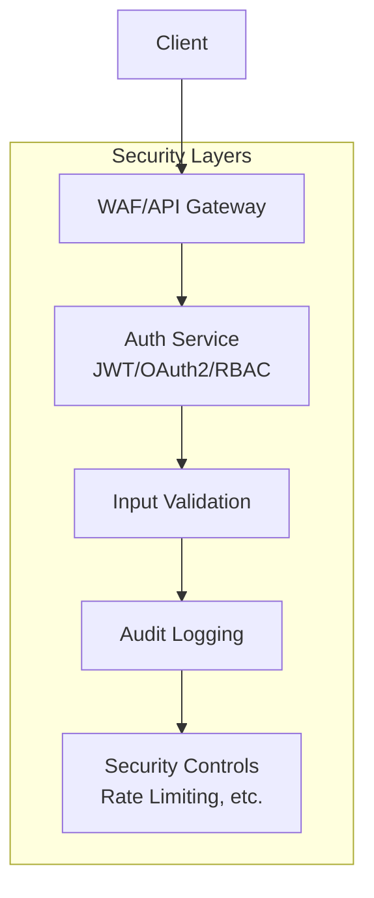
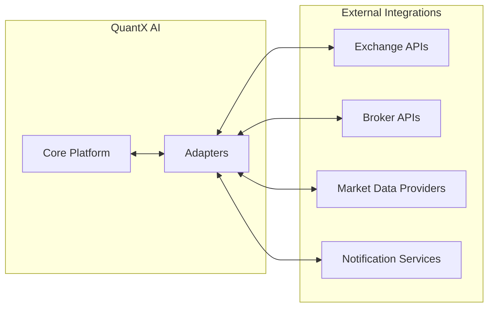
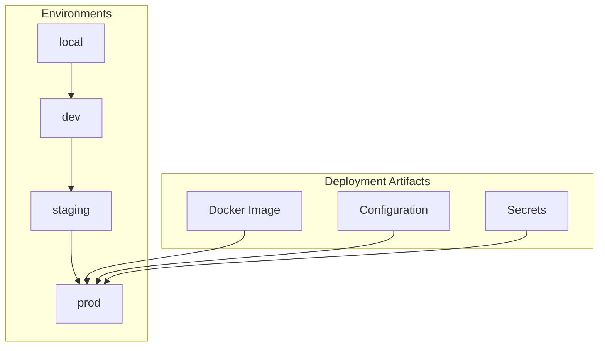
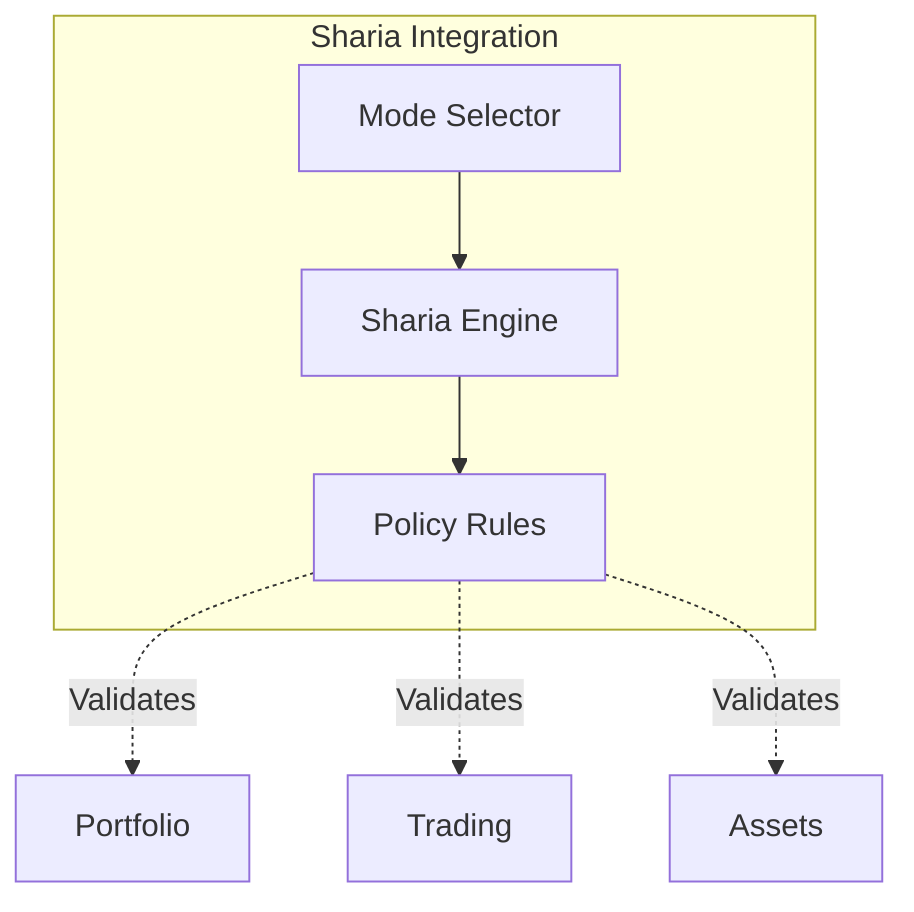
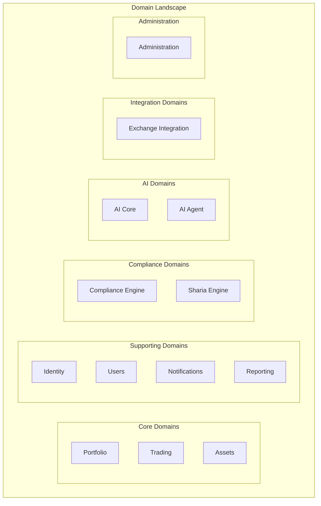
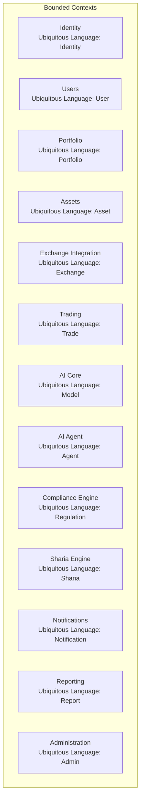
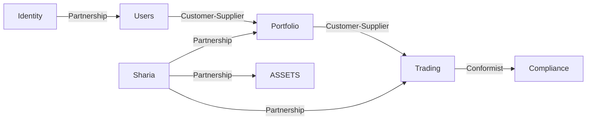
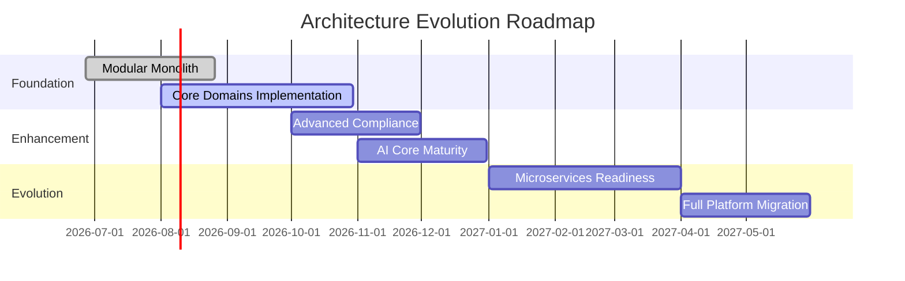

# Implementation Plan: Enterprise Architecture Vision

**Target Document:** `engineering/enterprise-architecture-vision.md`  
**Source of Authority:** Master Development Specification (QX-000) v1.0.1  
**Standards Alignment:** TOGAF ADM, ISO/IEC/IEEE 42010, ISO/IEC/IEEE 15288, DDD, Clean Architecture, C4 Model, OWASP, NIST Secure SDLC

---

## Section 1: Document Metadata

**Purpose:** Establish document identity, ownership, and governance status.

**Expected Content:**
- Document ID: QX-100 (following MDS naming convention)
- Title: Enterprise Architecture Vision
- Version: 1.0 (initial baseline)
- Status: BASELINE
- Owner: QuantX AI Enterprise Architecture Board
- Approvers: Enterprise Architecture Board, CTO, Security Architect, Compliance Officer
- Effective Date: 2026-06-27
- Review Cycle: Annual (per MDS Section 1)
- Distribution List: All engineering teams, architecture team, security team, compliance team, executive leadership

**Required Tables:** None

**Dependencies:** None

**Traceability:** MDS Section 1 (Document Lifecycle), MDS Glossary entries

**Review Checklist:**
- [ ] Document ID follows naming convention
- [ ] Owner and approvers match MDS requirements
- [ ] Status correctly set to BASELINE for initial document

**Quality Gates:**
- Document follows MDS Section 18 (Document Lifecycle) formatting

---

## Section 2: Executive Summary

**Purpose:** Provide high-level architectural direction and vision statement.

**Expected Content:**
- One-paragraph summary of the enterprise architecture vision
- Reference to Modular Monolith baseline with microservices evolution path
- Connection to business strategy through architectural strategy
- Mention of dual operating modes (Standard/Sharia)
- Reference to Clean Architecture and DDD foundations

**Required Tables:** None

**Required Diagrams:** Enterprise Context Diagram (D1 - reuse from MDS but expand for all 12 domains)

**Dependencies:** MDS Sections 3, 4

**Traceability:** MDS Section 4 (Vision Overview)

**Review Checklist:**
- [ ] Summary aligns with MDS Section 4
- [ ] Both operating modes mentioned
- [ ] No implementation details (technology-aware, not technology-specific)

**Quality Gates:**
- Summary length: 3-5 sentences maximum
- No technical implementation details

---

## Section 3: Architecture Vision

**Purpose:** Define the long-term architectural destination.

**Expected Content:**
- Vision statement for target architecture
- Modular Monolith as baseline with evolution triggers
- Clean Architecture with ports-and-adapters (hexagonal)
- Event-driven patterns where justified
- Plugin architecture support
- Configuration over hardcoding principle

**Required Tables:** None

**Required Diagrams:** 
- Target Architecture Diagram (high-level view showing bounded contexts)
- Technology Landscape (canonical technology mapping)

**Dependencies:** MDS Section 7 (Architecture Principles), Section 4 (Vision Overview)

**Traceability:** TOGAF ADM Phase A (Architecture Vision)

**Review Checklist:**
- [ ] Vision preserves Modular Monolith baseline
- [ ] Event-driven only where justified
- [ ] Plugin architecture referenced
- [ ] Configuration principle maintained

**Quality Gates:**
- Must reference MDS Section 7 principles
- Must be technology-aware but not implementation-specific

---

## Section 4: Business Drivers

**Purpose:** Identify forces motivating architectural decisions.

**Expected Content:**
- Business agility and time-to-market
- Regulatory and compliance requirements (including Sharia)
- Security and risk management
- Scalability and performance needs
- Operational efficiency and maintainability
- Cost optimization through shared capabilities

**Required Tables:** Business Driver Matrix

| Driver ID | Driver Description | Business Impact | Architectural Impact | Priority |
|-----------|------------------|-----------------|---------------------|----------|
| BD-001 | Regulatory compliance (Sharia/Standard) | Must support dual modes | Configurable policy layers | High |
| BD-002 | Rapid feature delivery | Time-to-market pressure | Modular architecture enabling independent development | High |
| BD-003 | Risk mitigation | Financial exposure reduction | Defense-in-depth security architecture | Critical |
| BD-004 | Scale for growing user base | Performance under load | Horizontal scaling strategy | Medium |
| BD-005 | Auditability and transparency | Regulatory compliance | Comprehensive observability design | High |

**Dependencies:** MDS Section 3 (Project Overview)

**Traceability:** TOGAF ADM Phase B (Business Architecture)

**Review Checklist:**
- [ ] All drivers linked to business outcomes
- [ ] Priorities assigned (Critical/High/Medium/Low)
- [ ] Matrix includes architectural impact column

**Quality Gates:**
- Minimum 5 business drivers identified
- Each driver has measurable impact

---

## Section 5: Business Goals

**Purpose:** Define measurable business objectives driving architecture.

**Expected Content:**
- Primary business outcomes (6-12 goals)
- Quantitative targets where possible
- Time horizon for achievement
- Mapping to business drivers

**Required Tables:** Business Goals Mapping

| Goal ID | Goal Statement | Metric | Target | Horizon | Related Drivers |
|---------|----------------|--------|--------|---------|-----------------|
| BG-001 | Achieve regulatory compliance for Islamic finance | Audit pass rate | 100% | Ongoing | BD-001 |
| BG-002 | Deliver new trading features within sprint cycles | Lead time | < 5 days | Quarterly | BD-002 |
| BG-003 | Maintain 99.9% platform availability | Uptime | 99.9% | Annual | BD-004 |
| BG-004 | Ensure zero security incidents in production | Incidents | 0 | Annual | BD-003 |

**Dependencies:** Section 4 (Business Drivers)

**Traceability:** TOGAF ADM Phase B

**Review Checklist:**
- [ ] Goals are SMART (Specific, Measurable, Achievable, Relevant, Time-bound)
- [ ] Each goal traces to one or more business drivers

---

## Section 6: Stakeholder Concerns

**Purpose:** Document stakeholder perspectives and quality expectations.

**Expected Content:**
- Stakeholder identification (Trader/Analyst, Compliance Officer, Administrator, Developer, Security Officer, Compliance Officer, Executive Leadership)
- Concerns per stakeholder group
- Concerns mapped to quality attributes

**Required Tables:** Stakeholder Matrix

| Stakeholder | Role | Concerns | Priority | Influence |
|-------------|------|----------|----------|-----------|
| Trader/Analyst | Primary user | Performance, reliability, feature access | High | High |
| Compliance Officer | Compliance oversight | Audit trails, regulatory adherence | Critical | High |
| Security Officer | Security oversight | Threat protection, vulnerability management | Critical | High |
| Administrator | System ops | Manageability, monitoring, deployment | High | Medium |
| Developer | Implementation | Development velocity, code quality, testability | High | Medium |
| Executive Leadership | Business outcomes | ROI, risk, compliance, scalability | High | High |

**Required Diagrams:** High-Level Capability Map

**Dependencies:** MDS Section 7

**Traceability:** ISO/IEC/IEEE 42010 Stakeholder Concerns

**Review Checklist:**
- [ ] All stakeholder groups from MDS covered
- [ ] Concerns mapped to quality attributes
- [ ] Priority and influence levels assigned

---

## Section 7: Architecture Principles

**Purpose:** Define foundational architectural rules.

**Expected Content:**
- Modular Monolith baseline
- Clean Architecture dependency rule
- API-first approach
- Event-driven only where justified
- Microservice evolution triggers
- Security by design
- Configuration over hardcoding

**Required Tables:** Architecture Principle Matrix

| Principle ID | Principle Statement | Rationale | Implications | Standards Reference |
|--------------|-------------------|-----------|--------------|---------------------|
| AP-001 | Modular Monolith baseline | Simplified deployment, shared data model | Single deployable, shared database | MDS Section 7 |
| AP-002 | Clean Architecture | Testability, maintainability | Hexagonal structure, inward dependencies | Clean Architecture |
| AP-003 | API-first | Contract stability, integration | All interactions through APIs | MDS Section 6 |
| AP-004 | Event-driven where justified | Decoupling, scalability | Event bus, eventual consistency | MDS Section 7 |
| AP-005 | Configuration over hardcoding | Regulatory agility | Externalized policies, feature flags | MDS Section 5 |
| AP-006 | Security by design | Defense in depth | Zero trust, least privilege | MDS Section 8, OWASP |
| AP-007 | Plugin architecture | Extensibility | Adapter patterns, sandboxing | MDS Section 22.1 |

**Dependencies:** MDS Sections 6, 7, 8, 22.1

**Traceability:** MDS Section 7, Clean Architecture, TOGAF ADM

**Review Checklist:**
- [ ] All MDS Section 7 principles included
- [ ] Each principle has clear rationale
- [ ] Implications are actionable

---

## Section 8: Enterprise Design Principles

**Purpose:** Define overarching design guidelines for the enterprise.

**Expected Content:**
- Separation of Concerns
- Single Responsibility Principle
- Explicit Interfaces
- Immutable Infrastructure
- Observability by Default
- Defensive Programming
- Zero Trust
- Least Privilege

**Required Tables:** None

**Dependencies:** MDS Section 6

**Traceability:** MDS Section 6 (Engineering Principles)

**Review Checklist:**
- [ ] All MDS Section 6 principles included
- [ ] Principles are technology-agnostic

---

## Section 9: Architecture Constraints

**Purpose:** Document non-negotiable architectural boundaries.

**Expected Content:**
- Technology constraints (NestJS/TypeScript stack)
- Regulatory constraints (compliance frameworks)
- Security constraints (Zero Trust, security standards)
- Operational constraints (monitoring, audit requirements)
- Plugin constraints (governance requirements)

**Required Tables:** Architecture Constraints Table

| Constraint ID | Category | Constraint Description | Justification | Enforcement |
|---------------|----------|------------------------|---------------|-------------|
| AC-001 | Technology | NestJS LTS/Stable only | Maintainability | Architecture Review |
| AC-002 | Security | Zero Trust must be implemented | Threat protection | Security Review |
| AC-003 | Compliance | All business rules configurable | Regulatory agility | Compliance Review |
| AC-004 | Integration | Hexagonal adapters for externals | Future flexibility | Code Review |
| AC-005 | Deployment | Immutable deployments only | Reliability | CI/CD Pipeline |

**Dependencies:** MDS Sections 8, 22.1, 36

**Traceability:** MDS Section 36 (Technology Baseline)

**Review Checklist:**
- [ ] All MDS constraints reflected
- [ ] Each constraint has clear justification

---

## Section 10: Quality Attribute Scenarios

**Purpose:** Define measurable quality attribute requirements.

**Expected Content:**
- Performance scenarios
- Security scenarios
- Availability scenarios
- Scalability scenarios
- Maintainability scenarios
- Compliance scenarios
- Observability scenarios

**Required Tables:** Quality Attribute Matrix

| QA ID | Attribute | Scenario | Priority | Measurement |
|-------|-----------|----------|----------|-------------|
| QA-001 | Performance | Request processing under peak load | High | 95th percentile < 500ms |
| QA-002 | Security | Authentication and authorization | Critical | 100% requests validated |
| QA-003 | Availability | System uptime over time period | High | 99.9% monthly |
| QA-004 | Scalability | Horizontal scale triggers | Medium | Scale within 2 minutes |
| QA-005 | Maintainability | Code coverage threshold | High | 80% unit, 60% integration |
| QA-006 | Compliance | Audit trail completeness | Critical | 100% traceability |
| QA-007 | Observability | Log and metric coverage | High | All services instrumented |

**Required Diagrams:** None

**Dependencies:** MDS Section 26 (Quality Gates), Section 30 (Compliance Strategy)

**Traceability:** ISO/IEC/IEEE 42010 Quality Attributes

**Review Checklist:**
- [ ] All quality attributes measurable
- [ ] Scenarios follow FORMAT (Given-When-Then style)
- [ ] Priorities aligned with business drivers

---

## Section 11: Target Business Architecture

**Purpose:** Translate business strategy into architectural capabilities.

**Expected Content:**
- Business capability model for all 12 domains
- Business-to-architecture mapping
- Ubiquitous language per domain
- Business process alignment

**Required Tables:** Domain Matrix (from MDS Section 3 extended)

| Domain | Capabilities | Primary Users | Compliance Scope |
|--------|--------------|---------------|----------------|
| Identity | Authentication, Authorization, Identity Management | All users | Security |
| Users | User Management, Profiles, Preferences | All users | General |
| Portfolio | Portfolio Management, Allocation, Rebalancing | Traders | High |
| Assets | Asset Management, Classification, Valuation | All users | High |
| Exchange Integration | Market Data, Order Execution, Connectivity | Traders | High |
| Trading | Order Management, Execution, Strategies | Traders | High |
| AI Core | Model Training, Inference, Analytics | Traders, Analysts | Medium |
| AI Agent | Agent Orchestration, Task Management | Developers | Medium |
| Compliance Engine | Regulatory Monitoring, Reporting | Compliance Officers | Critical |
| Sharia Engine | Sharia Compliance, Validation | All users (Sharia mode) | Critical |
| Notifications | Alerts, Messaging, Channels | All users | Medium |
| Reporting | Analytics, Dashboards, Export | All users | High |

**Required Diagrams:** Business-to-Architecture Mapping

**Dependencies:** MDS Section 3

**Traceability:** TOGAF ADM Phase B, BABOK

**Review Checklist:**
- [ ] All 12 primary domains included
- [ ] Capabilities clearly defined per domain
- [ ] Compliance scope correctly assigned

---

## Section 12: Target Application Architecture

**Purpose:** Define application layer structure and patterns.

**Expected Content:**
- Modular monolith structure
- Bounded contexts per domain
- Layer organization (Entities, Use Cases, Interface Adapters, Frameworks)
- Communication patterns
- Plugin integration points

**Required Tables:** None

**Required Diagrams:** Layered Architecture Diagram

**Dependencies:** MDS Section 7 (Architecture Principles), Clean Architecture

**Traceability:** Clean Architecture, C4 Model (Component level)

**Review Checklist:**
- [ ] Layer dependency rule followed (inward only)
- [ ] Bounded contexts isolated
- [ ] Plugin points clearly marked

---

## Section 13: Target Data Architecture

**Purpose:** Define data management strategy and patterns.

**Expected Content:**
- Data ownership per bounded context
- Data consistency patterns
- Audit trail requirements
- Data privacy considerations
- Sharia-compliant data handling

**Required Tables:** None

**Required Diagrams:** Data Flow Diagram (simple, showing bounded context boundaries)

**Dependencies:** MDS Section 30 (Compliance), Section 33 (Configuration Management)

**Traceability:** DDD (bounded context data isolation)

**Review Checklist:**
- [ ] Each domain owns its data
- [ ] Audit requirements specified
- [ ] Sharia considerations included

---

## Section 14: Target Technology Architecture

**Purpose:** Define technology landscape and standards.

**Expected Content:**
- Canonical technology stack (from MDS Section 36)
- Runtime environment
- Infrastructure components
- Integration technologies
- Monitoring and observability stack

**Required Tables:** Technology Matrix

| Component | Technology | Version/Status | Rationale | Alternatives Considered |
|-----------|------------|---------------|-----------|-----------------------|
| Backend | NestJS | Current LTS | Stability, ecosystem | Fastify, Express |
| ORM | Prisma | Latest Stable | Type safety, migrations | TypeORM, Sequelize |
| Frontend | Next.js | Current Stable | SSR, developer experience | Nuxt.js, Remix |
| Database | PostgreSQL | Supported Stable | ACID, JSONB support | MySQL, MongoDB |
| Cache | Redis | Supported Stable | Performance, pub/sub | Memcached |
| Queue | BullMQ | Latest | Redis integration | RabbitMQ |
| Auth | JWT + OAuth2 + RBAC | Standard | Industry standard | Session-based |
| Container | Docker | Latest Stable | Portability | Podman |
| Proxy | Nginx | Latest Stable | Performance | Traefik |
| CI/CD | GitHub Actions | Latest | Integration | Jenkins |
| Metrics | Prometheus | Latest Stable | Pull model | InfluxDB |
| Logs | Loki | Latest Stable | Integration with Grafana | ELK |
| Visualization | Grafana | Latest Stable | Dashboard flexibility | Kibana |

**Required Diagrams:** Technology Landscape

**Dependencies:** MDS Section 36

**Traceability:** MDS Section 36 (Technology Baseline)

**Review Checklist:**
- [ ] All MDS Section 36 technologies included
- [ ] LTS/Stable status verified
- [ ] Rationale and alternatives documented

---

## Section 15: Target AI Architecture

**Purpose:** Define AI/ML ecosystem integration.

**Expected Content:**
- AI/ML model lifecycle
- AI Core bounded context structure
- AI Agent orchestration patterns
- Model governance and validation
- Integration with Sharia Engine
- Explainability requirements

**Required Tables:** None

**Required Diagrams:** AI Ecosystem Diagram

**Dependencies:** MDS Section 9 (AI Governance Principles)

**Traceability:** MDS Section 9

**Review Checklist:**
- [ ] AI governance principles applied
- [ ] Sharia validation integration shown
- [ ] Lifecycle considerations included

---

## Section 16: Security Architecture Vision

**Purpose:** Define security as foundational architecture concern.

**Expected Content:**
- Defense in depth strategy
- Zero Trust implementation
- Authentication and authorization patterns
- Input validation requirements
- Audit logging as feature
- Secure default configurations

**Required Tables:** None

**Required Diagrams:** Security Architecture Diagram

**Dependencies:** MDS Section 8 (Security Principles)

**Traceability:** MDS Section 8, OWASP ASVS, NIST Secure SDLC

**Review Checklist:**
- [ ] All MDS Section 8 principles included
- [ ] Layers clearly defined
- [ ] Audit logging emphasized

---

## Section 17: Integration Architecture Vision

**Purpose:** Define integration patterns and strategies.

**Expected Content:**
- Hexagonal/adapter pattern for externals
- Exchange integration approach
- Broker integration approach
- Event-driven integration where justified
- API governance

**Required Tables:** None

**Required Diagrams:** Integration Landscape

**Dependencies:** MDS Section 7

**Traceability:** TOGAF ADM Phase C, Hexagonal Architecture

**Review Checklist:**
- [ ] Adapter pattern used for all external integrations
- [ ] Exchange/broker patterns differentiated
- [ ] Event-driven only where justified

---

## Section 18: Deployment Vision

**Purpose:** Define deployment architecture and patterns.

**Expected Content:**
- Containerized deployment model
- Environment tiers (local, dev, staging, prod)
- Immutable infrastructure
- Configuration management
- Feature flags for toggling

**Required Tables:** None

**Required Diagrams:** Deployment Overview

**Dependencies:** MDS Sections 15, 31, 33

**Traceability:** MDS Section 15 (Branching), Section 31 (Configuration)

**Review Checklist:**
- [ ] Environment progression correct
- [ ] Immutable deployment pattern
- [ ] Separation of config/secrets

---

## Section 19: Scalability Strategy

**Purpose:** Define scaling approach within modular monolith.

**Expected Content:**
- Horizontal scaling triggers
- Shared-nothing scaling patterns
- Database scaling considerations
- Caching strategy
- Load balancing approach

**Required Tables:** None

**Required Diagrams:** None

**Dependencies:** MDS Section 7 (evolution triggers)

**Traceability:** Quality Attribute Scenarios (Scalability)

**Review Checklist:**
- [ ] Scaling triggers defined
- [ ] Monolith constraints acknowledged
- [ ] Cache strategy included

---

## Section 20: Availability Strategy

**Purpose:** Define availability and resilience patterns.

**Expected Content:**
- High availability targets
- Failover mechanisms
- Graceful degradation
- Health checks and monitoring
- Backup recovery integration

**Required Tables:** None

**Required Diagrams:** None

**Dependencies:** MDS Section 26 (Quality Gates), Section 29 (Risk Management)

**Traceability:** Quality Attribute Scenarios (Availability)

**Review Checklist:**
- [ ] Availability targets set (99.9%)
- [ ] Failover strategies defined
- [ ] Health checks included

---

## Section 21: Disaster Recovery Vision

**Purpose:** Define recovery capabilities and procedures.

**Expected Content:**
- Recovery time objectives
- Recovery point objectives
- Backup strategy
- Restore procedures
- Testing requirements

**Required Tables:** None

**Required Diagrams:** None

**Dependencies:** MDS Section 29 (Risk Management)

**Traceability:** ISO/IEC/IEEE 15288 (Reliability), Risk Management

**Review Checklist:**
- [ ] RTO/RPO defined
- [ ] Backup strategy documented
- [ ] Testing cadence specified

---

## Section 22: Observability Vision

**Purpose:** Define monitoring, logging, and tracing strategy.

**Expected Content:**
- Structured logging requirements
- Metrics collection and retention
- Distributed tracing
- Alerting patterns
- Dashboard strategy

**Required Tables:** None

**Required Diagrams:** None

**Dependencies:** MDS Section 6 (Observability by Default)

**Traceability:** MDS Section 6, Clean Architecture

**Review Checklist:**
- [ ] All services instrumented
- [ ] Structured logging format
- [ ] Alerting thresholds defined

---

## Section 23: Compliance Vision

**Purpose:** Define compliance as architectural quality attribute.

**Expected Content:**
- Regulatory compliance frameworks (AAOIFI, IFSB, GDPR, SOC 2)
- Sharia compliance integration
- Audit trail requirements
- Evidence collection automation
- Compliance testing in CI/CD

**Required Tables:** None

**Required Diagrams:** None

**Dependencies:** MDS Section 30 (Compliance Strategy)

**Traceability:** MDS Section 30, ISO/IEC/IEEE 15288

**Review Checklist:**
- [ ] All compliance frameworks listed
- [ ] Sharia integration emphasized
- [ ] Audit trail automated

---

## Section 24: Sharia Architecture Vision

**Purpose:** Define Sharia compliance as first-class architectural concern.

**Expected Content:**
- Policy-driven Sharia rules
- Configurable compliance layer
- Sharia Engine bounded context
- Mode switching mechanisms
- Audit requirements for Sharia decisions

**Required Tables:** None

**Required Diagrams:** Sharia Compliance Flow (integration with domains)

**Dependencies:** MDS Section 30, Section 5 (Business Rules)

**Traceability:** MDS Section 30, AAOIFI, IFSB standards

**Review Checklist:**
- [ ] Policy layer approach
- [ ] Mode switching capability
- [ ] Integration with core domains

---

## Section 25: Domain Strategy

**Purpose:** Define organization of business capabilities into domains.

**Expected Content:**
- Domain decomposition rationale
- Shared kernel patterns
- Partnership/Customer/Supplier relationships between domains
- Domain maturity model application

**Required Tables:** Domain Matrix (same as Section 11)

**Required Diagrams:** Domain Landscape

**Dependencies:** MDS Section 3, Section 7

**Traceability:** DDD (Bounded Context), TOGAF ADM Phase B

**Review Checklist:**
- [ ] Core/supporting/compliance distinction
- [ ] Integration domains separated
- [ ] Administration domain included

---

## Section 26: Bounded Context Strategy

**Purpose:** Define DDD bounded context implementation approach.

**Expected Content:**
- Context mapping patterns
- Ubiquitous language per context
- Context integration patterns
- Testing boundaries

**Required Tables:** None

**Required Diagrams:** Bounded Context Map

**Dependencies:** MDS Section 7, Clean Architecture

**Traceability:** DDD (Bounded Context), Clean Architecture

**Review Checklist:**
- [ ] Each domain has bounded context
- [ ] Ubiquitous languages defined
- [ ] Mapping patterns identified

---

## Section 27: Context Map Overview

**Purpose:** Define relationships between bounded contexts.

**Expected Content:**
- Context mapping patterns (Partnership, Customer-Supplier, Conformist, etc.)
- Integration points between contexts
- Data flow between contexts
- Anti-corruption layer usage

**Required Tables:** None

**Required Diagrams:** Context Map (relationship diagram)

**Dependencies:** Section 26

**Traceability:** DDD (Context Mapping)

**Review Checklist:**
- [ ] All pattern types understood
- [ ] Relationships clearly mapped
- [ ] Integration mechanisms specified

---

## Section 28: Architecture Governance

**Purpose:** Define governance structure and processes.

**Expected Content:**
- Enterprise Architecture Board responsibilities
- Decision categories requiring approval
- Review cadence and process
- Governance artifacts and deliverables

**Required Tables:** None

**Required Diagrams:** None

**Dependencies:** MDS Section 21 (Architecture Governance)

**Traceability:** MDS Section 21, TOGAF ADM

**Review Checklist:**
- [ ] Board composition matches MDS
- [ ] Decision categories listed
- [ ] Review cadence specified

---

## Section 29: Architecture Decision Process

**Purpose:** Define how architectural decisions are made.

**Expected Content:**
- ADR process (per MDS Section 20)
- RFC triggers requiring formal process
- Decision authority matrix
- Review and approval workflow

**Required Tables:** None

**Required Diagrams:** None

**Dependencies:** MDS Section 20, Section 20.1

**Traceability:** MDS Section 20

**Review Checklist:**
- [ ] ADR process referenced
- [ ] RFC triggers listed
- [ ] Authority matrix defined

---

## Section 30: Technical Risk Assessment

**Purpose:** Identify and assess technical risks.

**Expected Content:**
- Technical risk categories
- Risk probability and impact
- Mitigation strategies
- Risk ownership

**Required Tables:** Risk Matrix

| Risk ID | Risk | Category | Probability | Impact | Mitigation | Owner |
|---------|------|----------|-------------|--------|------------|-------|
| TR-001 | Monolith scaling limitations | Scalability | Medium | High | Evolution trigger monitoring | Platform Team |
| TR-002 | Security vulnerability exploitation | Security | Low | Critical | Security review, penetration testing | Security Team |
| TR-003 | Compliance audit failure | Compliance | Low | Critical | Automated compliance testing | Compliance Team |
| TR-004 | Sharia rule misimplementation | Compliance | Medium | High | External validation, testing | Sharia Team |
| TR-005 | Exchange API changes | Integration | Medium | Medium | Adapter isolation, versioning | Integration Team |
| TR-006 | Data breach | Security | Low | Critical | Encryption, access controls | Security Team |

**Required Diagrams:** None

**Dependencies:** MDS Section 29 (Risk Management Strategy)

**Traceability:** MDS Section 29

**Review Checklist:**
- [ ] Risks categorized
- [ ] Probability/impact rated
- [ ] Mitigations specified

---

## Section 31: Architecture Roadmap

**Purpose:** Define long-term architectural evolution timeline.

**Expected Content:**
- Short-term milestones (0-6 months)
- Medium-term goals (6-18 months)
- Long-term vision (18+ months)
- Evolution triggers
- Success metrics

**Required Tables:** None

**Required Diagrams:** Evolution Roadmap

**Dependencies:** MDS Section 7 (evolution triggers)

**Traceability:** TOGAF ADM Phase E, F (Implementation Governance)

**Review Checklist:**
- [ ] Timeline realistic
- [ ] Evolution triggers referenced
- [ ] Success metrics aligned to quality attributes

---

## Section 32: Transition Architecture

**Purpose:** Define intermediate steps to target architecture.

**Expected Content:**
- Current state baseline
- Target state definition
- Transition phases
- Migration patterns
- Rollback strategies

**Required Tables:** None

**Required Diagrams:** None

**Dependencies:** Section 31

**Traceability:** TOGAF ADM Phase E (Opportunities & Solutions)

**Review Checklist:**
- [ ] Current state described
- [ ] Target state clear
- [ ] Transition phases defined
- [ ] Rollback strategies included

---

## Section 33: Architecture Success Metrics

**Purpose:** Define measurable outcomes for architecture success.

**Expected Content:**
- Technical metrics
- Business metrics
- Compliance metrics
- Operational metrics

**Required Tables:** Success Metrics Table

| Metric ID | Metric | Target | Measurement Frequency | Threshold |
|-----------|--------|--------|------------------------|-----------|
| SM-001 | Deployment Frequency | Weekly | Daily | Must not decrease |
| SM-002 | Mean Time to Recovery | < 30 min | Per incident | SLA |
| SM-003 | Security Incidents | 0 | Monthly | Critical threshold |
| SM-004 | Compliance Audit Score | > 95% | Quarterly | Blocking threshold |
| SM-005 | Code Coverage | 80% unit | Per merge | Quality gate |
| SM-006 | API Response Time | < 500ms | Continuous | SLA |
| SM-007 | System Uptime | 99.9% | Monthly | SLA |

**Dependencies:** Sections 10, 26

**Traceability:** ISO/IEC/IEEE 42010 (Evaluation), MDS Section 26

**Review Checklist:**
- [ ] All metrics measurable
- [ ] Targets defined
- [ ] Threshold levels set

---

## Section 34: Future Evolution Strategy

**Purpose:** Define long-term architectural evolution beyond initial roadmap.

**Expected Content:**
- Microservices evolution criteria
- Technology refresh cycles
- Platform extensibility patterns
- Deprecation and obsolescence handling

**Required Tables:** None

**Required Diagrams:** None

**Dependencies:** MDS Section 7 (evolution triggers), Section 22.1 (Plugin Governance)

**Traceability:** MDS Section 7, TOGAF ADM

**Review Checklist:**
- [ ] Evolution criteria clear
- [ ] Refresh cycles defined
- [ ] Extensibility patterns documented

---

## Section 35: References

**Purpose:** List source documents and standards.

**Expected Content:**
- Link to MDS (QX-000)
- TOGAF ADM reference
- ISO/IEC/IEEE standards
- OWASP standards
- Compliance frameworks
- All sections referenced must be listed

**Required Tables:** None

**Required Diagrams:** None

**Dependencies:** All sections

**Traceability:** MDS Section 41 (References)

**Review Checklist:**
- [ ] All standards referenced
- [ ] MDS linked
- [ ] Compliance frameworks listed

---

## Section 36: Revision History

**Purpose:** Track document changes over time.

**Expected Content:** Table following MDS Section 42 format

**Required Tables:** Revision History (required)

| Version | Date | Author | Change Summary | Affected Sections | Approval Status |
|---------|------|--------|----------------|-------------------|-----------------|
| 1.0 | 2026-06-27 | QuantX AI Enterprise Architecture Board | Initial baseline | All | BASELINE |

**Required Diagrams:** None

**Dependencies:** None

**Traceability:** MDS Section 42 (Revision History)

---

# Standards Mapping

| Standard | Influence on Document | Specific Sections |
|----------|----------------------|-------------------|
| TOGAF ADM | Architecture phases and governance | 3, 4, 11, 28, 31, 32 |
| ISO/IEC/IEEE 42010 | Stakeholder concerns, quality attributes | 6, 10 |
| ISO/IEC/IEEE 15288 | Risk management, lifecycle | 19, 21, 29 |
| DDD | Bounded contexts, domain strategy | 11, 12, 25, 26, 27 |
| Clean Architecture | Layer isolation, dependency rules | 12, 17 |
| C4 Model | Visualization framework | All diagram sections |
| OWASP | Security design | 16 |
| NIST Secure SDLC | Development security | 16 |

# Quality Gates for Final Document

- [ ] All 36 required sections present
- [ ] All required tables implemented
- [ ] All required diagrams implemented in Mermaid
- [ ] No implementation details (technology-aware, not specific)
- [ ] All MDS constraints preserved
- [ ] All standards properly referenced
- [ ] Stakeholder concerns mapped to quality attributes
- [ ] Evolution triggers clearly defined
- [ ] Sharia compliance treated as first-class concern

# Acceptance Criteria Verification

✓ Every section has clearly defined purpose  
✓ Every diagram is specified with Mermaid syntax  
✓ Every table is specified  
✓ Dependencies are documented  
✓ Traceability is defined to MDS and standards  
✓ Architecture standards are mapped  
✓ No implementation details included  
✓ The plan is deterministic and executable  
✓ The plan fully complies with MDS