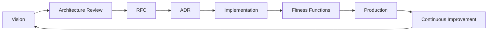

# Final Enterprise Architecture Refinement Plan

## Target Document
`engineering/enterprise-architecture-vision.md` (currently 1116 lines, Version 1.1)

## Objective
Add enterprise-grade architecture maturity elements without changing existing numbering, formatting, or content.

---

## Implementation Tasks

### Task 1: Architecture Principle Traceability Matrix
Add after Section 7 (after Cross-Cutting Architectural Concerns, before the section ends):

| Architecture Principle | Business Driver | Business Goal | Quality Attribute | Related Architecture Decision | Related MDS Section |
|---------------------|-----------------|---------------|-----------------|--------------------------|-------------------|
| Modular Monolith baseline | BD-002, BD-004 | BG-002, BG-003 | Maintainability, Scalability | Single deployable per context | MDS Section 7 |
| Clean Architecture | BD-003 | BG-004 | Maintainability, Security | Hexagonal isolation | MDS Section 7 |
| API-first approach | BD-001, BD-002 | BG-002 | Maintainability | Contract versioning | MDS Section 6 |
| Event-driven where justified | BD-002, BD-004 | BG-002 | Scalability | Async communication patterns | MDS Section 7 |
| Configuration over hardcoding | BD-001 | BG-001 | Compliance, Security | Externalized policies | MDS Section 5 |
| Security by design | BD-003 | BG-004 | Security | Defense-in-depth | MDS Section 8 |
| Plugin architecture | BD-002 | BG-002 | Extensibility | Adapter patterns | MDS Section 22.1 |

### Task 2: Capability Ownership Matrix
Add after Section 6 (after High-Level Capability Map):

| Capability | Business Owner | Technical Owner | Primary Bounded Context | Criticality | Operational KPI |
|------------|--------------|---------------|----------------------|-------------|---------------|
| Portfolio | Trading Desk Head | Portfolio Team Lead | Portfolio | Critical | MTM accuracy, performance |
| Orders | Trading Desk Head | Trading Team Lead | Trading | Critical | Order fill rate |
| Execution | Trading Desk Head | Trading Team Lead | Trading | Critical | Slippage, latency |
| Settlement | Operations Lead | Operations Team Lead | Trading | High | Settlement time |
| Prediction | Quant Research Lead | AI Team Lead | AI Core | Medium | Model accuracy |
| Agent | Quant Research Lead | AI Team Lead | AI Agent | Medium | Task completion rate |
| Analytics | Business Intelligence Lead | Analytics Team Lead | AI Core, Reporting | High | Report generation time |
| Explainability | Risk Officer | AI Team Lead | AI Core | Medium | Model interpretability score |
| Regulatory | Compliance Officer | Compliance Team Lead | Compliance Engine | Critical | Audit score |
| Sharia | Sharia Committee | Sharia Team Lead | Sharia Engine | Critical | Sharia compliance rate |
| Audit | Compliance Officer | Security Team Lead | Compliance Engine | High | Audit completeness |
| Risk | Risk Officer | Risk Team Lead | Compliance Engine | Critical | Risk coverage |
| Identity | Security Officer | Platform Lead | Identity | Critical | Auth success rate |
| Administration | System Admin | Platform Lead | Administration | High | Uptime |
| Notifications | Product Manager | Platform Lead | Notifications | Medium | Delivery rate |
| Reporting | Business Intelligence Lead | Analytics Team Lead | Reporting | High | Report availability |

### Task 3: ISO/IEC/IEEE 42010 Viewpoint Mapping
Add as new subsection after Section 29 (Architecture Governance):

| Viewpoint | Purpose | Stakeholders | Primary Sections | Related Diagrams |
|-----------|---------|--------------|----------------|----------------|
| Business View | Capture business capabilities and value streams | Executive Leadership, Business Owners | 4, 5, 6 | Capability Map |
| Capability View | Decompose business capabilities into services | Product Owners, Architects | 6, 11 | Capability Map |
| Application View | Define application components and interfaces | Developers, Tech Leads | 12, 26 | Layered Architecture |
| Information View | Data architecture and information flows | Data Engineers, Architects | 13, 25 | Data Flow Diagram |
| Technology View | Infrastructure and technology stack | Platform Team, DevSecOps | 14 | Technology Landscape |
| Security View | Security controls and assurance | Security Officer, Compliance | 16, 23, 24 | Security Architecture |
| Deployment View | Release and deployment patterns | Platform Team, Administrators | 18 | Deployment Vision |
| Operations View | Monitoring and operational concerns | Administrators, Security | 22 | Observability Vision |

### Task 4: ADR Classification
Add after Section 30 (Architecture Decision Process):

| Decision Type | Approval Authority | Documentation Required | Review Frequency | Escalation |
|---------------|------------------|---------------------|-----------------|------------|
| Strategic | Architecture Review Board | ADR + Business Case | Quarterly | Enterprise Architect → CTO |
| Tactical | Solution Architect | ADR + Impact Analysis | Monthly | Tech Lead → Solution Architect |
| Operational | Tech Lead | ADR + Implementation Guide | Monthly | Developer → Tech Lead |
| Emergency | Security Officer or Compliance Officer | ADR + Post-mortem | Within 72 hours | Architecture Review Board |

### Task 5: Architecture Governance KPIs
Add subsection with measurable governance metrics:

| Governance Metric | Definition | Target | Measurement |
|-----------------|----------|--------|-------------|
| ADR Lead Time | Time from decision to ADR completion | < 5 business days | Days per ADR |
| RFC Lead Time | Time from proposal to decision | < 10 business days | Days per RFC |
| Architecture Review SLA | Review completion time | < 48 hours | Hours per review |
| Architecture Compliance Score | % of components passing fitness functions | > 95% | Percentage |
| Fitness Function Pass Rate | CI pipeline pass rate for architecture checks | > 98% | Percentage |
| Architecture Exception Count | Unapproved architecture deviations | 0 | Count |
| Technical Debt Trend | Month-over-month debt change | Decreasing | % change |
| Policy Violation Count | Security/compliance violations | 0 | Count |

### Task 6: Compliance Coverage Matrix
Create matrix for compliance frameworks:

| Compliance Framework | Architecture Layer | Affected Components | Evidence Source | Validation Method | Review Frequency |
|-------------------|------------------|-------------------|---------------|-----------------|-----------------|
| ISO27001 | All | Identity, Security, Data | Audit logs, policies | External audit | Annual |
| SOC2 | Security, Observability | All services, Auth, Audit | Compliance reports | Third-party audit | Annual |
| OWASP ASVS | Security, API | All endpoints, Auth | Security scan reports | Penetration testing | Quarterly |
| GDPR | Data, Privacy | Users, Assets, Reporting | Data processing records | Privacy impact assessment | Quarterly |
| AAOIFI | Compliance, Business | Sharia Engine, Trading | Sharia audit trail | External Sharia audit | Annual |
| IFSB | Compliance, Reporting | Compliance Engine, Reporting | Compliance reports | External audit | Annual |
| NIST SSDF | Development, Security | All repositories | Security pipeline logs | Internal review | Continuous |

### Task 7: Repository Governance Expansion
Expand Section 36 (Repository Strategy) with subsections:
- Repository Ownership: Architecture Team maintains core, Domain Teams own domain folders
- CODEOWNERS Governance: CODEOWNERS file governs merge permissions
- Directory Ownership: Each /apps and /packages subdirectory owned by designated team
- Package Ownership: @quantx/shared maintained centrally
- Naming Standards: Follow MDS Section 13 (kebab-case for directories, PascalCase for classes)
- Branch Protection: trunk protected, feature branches auto-expire
- Release Strategy: semantic versioning with automated changelog
- Documentation Lifecycle: docs/adr for decisions, /docs for user docs

### Task 8: Technical Debt Governance Expansion
Expand Section 38 (Technical Debt Governance):
- Debt Register: Central tracking of all identified debt
- Debt Categories: Code, Architecture, Security, Compliance (per Task 4)
- Maximum Age: Critical 72h, High 30d, Medium 90d
- Approval Workflow: Architect → Security Officer (security debt) or Compliance Officer (compliance debt)
- Escalation: Unresolved debt escalates to Architecture Review Board
- Reporting Cadence: Weekly team reports, monthly aggregated
- Architecture Debt Board: Monthly review of architecture-type debt
- Acceptance Criteria: Remediation plan required for debt > 30 days

### Task 9: Architecture Lifecycle Diagram
Add Mermaid diagram after Section 36:



### Task 10: Enterprise Architecture Maturity Statement
Add at document end (before Standards Mapping):

**Current Architecture Maturity:** Operational maturity with defined governance processes, automated fitness functions, and compliance integration. Architecture decisions are documented and reviewed.

**Target Architecture Maturity:** Optimized maturity with predictive debt management, automated compliance validation, and continuous architecture feedback loops.

**Assessment Cadence:** Architecture maturity assessed quarterly through governance KPIs and compliance reviews.

**Continuous Improvement Model:** Plan-Do-Check-Act cycle applied to architecture governance, with monthly retrospectives and quarterly strategic reviews.

**Architecture Governance Philosophy:** Zero Technical Debt, Security by Design, Compliance by Default. Every component must pass fitness functions before production deployment.

### Task 11: Technology Governance Table
Add after Section 14 Technology Architecture table:

| Technology Category | Selection Criteria | Approval Authority | Replacement Trigger | Lifecycle Status | Supported Alternatives |
|-------------------|------------------|------------------|-------------------|----------------|---------------------|
| Backend Framework | LTS support, ecosystem, TypeScript compatibility | Architecture Team | Security vulnerability, EOL | Current Stable | Fastify, Express |
| Database | ACID, JSONB, extension ecosystem | Architecture Team | Performance degradation, vendor lock-in | Supported Stable | MySQL, CockroachDB |
| Cache | Performance, pub/sub, clustering | Platform Team | Memory issues, security | Supported Stable | Memcached, Hazelcast |
| Queue | Reliability, retry, monitoring | Platform Team | Throughput issues, cost | Latest Stable | RabbitMQ, Sidekiq |
| Auth Provider | OIDC, JWT, RBAC support | Security Team | Vulnerability, compliance | Standard | Auth0, Keycloak |

### Task 12: DDD Strategic Classification
Add after Section 25 (Domain Strategy) listing:

| Domain | Classification | Strategic Importance | Reason |
|--------|--------------|-------------------|--------|
| Portfolio | Core Domain | Critical | Primary business value delivery |
| Trading | Core Domain | Critical | Revenue generation |
| Assets | Core Domain | High | Trading foundation |
| Identity | Supporting Domain | Critical | Security infrastructure |
| Users | Supporting Domain | Medium | User experience |
| Notifications | Generic Domain | Medium | Third-party integration |
| Reporting | Supporting Domain | High | Business intelligence |
| Exchange Integration | Supporting Domain | High | External dependency |
| AI Core | Core Domain | Medium | Competitive advantage |
| AI Agent | Supporting Domain | Medium | Orchestration |
| Compliance Engine | Core Domain | Critical | Regulatory requirement |
| Sharia Engine | Core Domain | Critical | Sharia compliance |

### Task 13: Context Mapping Improvements
Add after Section 27 (Context Map Overview):

Explicit Pattern Documentation:
- **Identity → Users:** Published Language - Identity publishes standard user schema
- **Users → Portfolio:** Customer-Supplier - Portfolio consumes user data
- **Portfolio → Trading:** Customer-Supplier - Trading consumes portfolio state
- **Trading → Compliance:** Conformist - Trading adapts to compliance requirements
- **Sharia → Portfolio:** Partnership - Shared Sharia validation rules
- **Sharia → Trading:** Partnership - Shared Sharia validation rules
- **Sharia → Assets:** Partnership - Asset classification rules

### Task 14: Enterprise Architecture Glossary
Add after Section 41 (Revision History):

| Term | Definition |
|------|------------|
| Architecture Vision | High-level direction defining target architecture state |
| Architecture Principle | Foundational rule guiding architectural decisions |
| Capability | Discrete business function delivered by the platform |
| Bounded Context | DDD pattern isolating domain model and ubiquitous language |
| Domain | Business area represented as cohesive bounded context |
| ADR | Architecture Decision Record documenting significant choices |
| RFC | Request for Comments proposing architectural changes |
| Fitness Function | Automated test validating architectural conformance |
| Architecture Runway | Accumulated technical capacity for future features |
| Policy Engine | Configurable rules engine for compliance/business logic |
| Modular Monolith | Single deployable with modular internal architecture |
| Hexagonal Architecture | Ports-and-adapters pattern isolating core logic |
| Plugin Architecture | Extensible framework supporting external integrations |

### Task 15: Final Consistency Audit
Verify:
- [ ] Section numbering sequentially 1-41
- [ ] No duplicate tables or content
- [ ] All MDS references valid (Sections 7, 36, 5, 6, 8, 22, 13, 26, 20, 30, 33, 31)
- [ ] All Mermaid syntax valid (` ```mermaid` blocks)
- [ ] All table formatting consistent (pipe-aligned)
- [ ] Terminology consistent (Modular Monolith, Clean Architecture, etc.)

---

## Validation
After implementation, the document will have:
- 41 numbered sections (unchanged)
- 14 new governance matrices
- 1 new Mermaid diagram (Architecture Lifecycle)
- 1 glossary with 13 terms
- Updated Technology Landscape to capability-oriented narrative
- All existing content preserved