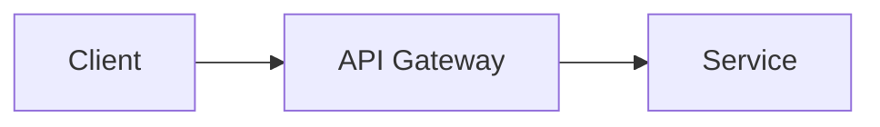
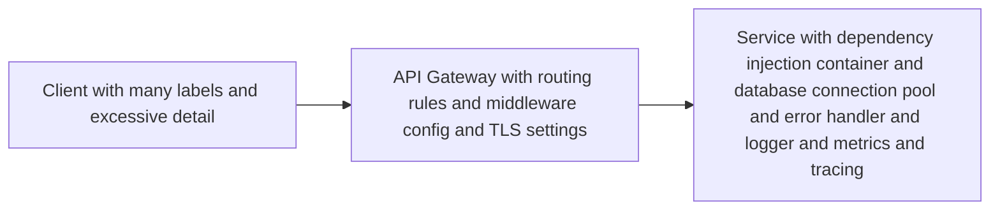

# QuantX AI - Documentation Rules

## 1. Purpose

This document defines the mandatory writing rules, naming conventions, Markdown standards, and formatting requirements for all QuantX AI documentation.

## 2. Writing Rules

### 2.1 General Principles

- **Clarity First**: Write for the intended audience. Avoid jargon unless defined in the glossary.
- **Active Voice**: Use active voice for instructions and descriptions.
- **Present Tense**: Use present tense for system descriptions.
- **Parallel Structure**: Use parallel structure in lists and tables.
- **One Idea per Section**: Each section should address a single concept.

### 2.2 Language Standards

- **Tone**: Professional, technical, neutral.
- **Person**: Third person for system descriptions; second person for instructions.
- **Terminology**: Use the canonical terms defined in `01_PROJECT_OVERVIEW.md`. Never invent synonyms.
- **Capitalization**: Title case for document titles and section headings. Sentence case for body text.

## 3. File Naming Conventions

### 3.1 Required Format

```
{NN}_{DESCRIPTIVE_TITLE}.md
```

| Part | Rule | Example |
|------|------|---------|
| `{NN}` | Two-digit zero-padded sequence number | `01`, `42` |
| `{DESCRIPTIVE_TITLE}` | UPPER_SNAKE_CASE, descriptive but concise | `SYSTEM_ARCHITECTURE` |

### 3.2 Prohibited Names

- Do not use spaces in filenames.
- Do not use special characters (`#`, `%`, `&`, `()`, etc.) in filenames.
- Do not abbreviate titles (e.g., `ARCH` instead of `ARCHITECTURE`).

## 4. Markdown Standards

### 4.1 Heading Hierarchy

| Level | Syntax | Usage |
|-------|--------|-------|
| 1 | `#` | Document title — one per file only |
| 2 | `##` | Major sections |
| 3 | `###` | Subsections |
| 4 | `####` | Minor subsections (avoid if possible) |
| 5+ | `#####` | Discouraged. Restructure instead. |

### 4.2 Rules

- Every document must have exactly one `#` heading.
- Heading text must use Title Case.
- Do not skip heading levels.
- Do not use inline `#` symbols in code examples without escaping.

### 4.3 Text Formatting

| Element | Markdown | Example |
|---------|----------|---------|
| Inline code | `` `code` `` | `services/` |
| Bold | `**text**` | **Required** |
| Italic | `*text*` | *Optional* |
| Links | `[text](url)` | `[Overview](01_PROJECT_OVERVIEW.md)` |
| External links | `[text](https://...){target="_blank"}` | `[FastAPI](https://fastapi.tiangolo.com){target="_blank"}` |

## 5. Table Standards

- Every table must have a header row and alignment row.
- Column headers use Title Case.
- Column widths should be balanced where possible.
- Use `|` for column separators. Do not use `:` or other characters.
- Wrap long cell content or reformat as a list if it exceeds 80 characters.

### Good Table

```markdown
| Component | Technology | Version | Rationale |
|-----------|------------|---------|-----------|
| Language | Python | 3.11+ | ML ecosystem |
| Framework | FastAPI | 0.110+ | Async-first |
```

### Bad Table

```markdown
|Comp|Tech|Ver|Reason|
|---|---|---|---|
|Python|3.11+|ML|
```

## 6. Diagram Standards

- Use Mermaid syntax when embedding diagrams in Markdown.
- Use code fences with the `mermaid` language tag.
- If Mermaid is unavailable, provide a plain ASCII/Unicode alternative inside a `mermaid` block comment.
- Keep diagrams focused. One concept per diagram.

### Good Diagram

```markdown

```

### Bad Diagram

```markdown

```

## 7. Code Block Standards

- Always specify a language tag: ` ```python `, ` ```json `, ` ```sql `, ` ```yaml `.
- Use 4-space indentation (tabs are not permitted in code blocks).
- Keep code blocks focused on a single concept.
- Document non-obvious code with inline comments.
- Example code must be executable or syntactically valid.

### Good Code Block

```python
def calculate_position_size(
    balance: Decimal,
    risk_pct: Decimal,
    entry_price: Decimal,
    stop_loss: Decimal,
) -> Decimal:
    risk_amount = balance * risk_pct
    price_diff = abs(entry_price - stop_loss)
    return risk_amount / price_diff
```

### Bad Code Block

```python
def calc(b, r, e, s):
    return b*r/abs(e-s)
```

## 8. Cross-Reference Standards

- All internal links must use relative paths: `[Target](12_API_CONTRACTS.md)`.
- All internal links must use the actual filename, not directory paths.
- Each major document must include a `## Related Documents` section at the end.
- Broken links are not permitted. Verify before commit.

### Reference Block Template

```markdown
## Related Documents

- [Related Doc Title](XX_FILENAME.md)
- [Another Doc](YY_FILENAME.md)
```

## 9. Metadata Standards

Every documentation file must begin with YAML front matter containing:

```yaml
---
status: Approved
owner: <Team or Individual>
version: 1.0.0
last_updated: YYYY-MM-DD
source_of_truth: docs/XX_FILENAME.md
depends_on: []
related_documents: []
---
```

| Field | Rule |
|-------|------|
| `status` | Draft \| In Review \| Approved \| Deprecated \| Archived |
| `owner` | Team name or individual responsible for accuracy |
| `version` | Semantic version (MAJOR.MINOR.PATCH) |
| `last_updated` | ISO 8601 date (YYYY-MM-DD) |
| `source_of_truth` | Path to authoritative document for this topic |
| `depends_on` | List of documents this doc depends on |
| `related_documents` | List of directly related documents |

## 10. Admonition Standards

Use standard Markdown admonitions or custom callouts:

```markdown
> **Note**
> Additional context or guidance.

> **Warning**
> Important cautionary information.

> **Important**
> Critical information that must not be overlooked.
```

## 11. Glossary Standards

- Define every domain-specific term in the `01_PROJECT_OVERVIEW.md` glossary.
- Do not introduce new terms without updating the glossary.
- Use the exact term casing and spelling from the glossary.

## 12. Empty Section Policy

- Do not leave empty sections or placeholder text.
- If a section is not yet ready, mark it with `> **Note** Section under development.` and assign an owner/date.
- Remove sections that are permanently not applicable.

## 13. Duplication Policy

- If the same information appears in multiple documents, designate one document as the **Source of Truth**.
- Other documents must link to the source of truth instead of repeating the content.
- Summaries and references are permitted; full duplication is not.

## 14. Examples

### Good Documentation

```markdown
---
status: Approved
owner: Architecture Team
version: 1.0.0
last_updated: 2026-06-24
source_of_truth: docs/02_SYSTEM_ARCHITECTURE.md
depends_on: ["docs/01_PROJECT_OVERVIEW.md"]
related_documents: ["docs/07_SERVICE_BOUNDARIES.md"]
---

# QuantX AI - System Architecture

## Architectural Overview

[Consistent, structured content...]

## Related Documents

- [Service Boundaries](07_SERVICE_BOUNDARIES.md)
```

### Bad Documentation

```markdown
# QuantX AI - System Architecture

## Architectural Overview

missing metadata at top

## Related Documents

- no links provided
```

---
*Document Version: 1.0.0*
*Created: 2026-06-24*
*Last Updated: 2026-06-24*
*Status: Approved*
*Owner: Architecture Team*
*Source of Truth: docs/DOCUMENTATION_RULES.md*
*Depends On: *
*Related Documents: *
*Phase: Foundation*
