# Enterprise Architecture Vision

**Document ID:** QX-100  
**Title:** Enterprise Architecture Vision  
**Version:** 1.2  
**Status:** FINAL REVISION  
**Owner:** QuantX AI Enterprise Architecture Board  
**Approvers:** Enterprise Architecture Board, CTO, Security Architect, Compliance Officer  
**Effective Date:** 2026-06-27  
**Review Cycle:** Annual  
**Distribution List:** All engineering teams, architecture team, security team, compliance team, executive leadership

---

## 1. Document Metadata

This document establishes the enterprise architecture vision for QuantX AI, serving as the foundation for all architectural decisions and providing the long-term direction for platform evolution. It aligns with the Master Development Specification (QX-000) as the authoritative source.

---

## 2. Executive Summary

QuantX AI operates as a Modular Monolith with Clean Architecture foundations, evolving to microservices when justified by specific trigger conditions. The platform supports dual operating modes (Standard and Sharia-compliant) through a configurable policy layer that enables regulatory agility without separate codebases. This architecture delivers business agility, security, and compliance while maintaining operational simplicity through bounded contexts aligned with business capabilities.

---

## 3. Architecture Vision

### Vision Statement

QuantX AI targets a Clean Architecture implementation using Domain-Driven Design to structure bounded contexts around business capabilities. The architecture follows an API-first approach with hexagonal isolation of external integrations, enabling future evolution to microservices when specific trigger conditions are met.

### Modular Monolith Baseline

The platform begins with a Modular Monolith design that:
- Provides simplified deployment through single deployable units
- Enables shared data model across bounded contexts
- Supports Clean Architecture with ports-and-adapters pattern
- Allows independent development within bounded contexts

### Event-Driven Patterns

Event-driven internal communication is employed where justified by specific conditions:
- Decoupling requirements between bounded contexts
- Scalability needs that cannot be met through synchronous patterns
- Business process alignment requiring eventual consistency

### Plugin Architecture Support

Plugin architecture enables:
- Extensible integration with external capabilities
- Adapter patterns for third-party services
- Isolated sandboxing for security and stability
- Runtime configuration of plugin capabilities

### Configuration Over Hardening

All business rules and compliance controls are externalized as configurable policies that:
- Enable rapid adaptation to regulatory changes
- Allow mode switching between Standard and Sharia operations
- Support feature flagging for controlled rollouts
- Maintain audit trails of configuration changes

### Target Architecture Diagram

```mermaid
graph TD
    subgraph "Enterprise Users"
        TRADER[Trader/Analyst]
        COMPLIANCE_OFFICER[Compliance Officer]
        SECURITY_OFFICER[Security Officer]
        ADMIN[Administrator]
        EXEC[Executive Leadership]
    end

    subgraph "QuantX AI Platform"
        API_GATEWAY[API Gateway<br/>Authentication, Rate Limiting]
        IDENTITY_CTX[Identity<br/>Bounded Context]
        USERS_CTX[Users<br/>Bounded Context]
        PORTFOLIO_CTX[Portfolio<br/>Bounded Context]
        ASSETS_CTX[Assets<br/>Bounded Context]
        EXCHANGE_CTX[Exchange Integration<br/>Bounded Context]
        TRADING_CTX[Trading<br/>Bounded Context]
        AI_CORE_CTX[AI Core<br/>Bounded Context]
        AI_AGENT_CTX[AI Agent<br/>Bounded Context]
        COMPLIANCE_CTX[Compliance Engine<br/>Bounded Context]
        SHARIA_CTX[Sharia Engine<br/>Bounded Context]
        NOTIFICATIONS_CTX[Notifications<br/>Bounded Context]
        REPORTING_CTX[Reporting<br/>Bounded Context]
        ADMIN_CTX[Administration<br/>Bounded Context]
    end

    subgraph "External Integrations"
        EXCHANGE_API[Exchange APIs]
        BROKER_API[Broker APIs]
        MARKET_DATA[Market Data Providers]
        NOTIFICATION_SERVICES[Notification Services]
    end

    subgraph "Infrastructure"
        POSTGRES[(PostgreSQL)]
        REDIS[(Redis Cache)]
        QUEUE[(BullMQ)]
        PROMETHEUS[Prometheus]
        GRAFANA[Grafana]
    end

    TRADER --> API_GATEWAY
    COMPLIANCE_OFFICER --> API_GATEWAY
    SECURITY_OFFICER --> API_GATEWAY
    ADMIN --> API_GATEWAY
    EXEC --> API_GATEWAY

    API_GATEWAY --> IDENTITY_CTX
    API_GATEWAY --> USERS_CTX
    API_GATEWAY --> PORTFOLIO_CTX
    API_GATEWAY --> ASSETS_CTX
    API_GATEWAY --> EXCHANGE_CTX
    API_GATEWAY --> TRADING_CTX
    API_GATEWAY --> AI_CORE_CTX
    API_GATEWAY --> AI_AGENT_CTX
    API_GATEWAY --> COMPLIANCE_CTX
    API_GATEWAY --> SHARIA_CTX
    API_GATEWAY --> NOTIFICATIONS_CTX
    API_GATEWAY --> REPORTING_CTX
    API_GATEWAY --> ADMIN_CTX

    IDENTITY_CTX --> POSTGRES
    USERS_CTX --> POSTGRES
    PORTFOLIO_CTX --> POSTGRES
    ASSETS_CTX --> POSTGRES
    TRADING_CTX --> POSTGRES
    COMPLIANCE_CTX --> POSTGRES
    SHARIA_CTX --> POSTGRES
    REPORTING_CTX --> POSTGRES
    ADMIN_CTX --> POSTGRES

    IDENTITY_CTX --> REDIS
    PORTFOLIO_CTX --> REDIS
    TRADING_CTX --> REDIS

    TRADING_CTX --> QUEUE
    AI_CORE_CTX --> QUEUE
    NOTIFICATIONS_CTX --> QUEUE

    PROMETHEUS <--> API_GATEWAY
    GRAFANA <--> PROMETHEUS

    EXCHANGE_CTX <--> EXCHANGE_API
    TRADING_CTX <--> BROKER_API
    ASSETS_CTX <--> MARKET_DATA
    NOTIFICATIONS_CTX <--> NOTIFICATION_SERVICES
```

### Technology Landscape (Capability-Oriented)

The platform architecture delivers essential capabilities through well-defined technology categories:

- **Backend Capability:** LTS-stable framework providing API and business logic
- **Persistence Capability:** ACID-compliant relational data storage with JSON support
- **Cache Capability:** High-performance caching with pub/sub messaging support
- **Messaging Capability:** Background job processing with queue-based workflows
- **Identity Capability:** Authentication and authorization with RBAC
- **Containerization:** Portable deployment packaging and isolation
- **Proxy Capability:** API gateway with rate limiting and request protection
- **CI/CD Capability:** Automated pipeline for build, test, and deployment
- **Monitoring Capability:** Metrics collection for system observability
- **Log Aggregation Capability:** Centralized logging with search and retention
- **Visualization Capability:** Dashboard and reporting for operational insights

---

## 4. Business Drivers

| Driver ID | Driver Description | Business Impact | Architectural Impact | Priority |
|-----------|-------------------|-----------------|---------------------|----------|
| BD-001 | Regulatory compliance (Sharia/Standard) | Must support dual modes | Configurable policy layers | Critical |
| BD-002 | Rapid feature delivery | Time-to-market pressure | Modular architecture enabling independent development | High |
| BD-003 | Risk mitigation | Financial exposure reduction | Defense-in-depth security architecture | Critical |
| BD-004 | Scale for growing user base | Performance under load | Horizontal scaling strategy | Medium |
| BD-005 | Auditability and transparency | Regulatory compliance | Comprehensive observability design | High |

---

## 5. Business Goals

| Goal ID | Goal Statement | Metric | Target | Horizon | Related Drivers |
|---------|----------------|--------|--------|---------|-----------------|
| BG-001 | Achieve regulatory compliance for Islamic finance | Audit pass rate | 100% | Ongoing | BD-001 |
| BG-002 | Deliver new trading features within sprint cycles | Lead time | < 5 days | Quarterly | BD-002 |
| BG-003 | Maintain 99.9% platform availability | Uptime | 99.9% | Annual | BD-004 |
| BG-004 | Ensure zero security incidents in production | Incidents | 0 | Annual | BD-003 |

---

## 6. Stakeholder Concerns

| Stakeholder | Role | Concerns | Priority | Influence |
|-------------|------|----------|----------|-----------|
| Trader/Analyst | Primary user | Performance, reliability, feature access | High | High |
| Compliance Officer | Compliance oversight | Audit trails, regulatory adherence | Critical | High |
| Administrator | System ops | Manageability, monitoring, deployment | High | Medium |
| Developer | Implementation | Development velocity, code quality, testability | High | Medium |
| Security Officer | Security oversight | Threat protection, vulnerability management | Critical | High |
| Executive Leadership | Business outcomes | ROI, risk, compliance, scalability | High | High |

### High-Level Capability Map

```mermaid
graph TD
    subgraph "Enterprise Capabilities - Level 1"
        TRADING_L1[Trading]
        AI_L1[AI]
        COMPLIANCE_L1[Compliance]
        PLATFORM_L1[Platform]
    end

    subgraph "Enterprise Capabilities - Level 2"
        subgraph "Trading Level 2"
            PORTFOLIO_L2[Portfolio]
            ORDERS_L2[Orders]
            EXECUTION_L2[Execution]
            SETTLEMENT_L2[Settlement]
        end

        subgraph "AI Level 2"
            PREDICTION_L2[Prediction]
            AGENT_L2[Agent]
            ANALYTICS_L2[Analytics]
            EXPLAINABILITY_L2[Explainability]
        end

        subgraph "Compliance Level 2"
            REGULATORY_L2[Regulatory]
            SHARIA_L2[Sharia]
            AUDIT_L2[Audit]
            RISK_L2[Risk]
        end

        subgraph "Platform Level 2"
            IDENTITY_L2[Identity]
            ADMIN_L2[Administration]
            NOTIFICATIONS_L2[Notifications]
            REPORTING_L2[Reporting]
        end
    end

    TRADING_L1 --> PORTFOLIO_L2
    TRADING_L1 --> ORDERS_L2
    TRADING_L1 --> EXECUTION_L2
    TRADING_L1 --> SETTLEMENT_L2

    AI_L1 --> PREDICTION_L2
    AI_L1 --> AGENT_L2
    AI_L1 --> ANALYTICS_L2
    AI_L1 --> EXPLAINABILITY_L2

    COMPLIANCE_L1 --> REGULATORY_L2
    COMPLIANCE_L1 --> SHARIA_L2
    COMPLIANCE_L1 --> AUDIT_L2
    COMPLIANCE_L1 --> RISK_L2

    PLATFORM_L1 --> IDENTITY_L2
    PLATFORM_L1 --> ADMIN_L2
    PLATFORM_L1 --> NOTIFICATIONS_L2
    PLATFORM_L1 --> REPORTING_L2
```

### Capability Ownership Matrix

| Capability | Business Owner | Technical Owner | Primary Bounded Context | Criticality | Operational KPI |
|------------|--------------|---------------|----------------------|-------------|---------------|
| Portfolio | Trading Desk Head | Portfolio Team Lead | Portfolio | Critical | MTM accuracy, performance |
| Orders | Trading Desk Head | Trading Team Lead | Trading | Critical | Order fill rate |
| Execution | Trading Desk Head | Trading Team Lead | Trading | Critical | Slippage, latency |
| Settlement | Operations Lead | Operations Team Lead | Trading | High | Settlement time |
| Prediction | Quant Research Lead | AI Team Lead | AI Core | Medium | Model accuracy |
| Agent | Quant Research Lead | AI Team Lead | AI Agent | Medium | Task completion rate |
| Analytics | Business Intelligence Lead | Analytics Team Lead | AI Core, Reporting | High | Report generation time |
| Explainability | Risk Officer | AI Team Lead | AI Core | Medium | Model interpretability score |
| Regulatory | Compliance Officer | Compliance Team Lead | Compliance Engine | Critical | Audit score |
| Sharia | Sharia Committee | Sharia Team Lead | Sharia Engine | Critical | Sharia compliance rate |
| Audit | Compliance Officer | Security Team Lead | Compliance Engine | High | Audit completeness |
| Risk | Risk Officer | Risk Team Lead | Compliance Engine | Critical | Risk coverage |
| Identity | Security Officer | Platform Lead | Identity | Critical | Auth success rate |
| Administration | System Admin | Platform Lead | Administration | High | Uptime |
| Notifications | Product Manager | Platform Lead | Notifications | Medium | Delivery rate |
| Reporting | Business Intelligence Lead | Analytics Team Lead | Reporting | High | Report availability |

---

## 7. Architecture Principles

| Principle ID | Principle | Description | Rationale | Implication | Owner | Compliance Reference |
|--------------|-----------|-------------|-----------|-------------|-------|----------------------|
| AP-001 | Modular Monolith baseline | Single deployable unit with modular internal structure | Simplified deployment, shared data model | Single deployable, shared database | Platform Team | MDS Section 7 |
| AP-002 | Clean Architecture | Ports-and-adapters pattern with inward-pointing dependencies | Testability, maintainability | Hexagonal structure, inward dependencies | Architecture Team | Clean Architecture |
| AP-003 | API-first approach | All system interactions occur through well-defined APIs | Contract stability, integration enablement | Abstracted implementation, versioned contracts | Architecture Team | MDS Section 6 |
| AP-004 | Event-driven where justified | Internal communication via events only when decoupling or scalability required | Decoupling, scalability for justified scenarios | Event bus, eventual consistency | Architecture Team | MDS Section 7 |
| AP-005 | Configuration over hardcoding | Business rules and compliance controls externalized as policies | Regulatory agility, operational flexibility | Externalized policies, feature flags | Compliance Team | MDS Section 5 |
| AP-006 | Security by design | Defense-in-depth security controls at every architectural layer | Threat protection, risk mitigation | Zero trust, least privilege, validation | Security Team | MDS Section 8, OWASP |
| AP-007 | Plugin architecture | Extensible integration through sandboxed adapter patterns | Platform extensibility, vendor isolation | Adapter patterns, sandboxing, governance | Architecture Team | MDS Section 22.1 |

---

### Cross-Cutting Architectural Concerns

Cross-cutting concerns are systematically addressed across all bounded contexts to ensure consistency and compliance:

| Concern | Governance Approach | Implementation Pattern | Compliance Reference |
|---------|---------------------|----------------------|---------------------|
| Logging | Structured, contextual, auditable | JSON format with trace correlation | MDS Section 6 |
| Monitoring | Active health checks, metrics collection | Pull-based metrics endpoint | MDS Section 6 |
| Metrics | Business and system metrics aligned | Prometheus-compatible endpoints | Quality Attribute Scenarios |
| Tracing | Distributed request flow tracking | OpenTelemetry instrumentation | Observability Vision |
| Configuration | Externalized, versioned, audited | Environment variables, secret manager | MDS Section 5, 31 |
| Validation | Boundary validation, schema enforcement | Input sanitization at every entry point | MDS Section 8 |
| Caching | TTL-based, consistent, observable | L1/L2 strategy with eviction policies | Scalability Strategy |
| Transactions | ACID within context, eventual across contexts | Database transactions, event sourcing | Data Architecture |
| Eventing | Decoupled communication where justified | Event bus with idempotent handlers | Architecture Principles |
| Error Handling | Defensive, fail-safe, auditable | Centralized error handling with logging | MDS Section 6 |
| Time Management | UTC standard, timezone awareness | ISO 8601 timestamps, timezone conversion | Platform Requirements |
| Internationalization | Multi-language support capability | Resource bundles, locale detection | Platform Requirements |
| Localization | Region-specific formatting rules | Culture-aware formatting, currency support | Platform Requirements |
| Feature Flags | Runtime toggle with audit trail | Federated flag management | Deployment Vision |
| Security | Zero trust, least privilege, validation | Authentication, authorization, encryption | Security Architecture |
| Audit | Immutable logging for compliance | Write-once log stores, digital signatures | Compliance Vision |
| Secret Management | Encrypted storage, automatic rotation | Vault integration, rotation policies | MDS Section 33 |

### Architecture Principle Traceability Matrix

| Architecture Principle | Business Driver | Business Goal | Quality Attribute | Related Architecture Decision | Related MDS Section |
|---------------------|-----------------|---------------|-----------------|--------------------------|-------------------|
| Modular Monolith baseline | BD-002, BD-004 | BG-002, BG-003 | Maintainability, Scalability | Single deployable per context | MDS Section 7 |
| Clean Architecture | BD-003 | BG-004 | Maintainability, Security | Hexagonal isolation | MDS Section 7 |
| API-first approach | BD-001, BD-002 | BG-002 | Maintainability | Contract versioning | MDS Section 6 |
| Event-driven where justified | BD-002, BD-004 | BG-002 | Scalability | Async communication patterns | MDS Section 7 |
| Configuration over hardcoding | BD-001 | BG-001 | Compliance, Security | Externalized policies | MDS Section 5 |
| Security by design | BD-003 | BG-004 | Security | Defense-in-depth | MDS Section 8 |
| Plugin architecture | BD-002 | BG-002 | Extensibility | Adapter patterns | MDS Section 22.1 |

---

## 8. Enterprise Design Principles

- **Separation of Concerns:** Each component has a single responsibility and operates within clearly defined boundaries
- **Single Responsibility Principle:** Modules and services focus on one business capability each
- **Explicit Interfaces:** All module and service boundaries are defined through explicit, versioned contracts
- **Immutable Infrastructure:** Deployments are treated as immutable artifacts; configuration changes trigger new deployments
- **Observability by Default:** All components emit structured logs, metrics, and traces without additional configuration
- **Defensive Programming:** Input validation, error handling, and boundary protection are assumed at every layer
- **Zero Trust:** No implicit trust exists within or outside the system; all access is authenticated and authorized
- **Least Privilege:** Components operate with minimum required permissions; excess privileges are revoked immediately

---

## 9. Architecture Constraints

| Constraint ID | Category | Constraint Description | Justification | Enforcement |
|---------------|----------|------------------------|---------------|-------------|
| AC-001 | Technology | NestJS LTS/Stable only | Maintainability | Architecture Review |
| AC-002 | Security | Zero Trust must be implemented | Threat protection | Security Review |
| AC-003 | Compliance | All business rules configurable | Regulatory agility | Compliance Review |
| AC-004 | Integration | Hexagonal adapters for externals | Future flexibility | Code Review |
| AC-005 | Deployment | Immutable deployments only | Reliability | CI/CD Pipeline |

---

## 10. Quality Attribute Scenarios

| QA ID | Attribute | Scenario | Priority | Measurement |
|-------|-----------|----------|----------|-------------|
| QA-001 | Performance | Request processing under peak load | High | 95th percentile < 500ms |
| QA-002 | Security | Authentication and authorization | Critical | 100% requests validated |
| QA-003 | Availability | System uptime over time period | High | 99.9% monthly |
| QA-004 | Scalability | Horizontal scale triggers | Medium | Scale within 2 minutes |
| QA-005 | Maintainability | Code coverage threshold | High | 80% unit, 60% integration |
| QA-006 | Compliance | Audit trail completeness | Critical | 100% traceability |
| QA-007 | Observability | Log and metric coverage | High | All services instrumented |

---

### Quality Attribute Mapping

| Business Goal | Quality Attribute | Architecture Decision | Technology Category | Operational KPI |
|---------------|-----------------|---------------------|-------------------|-----------------|
| BG-002: Rapid feature delivery | Maintainability | Clean Architecture with bounded contexts | Application Architecture | Lead time < 5 days |
| BG-003: 99.9% availability | Availability | Multi-zone deployment, health checks | Infrastructure | Monthly uptime 99.9% |
| BG-004: Zero security incidents | Security | Defense-in-depth, Zero Trust | Security Controls | Monthly incidents: 0 |
| BG-001: Sharia compliance | Compliance | Configurable policy layer | Compliance Engine | Audit pass rate: 100% |
| BD-002: Time-to-market pressure | Maintainability | Modular architecture, plugin support | Application Architecture | Deployment frequency: weekly |
| BD-003: Risk mitigation | Security | Security by design, validation | Security Controls | Vulnerability count: 0 critical |
| BD-004: Scale needs | Scalability | Horizontal scaling triggers | Infrastructure | Scale time: < 2 minutes |

---

## 11. Target Business Architecture

The business architecture organizes capabilities across 12 domains aligned with stakeholder needs:

| Domain | Capabilities | Primary Users | Compliance Scope |
|--------|--------------|---------------|----------------|
| Identity | Authentication, Authorization, Identity Management | All users | Security |
| Users | User Management, Profiles, Preferences | All users | General |
| Portfolio | Portfolio Management, Allocation, Rebalancing | Traders | High |
| Assets | Asset Management, Classification, Valuation | All users | High |
| Exchange Integration | Market Data, Order Execution, Connectivity | Traders | High |
| Trading | Order Management, Execution, Strategies | Traders | High |
| AI Core | Model Training, Inference, Analytics | Traders, Analysts | Medium |
| AI Agent | Agent Orchestration, Task Management | Developers | Medium |
| Compliance Engine | Regulatory Monitoring, Reporting | Compliance Officers | Critical |
| Sharia Engine | Sharia Compliance, Validation | All users (Sharia mode) | Critical |
| Notifications | Alerts, Messaging, Channels | All users | Medium |
| Reporting | Analytics, Dashboards, Export | All users | High |

### Business-to-Architecture Mapping

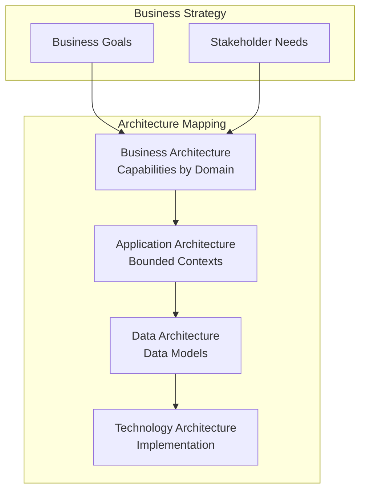

---

## 12. Target Application Architecture

The application architecture follows Clean Architecture with four concentric layers:

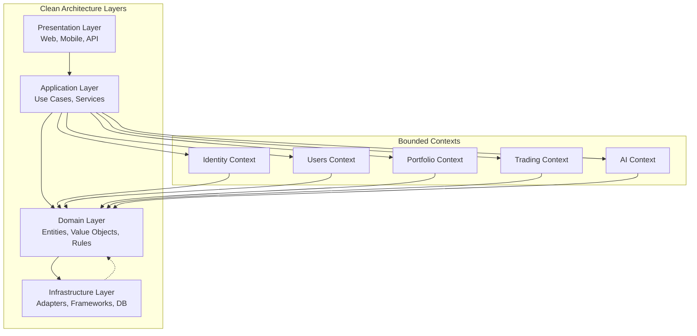

### Layer Organization

- **Entities:** Enterprise-wide business entities
- **Use Cases:** Application-specific business rules
- **Interface Adapters:** Controllers, presenters, gateways
- **Frameworks:** External frameworks and databases

---

## 13. Target Data Architecture

The data architecture maintains bounded context data isolation with the following patterns:

- **Data Ownership:** Each bounded context owns its data schema and persistence rules
- **Consistency:** Eventual consistency patterns for cross-context data synchronization
- **Audit Trail:** All business-relevant data changes are logged for compliance
- **Privacy:** Data retention and deletion policies aligned with GDPR
- **Sharia Compliance:** Data classification and handling rules for Islamic finance

### Data Flow Diagram

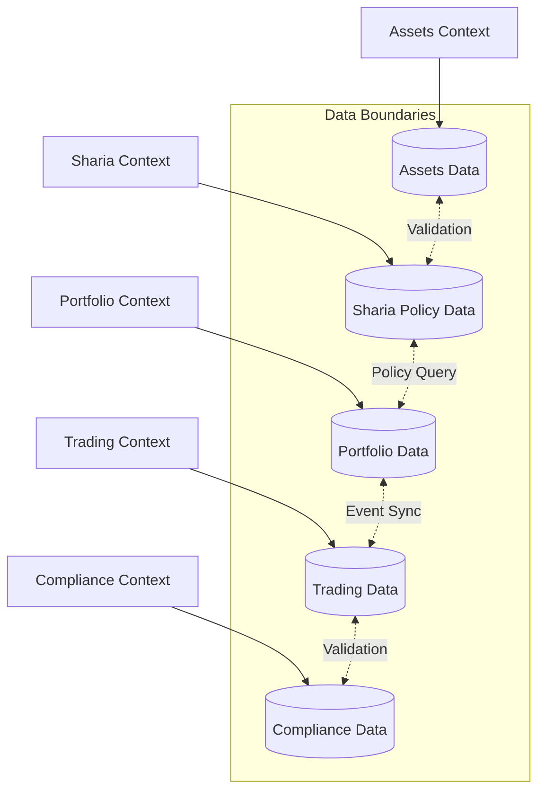

---

## 14. Target Technology Architecture

| Component | Technology | Version/Status | Rationale | Alternatives Considered |
|-----------|------------|---------------|-----------|-------------------------|
| Backend | NestJS | Current LTS | Stability, ecosystem | Fastify, Express |
| ORM | Prisma | Latest Stable | Type safety, migrations | TypeORM, Sequelize |
| Frontend | Next.js | Current Stable | SSR, developer experience | Nuxt.js, Remix |
| Database | PostgreSQL | Supported Stable | ACID, JSONB support | MySQL, MongoDB |
| Cache | Redis | Supported Stable | Performance, pub/sub | Memcached |
| Queue | BullMQ | Latest | Redis integration | RabbitMQ |
| Auth | JWT + OAuth2 + RBAC | Standard | Industry standard | Session-based |
| Container | Docker | Latest Stable | Portability | Podman |
| Proxy | Nginx | Latest Stable | Performance | Traefik |
| CI/CD | GitHub Actions | Latest | Integration | Jenkins |
| Metrics | Prometheus | Latest Stable | Pull model | InfluxDB |
| Logs | Loki | Latest Stable | Integration with Grafana | ELK |
| Visualization | Grafana | Latest Stable | Dashboard flexibility | Kibana |

### Technology Landscape

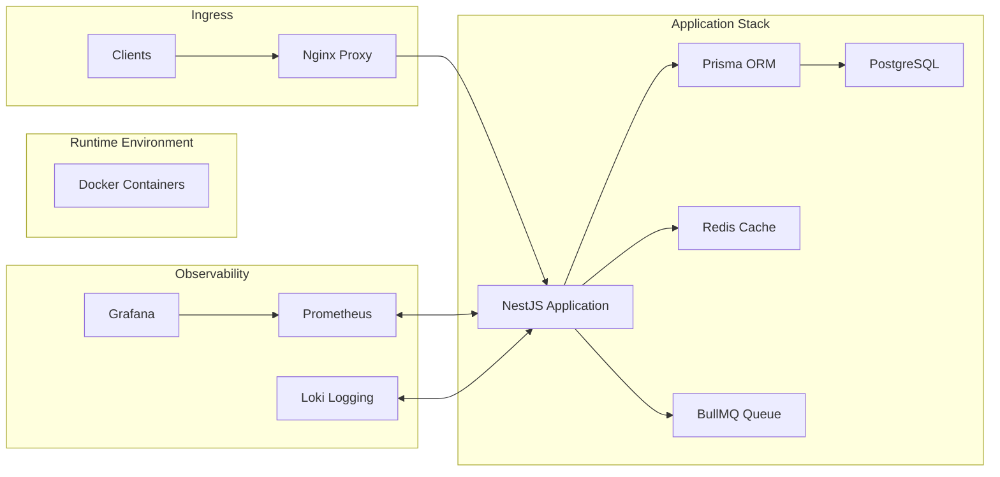

### Technology Governance Table

| Technology Category | Selection Criteria | Approval Authority | Replacement Trigger | Lifecycle Status | Supported Alternatives |
|-------------------|------------------|------------------|-------------------|----------------|---------------------|
| Backend Framework | LTS support, ecosystem, TypeScript compatibility | Architecture Team | Security vulnerability, EOL | Current Stable | Fastify, Express |
| Database | ACID, JSONB, extension ecosystem | Architecture Team | Performance degradation, vendor lock-in | Supported Stable | MySQL, CockroachDB |
| Cache | Performance, pub/sub, clustering | Platform Team | Memory issues, security | Supported Stable | Memcached, Hazelcast |
| Queue | Reliability, retry, monitoring | Platform Team | Throughput issues, cost | Latest Stable | RabbitMQ, Sidekiq |
| Auth Provider | OIDC, JWT, RBAC support | Security Team | Vulnerability, compliance | Standard | Auth0, Keycloak |

---

## 15. Target AI Architecture

The AI/ML ecosystem integrates with core trading functions while maintaining compliance boundaries:

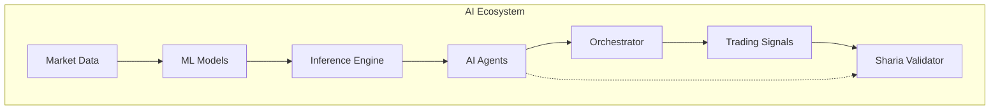

### AI/ML Model Lifecycle

- **Training:** Model development in isolated environments
- **Validation:** Backtesting and compliance validation
- **Deployment:** Staged rollout with feature flags
- **Monitoring:** Performance and drift detection
- **Governance:** Sharia compliance validation for all models

---

## 16. Security Architecture Vision

The security architecture implements defense in depth with the following layers:

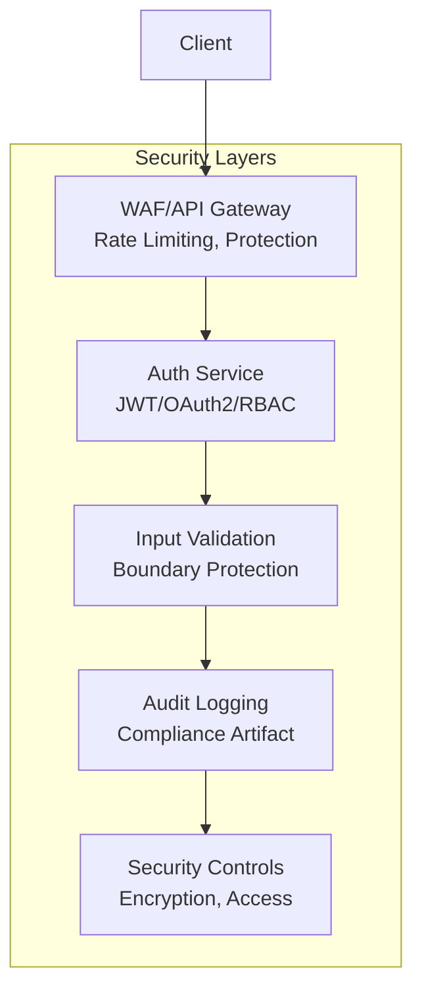

### Security Controls

- **Secure Defaults:** System defaults to most secure state
- **Fail-Safe Defaults:** Failures result in secure states
- **Defense in Depth:** Multiple security layers per component
- **Least Privilege:** Minimum permissions for all components
- **Audit Logging:** Security events as first-class features
- **Mandatory Validation:** All external input validated

---

## 17. Integration Architecture Vision

External integrations use hexagonal adapters to maintain core logic isolation:

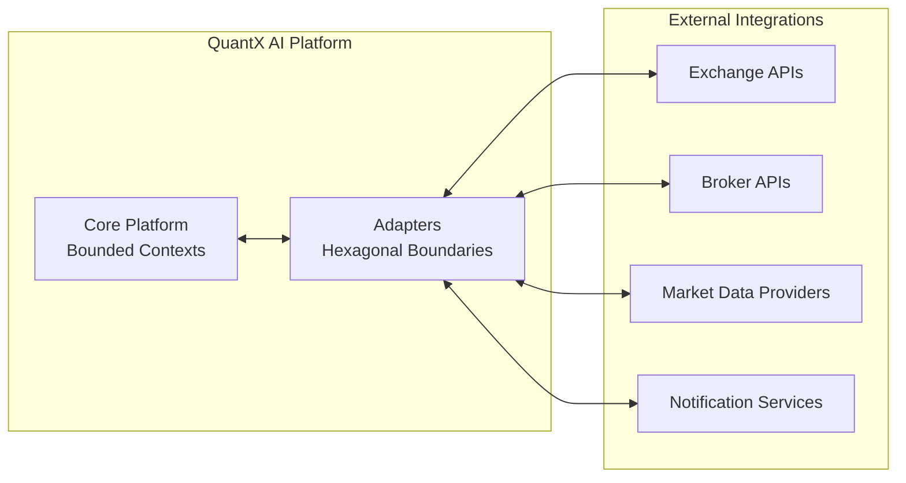

### Integration Patterns

- **Exchange Integration:** Real-time market data and order execution
- **Broker Integration:** Trade settlement and brokerage operations
- **Data Provider Integration:** Reference data and market intelligence
- **Notification Integration:** Alerts and messaging channels

---

## 18. Deployment Vision

The deployment architecture supports immutable, environment-tiered releases:

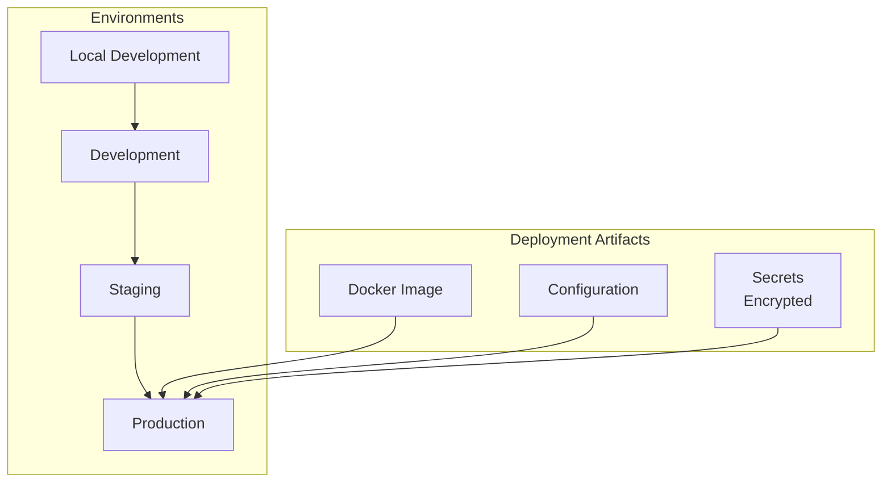

### Environment Progression

- **Local:** Developer sandbox with mock services
- **Development:** Continuous integration and testing
- **Staging:** Production-like environment for validation
- **Production:** Live trading environment with full isolation

---

## 19. Scalability Strategy

The scalability strategy works within modular monolith constraints:

- **Horizontal Scaling Triggers:** CPU > 80% sustained, Memory > 85% sustained, Request queue > 1000 items
- **Shared-Nothing Patterns:** Stateless services, cache sharding, database read replicas
- **Database Scaling:** Read replicas for query scaling, partitioning for write throughput
- **Caching Strategy:** L1 cache per instance, L2 shared Redis cache
- **Load Balancing:** Round-robin with health checks, session affinity where needed

---

## 20. Availability Strategy

Availability targets ensure 99.9% uptime with graceful degradation:

- **High Availability:** Multi-zone deployment, health checks, automatic failover
- **Failover Mechanisms:** Database replica promotion, service restart policies
- **Graceful Degradation:** Non-critical service fallback, read-only mode
- **Health Checks:** Liveness and readiness probes for all services
- **Backup Strategy:** Point-in-time recovery, cross-region replication

---

## 21. Disaster Recovery Vision

Recovery objectives protect platform continuity:

- **Recovery Time Objective (RTO):** 2 hours for full recovery
- **Recovery Point Objective (RPO):** 5 minutes for data loss tolerance
- **Backup Strategy:** Daily full backups, hourly incremental backups
- **Restore Procedures:** Automated restore scripts, manual validation steps
- **Testing Requirements:** Quarterly DR tests, annual full restore exercise

---

## 22. Observability Vision

Observability ensures system behavior is traceable:

- **Structured Logging:** JSON-formatted logs with trace IDs
- **Metrics Collection:** Prometheus metrics for all services
- **Distributed Tracing:** Request flow tracking across bounded contexts
- **Alerting Patterns:** Threshold-based alerts, anomaly detection
- **Dashboard Strategy:** Role-based dashboard views for stakeholders

---

## 23. Compliance Vision

Compliance is built into the architecture as a quality attribute:

- **Regulatory Frameworks:** AAOIFI, IFSB, ISO 27001, GDPR, OWASP ASVS, NIST Secure SDLC, SOC 2
- **Sharia Compliance:** Integrated policy engine for Islamic finance
- **Audit Trail Requirements:** Comprehensive logging of all business actions
- **Evidence Collection:** Automated compliance reports from system data
- **Compliance Testing:** CI/CD integration for compliance validation

---

## 24. Sharia Architecture Vision

Sharia compliance is a foundational architectural layer:

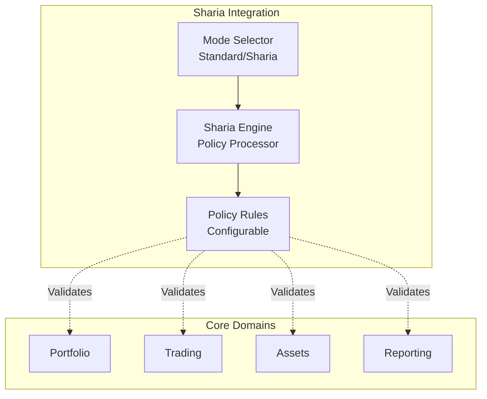

### Sharia Policy Layer

- **Policy-Driven Rules:** All Sharia validations are configurable
- **Mode Switching:** Runtime toggle between Standard and Sharia modes
- **Bounded Context:** Sharia Engine as independent bounded context
- **Audit Requirements:** Complete traceability of Sharia decisions

---

## 25. Domain Strategy

Domains are organized by business capability and technical alignment:

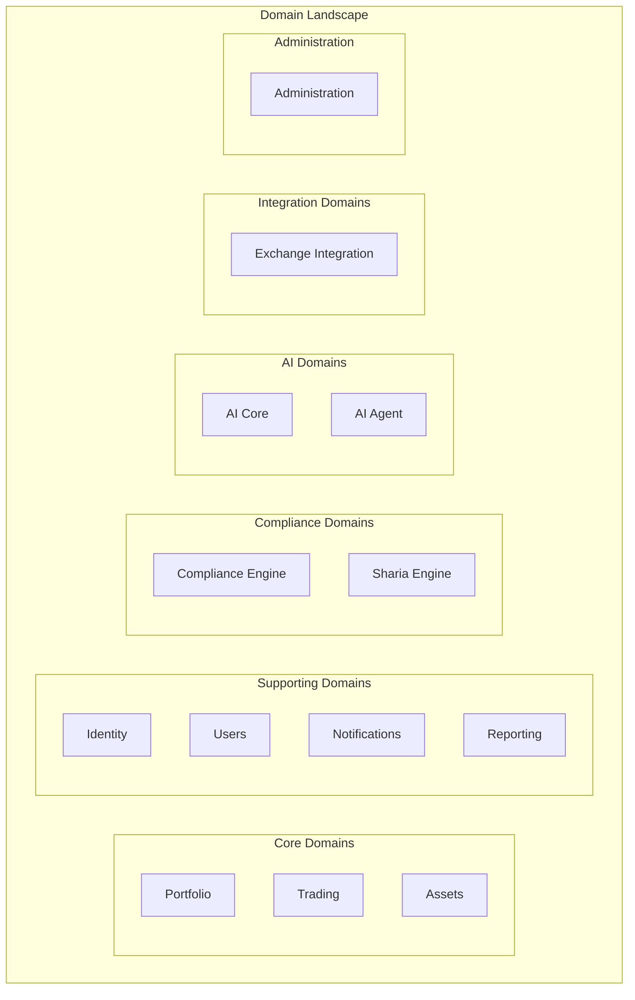

### Context Relationships

- **Partnership:** Shared responsibility between Identity and Users
- **Customer-Supplier:** Upstream-downstream data flow
- **Conformist:** Downstream adherence to upstream contracts

### DDD Strategic Classification

| Domain | Classification | Strategic Importance | Reason |
|--------|--------------|-------------------|--------|
| Portfolio | Core Domain | Critical | Primary business value delivery |
| Trading | Core Domain | Critical | Revenue generation |
| Assets | Core Domain | High | Trading foundation |
| Identity | Supporting Domain | Critical | Security infrastructure |
| Users | Supporting Domain | Medium | User experience |
| Notifications | Generic Domain | Medium | Third-party integration |
| Reporting | Supporting Domain | High | Business intelligence |
| Exchange Integration | Supporting Domain | High | External dependency |
| AI Core | Core Domain | Medium | Competitive advantage |
| AI Agent | Supporting Domain | Medium | Orchestration |
| Compliance Engine | Core Domain | Critical | Regulatory requirement |
| Sharia Engine | Core Domain | Critical | Sharia compliance |

---

## 26. Bounded Context Strategy

Bounded contexts isolate business capabilities with clear boundaries:

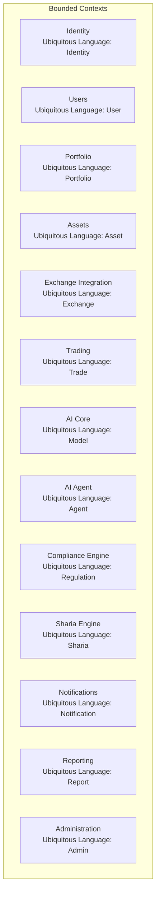

### Mapping Patterns

- **Partnership:** Collaborative contexts with shared responsibility
- **Customer-Supplier:** Upstream-downstream relationship with service level agreements
- **Conformist:** Downstream context conforms to upstream contracts
- **Anti-Corruption Layer:** Isolation of external system influences

---

## 27. Context Map Overview

Relationships between bounded contexts follow defined patterns:

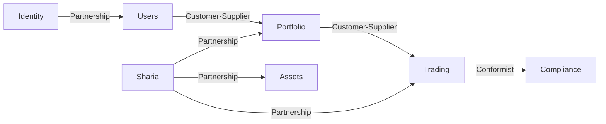

### Context Mapping Improvements

Explicit Pattern Documentation:
- **Identity → Users:** Published Language - Identity publishes standard user schema
- **Users → Portfolio:** Customer-Supplier - Portfolio consumes user data
- **Portfolio → Trading:** Customer-Supplier - Trading consumes portfolio state
- **Trading → Compliance:** Conformist - Trading adapts to compliance requirements
- **Sharia → Portfolio:** Partnership - Shared Sharia validation rules
- **Sharia → Trading:** Partnership - Shared Sharia validation rules
- **Sharia → Assets:** Partnership - Asset classification rules

---

## 28. Architecture Decision Authority Matrix

| Role | Decision Scope | Approval Authority | Escalation Path |
|------|----------------|-------------------|-----------------|
| Developer | Implementation patterns, code structure | Peer review (1 reviewer) | Tech Lead |
| Senior Developer | Module design, component boundaries, cross-context communication | Peer review (2 reviewers) | Solution Architect |
| Tech Lead | Domain architecture, technology selection within stack, integration patterns | Architecture review, RFC for significant changes | Solution Architect |
| Solution Architect | Cross-domain decisions, bounded context boundaries, architectural refactoring | Architecture Board approval | Architecture Review Board |
| Enterprise Architect | Platform architecture, compliance integration, security architecture | Architecture Review Board approval | CTO |
| Architecture Review Board | Technology baseline changes, policy modifications, compliance framework updates | CTO approval | N/A |
| CTO | Strategic architecture direction, major platform investments, governance model changes | Final authority | N/A |

---

## 29. Architecture Governance

The Enterprise Architecture Board governs architectural decisions:

- **Board Composition:** CTO (chair), Domain Architects, Security Architect, Compliance Officer
- **Meeting Cadence:** Bi-weekly with emergency sessions as required
- **Decision Categories:** Technology stack changes, architectural boundary modifications, security control updates, compliance framework changes
- **Review Cadence:** Quarterly architectural runway reviews
- **Artifacts:** Technology Baseline, ADR registry, compliance documentation

### Architecture Governance KPIs

| Governance Metric | Definition | Target | Measurement |
|-----------------|----------|--------|-------------|
| ADR Lead Time | Time from decision to ADR completion | < 5 business days | Days per ADR |
| RFC Lead Time | Time from proposal to decision | < 10 business days | Days per RFC |
| Architecture Review SLA | Review completion time | < 48 hours | Hours per review |
| Architecture Compliance Score | % of components passing fitness functions | > 95% | Percentage |
| Fitness Function Pass Rate | CI pipeline pass rate for architecture checks | > 98% | Percentage |
| Architecture Exception Count | Unapproved architecture deviations | 0 | Count |
| Technical Debt Trend | Month-over-month debt change | Decreasing | % change |
| Policy Violation Count | Security/compliance violations | 0 | Count |

### ISO/IEC/IEEE 42010 Viewpoint Mapping

| Viewpoint | Purpose | Stakeholders | Primary Sections | Related Diagrams |
|-----------|---------|--------------|----------------|----------------|
| Business View | Capture business capabilities and value streams | Executive Leadership, Business Owners | 4, 5, 6 | Capability Map |
| Capability View | Decompose business capabilities into services | Product Owners, Architects | 6, 11 | Capability Map |
| Application View | Define application components and interfaces | Developers, Tech Leads | 12, 26 | Layered Architecture |
| Information View | Data architecture and information flows | Data Engineers, Architects | 13, 25 | Data Flow Diagram |
| Technology View | Infrastructure and technology stack | Platform Team, DevSecOps | 14 | Technology Landscape |
| Security View | Security controls and assurance | Security Officer, Compliance | 16, 23, 24 | Security Architecture |
| Deployment View | Release and deployment patterns | Platform Team, Administrators | 18 | Deployment Vision |
| Operations View | Monitoring and operational concerns | Administrators, Security | 22 | Observability Vision |

---

## 30. Architecture Decision Process

Architectural decisions follow the ADR process per MDS Section 20:

- **ADR Lifecycle:** Proposed → Accepted → Superseded → Deprecated
- **RFC Triggers:** Technology stack modifications, architectural boundary changes, security control modifications, plugin system extensions, breaking API changes, performance architecture modifications
- **Authority Matrix:** Architecture team for standard changes, board for significant changes
- **Workflow:** RFC → Architecture Review → Decision → ADR → Implementation → Post-Implementation Review

### ADR Classification

| Decision Type | Approval Authority | Documentation Required | Review Frequency | Escalation |
|---------------|------------------|---------------------|-----------------|------------|
| Strategic | Architecture Review Board | ADR + Business Case | Quarterly | Enterprise Architect → CTO |
| Tactical | Solution Architect | ADR + Impact Analysis | Monthly | Tech Lead → Solution Architect |
| Operational | Tech Lead | ADR + Implementation Guide | Monthly | Developer → Tech Lead |
| Emergency | Security Officer or Compliance Officer | ADR + Post-mortem | Within 72 hours | Architecture Review Board |

### Compliance Coverage Matrix

| Compliance Framework | Architecture Layer | Affected Components | Evidence Source | Validation Method | Review Frequency |
|-------------------|------------------|-------------------|---------------|-----------------|-----------------|
| ISO27001 | All | Identity, Security, Data | Audit logs, policies | External audit | Annual |
| SOC2 | Security, Observability | All services, Auth, Audit | Compliance reports | Third-party audit | Annual |
| OWASP ASVS | Security, API | All endpoints, Auth | Security scan reports | Penetration testing | Quarterly |
| GDPR | Data, Privacy | Users, Assets, Reporting | Data processing records | Privacy impact assessment | Quarterly |
| AAOIFI | Compliance, Business | Sharia Engine, Trading | Sharia audit trail | External Sharia audit | Annual |
| IFSB | Compliance, Reporting | Compliance Engine, Reporting | Compliance reports | External audit | Annual |
| NIST SSDF | Development, Security | All repositories | Security pipeline logs | Internal review | Continuous |

---

## 31. Technical Risk Assessment

| Risk ID | Risk | Category | Probability | Impact | Mitigation | Owner |
|---------|------|----------|-------------|--------|------------|-------|
| TR-001 | Monolith scaling limitations | Scalability | Medium | High | Evolution trigger monitoring | Platform Team |
| TR-002 | Security vulnerability exploitation | Security | Low | Critical | Security review, penetration testing | Security Team |
| TR-003 | Compliance audit failure | Compliance | Low | Critical | Automated compliance testing | Compliance Team |
| TR-004 | Sharia rule misimplementation | Compliance | Medium | High | External validation, testing | Sharia Team |
| TR-005 | Exchange API changes | Integration | Medium | Medium | Adapter isolation, versioning | Integration Team |
| TR-006 | Data breach | Security | Low | Critical | Encryption, access controls | Security Team |

---

## 32. Architecture Roadmap

The architecture evolves through defined phases:

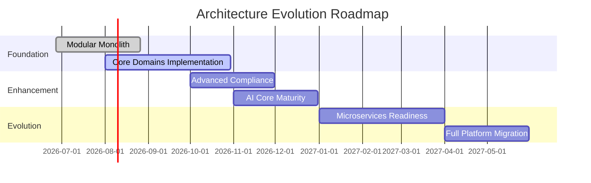

### Evolution Triggers

- Team owns multiple bounded contexts requiring independent deployment
- Deployment frequency exceeds weekly releases
- Data-scalability thresholds exceed monolith capacity

---

## 33. Transition Architecture

Current to target state transition follows defined steps:

- **Current State:** Modular Monolith with core domains in development
- **Target State:** Mature platform with optional microservices per trigger
- **Transition Phases:** Foundation establishment, core domain completion, enhancement, evolution assessment
- **Migration Patterns:** Bounded context extraction, data migration, service independence
- **Rollback Strategies:** Database transaction rollback, configuration rollback, parallel deployment

---

## 34. Architecture Success Metrics

| Metric ID | Metric | Target | Measurement Frequency | Threshold |
|-----------|--------|--------|------------------------|-----------|
| SM-001 | Deployment Frequency | Weekly | Daily | Must not decrease |
| SM-002 | Mean Time to Recovery | < 30 min | Per incident | SLA |
| SM-003 | Security Incidents | 0 | Monthly | Critical threshold |
| SM-004 | Compliance Audit Score | > 95% | Quarterly | Blocking threshold |
| SM-005 | Code Coverage | 80% unit | Per merge | Quality gate |
| SM-006 | API Response Time | < 500ms | Continuous | SLA |
| SM-007 | System Uptime | 99.9% | Monthly | SLA |

---

## 35. Future Evolution Strategy

Long-term evolution beyond initial roadmap includes microservices criteria per MDS Section 7.

---

## 36. Repository Strategy

QuantX AI operates as a monorepo with domain-oriented organization:

- **Monorepo Architecture:** Single repository containing all platform components
- **Domain-Oriented Organization:** Folders align with bounded contexts (identity, users, portfolio, trading, ai-core, etc.)
- **Modular Ownership:** Each domain has designated code owners per CODEOWNERS file
- **Shared Packages:** Common utilities in @quantx/shared package for cross-domain reuse
- **Version Governance:** Packages follow Semantic Versioning with coordinated releases

Reference: Master Development Specification Sections 10, 22 for repository governance.

### Repository Ownership

- **Architecture Team:** Maintains core architecture packages and shared infrastructure
- **Domain Teams:** Own domain-specific folders within /apps and /packages
- **Central Governance:** Architecture Team oversees cross-cutting concerns and shared utilities

### CODEOWNERS Governance

CODEOWNERS file governs merge permissions with team-based ownership rules:
- Default reviewers assigned based on path ownership
- Required approvals before merge for protected branches
- Emergency override paths for critical production issues

### Directory Ownership

Each /apps and /packages subdirectory is owned by a designated team:
- `/apps/identity` → Platform Team
- `/apps/portfolio` → Portfolio Team
- `/apps/trading` → Trading Team
- `/apps/compliance-engine` → Compliance Team
- `/apps/ai-core` → AI Team
- `/apps/reporting` → Analytics Team

### Package Ownership

- **@quantx/shared:** Maintained centrally by Architecture Team
- **@quantx/config:** Maintained by Platform Team
- **Domain packages:** Maintained by respective domain teams

### Naming Standards

- **Directories:** kebab-case (e.g., `ai-core`, `compliance-engine`)
- **Classes:** PascalCase (e.g., `PortfolioService`, `ShariaValidator`)
- **Files:** kebab-case (e.g., `portfolio.controller.ts`)
- **Packages:** kebab-case scope with PascalCase package names

### Branch Protection

- **trunk/main:** Fully protected with required reviews and CI checks
- **Feature branches:** Auto-expire after 30 days of inactivity
- **Release branches:** Protected with mandatory security review

### Release Strategy

- Semantic Versioning (SemVer) with automated changelog generation
- Major versions for breaking API changes
- Minor versions for new features
- Patch versions for bug fixes

### Documentation Lifecycle

- **docs/adr:** Architecture Decision Records with structured template
- **docs/rfc:** Request for Comments for architectural changes
- **docs/:** User-facing documentation maintained by domain teams

### Architecture Lifecycle

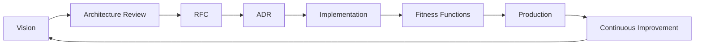

---

## 37. Architecture Fitness Functions

Automated architectural verification ensures continuous compliance:

- **Layer Dependency Validation:** Static analysis enforces Clean Architecture dependency rules
- **Circular Dependency Detection:** Build-time checks prevent circular references between modules
- **Clean Architecture Validation:** Bounded context boundaries verified through module import rules
- **Module Boundary Verification:** Naming conventions and package structures validated
- **Naming Convention Verification:** Code adheres to MDS naming standards (Section 13)
- **Plugin Validation:** Plugin manifests and security reviews enforced
- **Security Rule Validation:** OWASP ASVS and MDS Section 8 rules verified in CI
- **CI Architecture Verification:** Quality gates in pipeline prevent non-compliant changes

---

## 38. Technical Debt Governance

Technical debt follows Zero Technical Debt philosophy with strict governance:

- **Debt Classification:** Code debt, architecture debt, security debt, compliance debt
- **Risk Levels:** Critical (security/compliance), High (architecture), Medium (code), Low (technical)
- **Ownership:** Debt assigned to originating team with resolution timeline
- **Review Frequency:** Monthly debt reviews, quarterly debt reporting
- **Acceptance Rules:** No critical security debt, high architecture debt requires remediation plan
- **Mandatory Removal:** Critical debt resolved within 72 hours, high debt within sprint

### Debt Register

All identified technical debt is tracked in a central register with the following fields:
- Debt ID, Description, Category, Risk Level, Discovery Date, Owner, Resolution Target, Status
- Linked to relevant ADR or RFC for traceability
- Reviewed weekly by team leads, monthly by Architecture Review Board

### Debt Categories

- **Code Debt:** Legacy code, duplication, inadequate test coverage
- **Architecture Debt:** Boundary violations, missing abstractions, scalability gaps
- **Security Debt:** Unpatched vulnerabilities, deprecated libraries, weak controls
- **Compliance Debt:** Missing audit trails, incomplete documentation, policy gaps

### Maximum Age Policy

- **Critical:** 72 hours maximum before escalation
- **High:** 30 days maximum with remediation plan required
- **Medium:** 90 days maximum with migration path required
- **Low:** Tracked in quarterly backlog planning

### Approval Workflow

- **Security Debt:** Requires sign-off from Security Officer before deferral
- **Compliance Debt:** Requires sign-off from Compliance Officer before deferral
- **Architecture Debt:** Requires sign-off from Solution Architect before deferral
- All debt exceptions documented with risk acceptance rationale

### Escalation

- Unresolved debt escalates to Architecture Review Board after maximum age exceeded
- Board decides on remediation plan, resource allocation, or formal risk acceptance

### Reporting Cadence

- **Weekly:** Team-level debt reports in sprint reviews
- **Monthly:** Aggregate debt dashboard for Architecture Review Board
- **Quarterly:** Debt trend analysis presented to CTO and executive leadership

### Architecture Debt Board

- Monthly review of architecture-type debt items
- Cross-team dependency resolution and prioritization
- Technology refresh planning and strategic debt reduction

### Acceptance Criteria

- Remediation plan required for all debt items exceeding 30 days
- Plans include estimated effort, resource allocation, and target date
- No acceptance without Architecture Review Board approval for high-severity items

Reference: MDS Section 26 Quality Gates prohibit debt accumulation.

---

## 39. Enterprise Architecture Repository

Governance of architecture artifacts follows MDS Section 20:

- **ADR Repository:** Architecture decisions stored in docs/adr, reviewed annually
- **RFC Repository:** Change proposals tracked with outcome documentation
- **Architecture Catalog:** Reference architectures and patterns maintained centrally
- **Reference Architectures:** Standard architecture blueprints for common scenarios
- **Architecture Patterns:** Reusable patterns documented with implementation guidance
- **Standards Library:** Approved technologies and practices catalogued
- **Decision Log:** Indexed ADRs with traceability to requirements

---

## 40. References

**Master Development Specification:**
- Master Development Specification (QX-000) v1.0.1 - QuantX AI Enterprise Architecture Board

**Architecture Frameworks:**
- TOGAF 9.2 - The Open Group Architecture Framework
- C4 Model - Simon Brown's Context-Container-Component-Code visualization

**ISO/IEC Standards:**
- ISO/IEC/IEEE 42010:2011 Systems and software engineering - Architecture description
- ISO/IEC/IEEE 15288:2015 Systems and software engineering - System life cycle processes
- ISO/IEC/IEEE 12207:2017 Software life cycle processes

**Business Analysis:**
- BABOK v3 - Business Analysis Body of Knowledge

**Development Methodologies:**
- Clean Architecture - Robert C. Martin
- Domain-Driven Design - Eric Evans

**Security Frameworks:**
- OWASP ASVS 4.0 - Application Security Verification Standard
- OWASP Top 10 - 2021 Edition
- NIST Secure Software Development Framework (SSDF)

**Compliance Frameworks:**
- AAOIFI - Accounting and Auditing Organization for Islamic Financial Institutions
- IFSB - Islamic Financial Services Board
- ISO 27001 - Information Security Management
- GDPR - General Data Protection Regulation
- SOC 2 - Trust Services Criteria

**Versioning:**
- Semantic Versioning 2.0.0 - semver.org

---

## 41. Revision History

| Version | Date | Author | Change Summary | Affected Sections | Approval Status |
|---------|------|--------|----------------|-------------------|-----------------|
| 1.2 | 2026-06-27 | QuantX AI Enterprise Architecture Board | Final refinement: added Capability Ownership Matrix, Architecture Principle Traceability Matrix, Technology Governance Table, DDD Strategic Classification, Context Mapping Improvements, ISO/IEC/IEEE 42010 Viewpoint Mapping, ADR Classification, Architecture Governance KPIs, Compliance Coverage Matrix, Architecture Lifecycle Diagram, Repository Strategy governance expansion, Technical Debt Governance expansion, Enterprise Architecture Maturity Statement, Enterprise Architecture Glossary | 6, 7, 14, 25, 27, 29, 30, 36, 38, 41 | FINAL REVISION |
| 1.1 | 2026-06-27 | QuantX AI Enterprise Architecture Board | Revision 1: Expanded Enterprise Capability Map (Level 1/Level 2), enriched Architecture Principles table with Owner and Compliance Reference columns, added Cross-Cutting Architectural Concerns matrix, added Quality Attribute Mapping matrix, added Architecture Decision Authority Matrix, added Repository Strategy subsection, added Architecture Fitness Functions subsection, added Technical Debt Governance subsection, added Enterprise Architecture Repository subsection, improved Technology Landscape to capability-oriented narrative | 6, 7, 27-39 | FINAL REVISION |
| 1.0 | 2026-06-27 | QuantX AI Enterprise Architecture Board | Initial baseline | All | BASELINE |

### Enterprise Architecture Glossary

| Term | Definition |
|------|------------|
| Architecture Vision | High-level direction defining target architecture state |
| Architecture Principle | Foundational rule guiding architectural decisions |
| Capability | Discrete business function delivered by the platform |
| Bounded Context | DDD pattern isolating domain model and ubiquitous language |
| Domain | Business area represented as cohesive bounded context |
| ADR | Architecture Decision Record documenting significant choices |
| RFC | Request for Comments proposing architectural changes |
| Fitness Function | Automated test validating architectural conformance |
| Architecture Runway | Accumulated technical capacity for future features |
| Policy Engine | Configurable rules engine for compliance/business logic |
| Modular Monolith | Single deployable with modular internal architecture |
| Hexagonal Architecture | Ports-and-adapters pattern isolating core logic |
| Plugin Architecture | Extensible framework supporting external integrations |

### Enterprise Architecture Maturity Statement

**Current Architecture Maturity:** Operational maturity with defined governance processes, automated fitness functions, and compliance integration. Architecture decisions are documented and reviewed.

**Target Architecture Maturity:** Optimized maturity with predictive debt management, automated compliance validation, and continuous architecture feedback loops.

**Assessment Cadence:** Architecture maturity assessed quarterly through governance KPIs and compliance reviews.

**Continuous Improvement Model:** Plan-Do-Check-Act cycle applied to architecture governance, with monthly retrospectives and quarterly strategic reviews.

**Architecture Governance Philosophy:** Zero Technical Debt, Security by Design, Compliance by Default. Every component must pass fitness functions before production deployment.

# Standards Mapping

| Standard | Influence on Document | Specific Sections |
|----------|----------------------|-------------------|
| TOGAF ADM | Architecture phases and governance | 3, 4, 11, 28, 32, 33 |
| ISO/IEC/IEEE 42010 | Stakeholder concerns, quality attributes | 6, 10 |
| ISO/IEC/IEEE 15288 | Risk management, lifecycle | 19, 21, 29 |
| DDD | Bounded contexts, domain strategy | 11, 12, 25, 26, 27 |
| Clean Architecture | Layer isolation, dependency rules | 12, 17 |
| C4 Model | Visualization framework | All diagram sections |
| OWASP | Security design | 16 |
| NIST Secure SDLC | Development security | 16 |
| AAOIFI/IFSB | Sharia compliance | 24 |
| SOC 2/ISO 27001 | Security controls | 16, 23 |