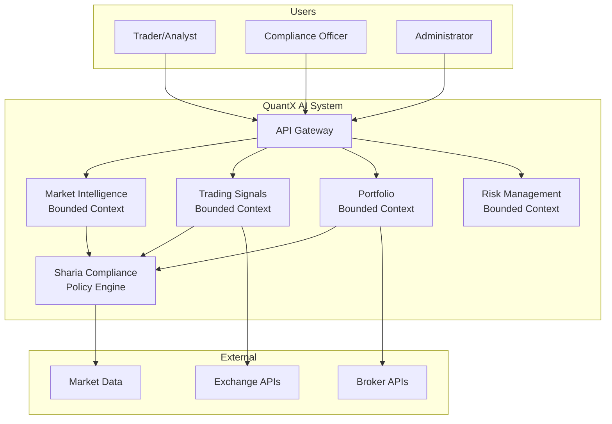
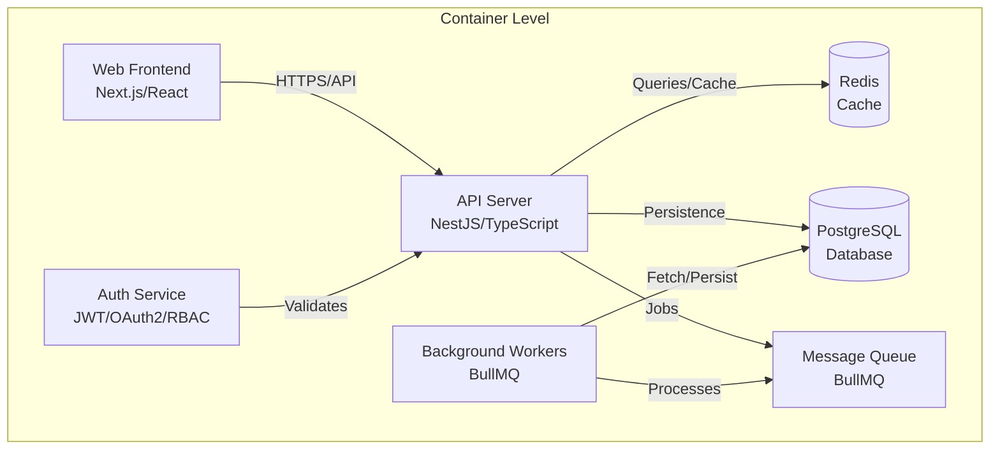
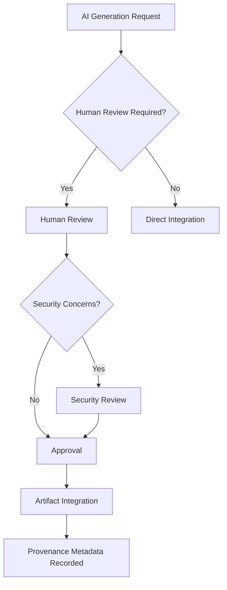
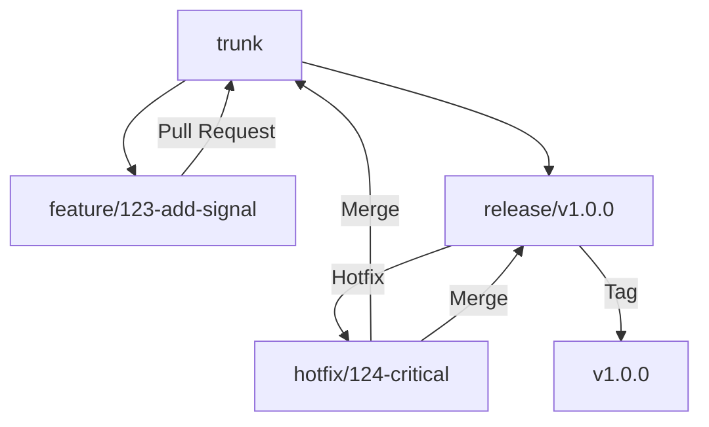
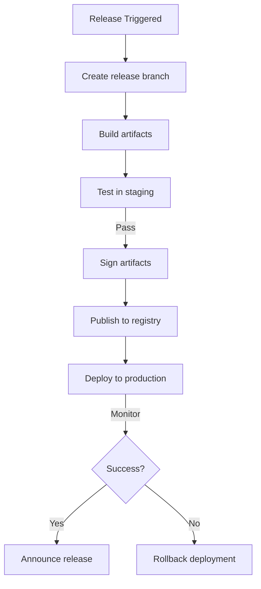
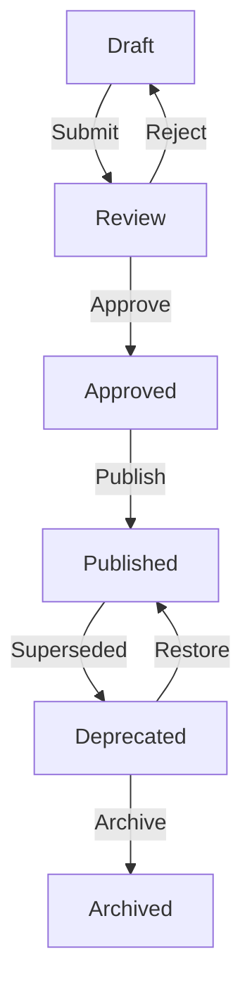
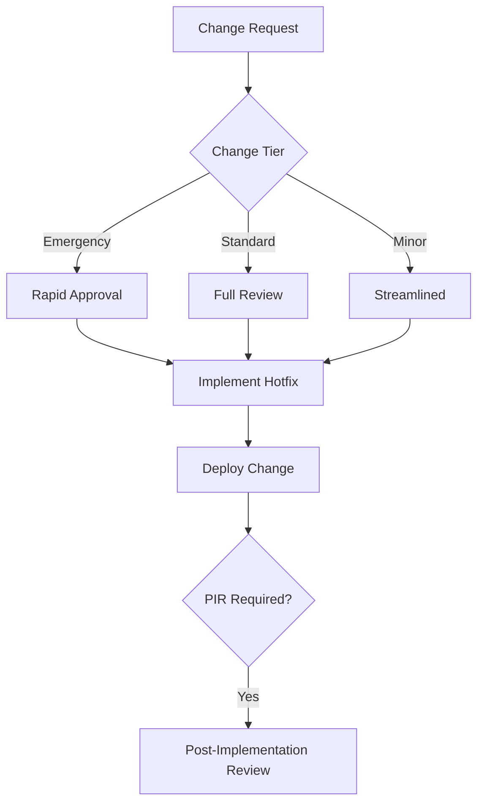

# Master Development Specification

## 1. Document Metadata

- **Document ID:** QX-000
- **Title:** Master Development Specification
- **Version:** 1.1
- **Status:** REVISION
- **Owner:** QuantX AI Enterprise Architecture Board
- **Approvers:** Enterprise Architecture Board, Chief Technology Officer, Chief Security Officer, Chief Compliance Officer
- **Effective Date:** 2026-06-27
- **Review Cycle:** Annual
- **Distribution List:** All engineering teams, architecture team, security team, compliance team, executive leadership

## 2. Executive Summary

The Master Development Specification (MDS) serves as the single source of truth for all engineering practices, governance policies, and architectural standards within the QuantX AI Enterprise AI Platform. This document establishes the mandatory compliance posture for all development activities and provides a unified framework for evolving the platform architecture from a Modular Monolith to Microservices when justified by business and technical requirements.

QuantX AI operates in both Standard and Sharia-compliant modes, requiring all engineering decisions to account for dual operating paradigms. The platform is designed for maintainability, security, and compliance first, with performance as a secondary consideration. All team members, contractors, and AI systems operating within the QuantX ecosystem must adhere to the principles, standards, and processes defined herein.

This specification harmonizes established industry standards including ISO/IEC/IEEE 12207, ISO/IEC/IEEE 15288, IEEE 29148, TOGAF ADM, BABOK, PMBOK, Clean Architecture, Domain-Driven Design, C4 Model, OWASP Secure Development, and Semantic Versioning into a cohesive set of QuantX-specific rules and guidelines.

This specification now includes comprehensive governance extensions covering data management, API standards, database operations, event-driven architecture, observability, testing, domain modeling, dependency direction, error handling, AI coding standards, cache management, feature flags, backup and recovery, disaster recovery, business continuity, internationalization, performance engineering, and capacity planning. These extensions maintain additive compatibility with the baseline sections while establishing enterprise-grade operational rigor.

## 3. Project Overview

QuantX AI is an Enterprise AI Platform designed to deliver quantitative trading and analytics capabilities across multiple domains including market intelligence, trading signals, portfolio optimization, and risk management. The platform operates in two distinct modes: Standard Mode for conventional financial operations and Sharia Mode for compliance with Islamic finance principles.

### Primary Domains:
- Market Intelligence and Data Processing
- Trading Signal Generation and Analytics
- Portfolio Optimization and Management
- Risk Assessment and Compliance Monitoring
- Sharia Compliance Engine

### Non-Functional Constraints:
- Security by Design: All components must implement defense-in-depth security controls
- Compliance by Default: Regulatory and Sharia compliance must be configurable and auditable
- Observability: System behavior must be traceable through comprehensive logging and monitoring
- Performance: Response times must meet SLA requirements under peak load conditions
- Scalability: Architecture must support horizontal scaling when justified by growth metrics

## 4. Vision Overview

QuantX AI envisions a Clean Architecture implementation using Domain-Driven Design to structure bounded contexts around business capabilities. The architecture follows an API-first approach with hexagonal isolation of external integrations, enabling future evolution to microservices when specific trigger conditions are met.

The long-term architectural destination includes event-driven internal communication patterns, well-defined bounded contexts for each domain, and infrastructure that supports both deployment models. Microservices evolution will be triggered by team ownership boundaries, deployment frequency requirements, or data-scalability thresholds that cannot be met within the modular monolith constraints.

Sharia Mode remains a first-class architectural concern, implemented as a configurable policy layer that can be activated at the service or feature level without requiring separate codebases.

## 5. Development Philosophy

QuantX AI adopts the foundational mindset that all artifacts must be designed for maintainability, security, and compliance first, with performance as a secondary optimization goal. This philosophy ensures that architectural decisions prioritize long-term sustainability over short-term gains.

Business rules must never be hardcoded; they must be externalized as configurable policies that can be modified without code changes. This enables rapid adaptation to regulatory changes, market conditions, and Sharia compliance requirements without compromising system stability.

Every engineering decision must consider its impact on auditability, traceability, and compliance. The platform must be designed to produce artifacts that can withstand external audits and demonstrate continuous adherence to both financial regulations and Sharia principles.

## 6. Engineering Principles

QuantX AI adheres to the following actionable, non-overlapping engineering principles:

- **API-first:** All system interactions occur through well-defined APIs that abstract implementation details
- **Separation of Concerns:** Each component has a single responsibility and operates within clearly defined boundaries
- **Dependency Rule:** Inner architectural circles never depend on outer circles; dependencies point inward only
- **Explicit Interfaces:** All module and service boundaries are defined through explicit, versioned contracts
- **Immutable Infrastructure:** Deployments are treated as immutable artifacts; configuration changes trigger new deployments
- **Observability by Default:** All components emit structured logs, metrics, and traces without additional configuration
- **Defensive Programming:** Input validation, error handling, and boundary protection are assumed at every layer
- **Zero Trust:** No implicit trust exists within or outside the system; all access is authenticated and authorized
- **Least Privilege:** Components operate with minimum required permissions; excess privileges are revoked immediately

## 7. Architecture Principles

QuantX AI implements a Modular Monolith baseline with bounded contexts defined per domain. Each bounded context represents a cohesive business capability and maintains its own ubiquitous language.

The architecture follows the ports-and-adapters (hexagonal) structure, ensuring that core business logic remains isolated from external frameworks, databases, and infrastructure. Internal communication uses event-driven patterns to decouple components while maintaining clear data flow.

The C4 model (Context, Container, Component, Code) serves as the canonical modeling framework for architecture visualization and communication. External integrations with exchanges and brokers are isolated through hexagonal adapters to enable future technology changes without core logic modifications.

Microservices Evolution Trigger conditions include: when a team owns more than one bounded context and requires independent deployment, when deployment frequency exceeds weekly releases, or when data-scalability thresholds require independent scaling of specific capabilities.



> Figure: QuantX AI System Context (D1)



> Figure: QuantX AI High-Level Containers (D2)

## 8. Security Principles

QuantX AI implements a comprehensive security posture synthesizing OWASP Secure Development, NIST Secure SDLC, and Security by Design principles:

- **Secure Defaults:** All system configurations default to the most secure state; insecure options require explicit override
- **Fail-Safe Defaults:** System failures result in secure states; access is denied by default
- **Defense in Depth:** Multiple security layers protect each component; breach of one layer does not compromise the system
- **Least Privilege:** Users and components operate with minimum required permissions
- **Audit Logging as Feature:** All security-relevant events are recorded as first-class features, not side effects
- **Secure Default Configuration:** No out-of-box secrets or credentials exist; all secrets must be provisioned
- **Sharia-Compliant Security Controls:** Security controls respect and support Sharia compliance requirements
- **RBAC with Fine-Grained Permissions:** Role-based access control with granular permissions per business function
- **Mandatory Input Validation:** All external input is validated at every architectural boundary

## 9. AI Governance Principles

QuantX AI establishes explicit governance for AI-assisted development and operation:

- **AI Permitted Actions:** AI may generate tests, documentation drafts, boilerplate code, and refactoring suggestions that improve developer productivity
- **AI Prohibited Actions:** AI must never modify production code without human review, bypass security checks, or access external networks during generation without explicit authorization
- **Conflict Resolution:** When AI output conflicts with compliance or security requirements, human judgment takes precedence and the conflict must be documented
- **Human Approval Requirements:** All AI-generated artifacts must receive human review before integration; critical changes require senior engineer approval
- **Artifact Traceability:** AI-generated artifacts carry provenance metadata including prompt ID, generation timestamp, and confidence scores
- **Review Responsibilities:** AI output is reviewed by the originating author, with additional review for security-sensitive changes
- **Quality Expectations:** AI-generated code must meet the same quality standards as human-authored code, including test coverage and documentation requirements



> Figure: AI Governance Decision Flow (D7)

## 10. Repository Manifest

The QuantX AI ecosystem consists of the following repository structure organized to reflect bounded contexts and technical capabilities:

### Root-Level Directories

| Directory | Responsibility | Ownership |
|-----------|----------------|-----------|
| `apps/` | Deployable applications (web, mobile, services) | Frontend/Mobile Teams |
| `packages/` | Shared libraries and reusable components | Architecture Team |
| `engineering/` | Engineering specifications and documentation | Architecture Team |
| `infrastructure/` | Infrastructure definitions and deployments | DevSecOps Team |
| `tooling/` | Development tools and utilities | Platform Team |
| `templates/` | Project and repository templates | Architecture Team |
| `scripts/` | Automation and maintenance scripts | Platform Team |
| `docs/` | Central documentation and knowledge base | Architecture Team |
| `.github/` | GitHub workflows, actions, and issue templates | DevSecOps Team |

### Repository Manifest

| Repository Name | Purpose | Primary Tech | Owning Team | Depends On | Monorepo/Standalone |
|-----------------|---------|--------------|-------------|------------|-------------------|
| quantx-platform | Main modular monolith application | NestJS/TypeScript | Core Platform | None | Monorepo |
| quantx-web | Frontend web application | Next.js/React/TypeScript | Frontend | quantx-platform | Standalone |
| quantx-mobile | Mobile application | React Native/Expo | Mobile | quantx-platform | Standalone |
| quantx-shared | Shared libraries and utilities | TypeScript | Architecture | None | Standalone |
| quantx-docs | Central documentation wiki | Markdown | Architecture | All | Standalone |
| quantx-infrastructure | Infrastructure definitions | Docker/GitHub Actions | DevSecOps | None | Standalone |

Each repository implements the required structure and standards defined in this specification. Repository ownership aligns with team boundaries and follows the Conway's Law alignment principle.

## 11. Repository Standards

All QuantX AI repositories must include the following root files:
- README.md with project overview and quick start instructions
- LICENSE with appropriate open-source or commercial license
- ARCHITECTURE.md describing component and module boundaries
- CHANGELOG.md documenting all notable changes
- CODEOWNERS defining team ownership for code review
- SECURITY.md specifying security reporting and policies
- .gitignore excluding secrets, build artifacts, and temporary files

Required CI workflow minimums include lint validation, type checking, test execution, build verification, and dependency security review. Branch protection rules mandate that all changes receive review approval before merge, all CI checks pass, and status checks are enforced.

Forbidden patterns include committing secrets in any form, storing large binary files in repositories, and bypassing automated security checks. All repositories must adhere to these standards without exception.

## 12. Repository Lifecycle

Repositories progress through defined lifecycle stages:
- **Creation:** New repositories require architecture review and approval before creation
- **Maturation:** Experimental repositories graduate to production after meeting stability criteria
- **Maintenance:** Active repositories receive regular updates and security patches
- **Deprecation:** Obsolete repositories are marked deprecated with migration path documented
- **Archival:** Unused repositories are archived with preserved artifacts and documentation

Criteria for moving to production include successful CI/CD pipeline execution, security review completion, and architectural approval. The sunset process includes artifact migration to successor systems and documentation retention in the archive repository.

### 12.1 Module Maturity Model

Every module within QuantX AI follows the Module Maturity Model to ensure consistent quality and stability across the platform:

**Maturity States:**
- **Draft:** Initial module definition with incomplete implementation; not suitable for testing
- **Experimental:** Working prototype with limited functionality; available in development environment only
- **Development:** Actively developed module with core functionality; available in development and staging environments
- **Stable:** Feature-complete module with passing quality gates; available in staging environment
- **Production:** Fully tested, documented, and approved module; available in production environment
- **Deprecated:** Module marked for replacement; no new features accepted, critical fixes only
- **Archived:** Module removed from active use; artifacts preserved for reference

**Transition Rules:**
- Promotion from Draft to Experimental requires architecture approval
- Promotion from Experimental to Development requires passing basic tests and documentation stub
- Promotion from Development to Stable requires meeting all quality gates and security review
- Promotion from Stable to Production requires architecture board approval and full compliance sign-off
- Deprecation requires documented replacement timeline and migration path
- Archival occurs automatically after deprecated state exceeds 6 months or upon explicit decision

## 13. Naming Conventions

Consistent naming across all artifacts improves maintainability and reduces cognitive load:

| Artifact Type | Convention | Pattern | Example | Rationale |
|---------------|------------|---------|---------|-----------|
| Repositories | kebab-case, prefixed with project | `quantx-{purpose}` | quantx-platform | Identifies ecosystem and purpose |
| Packages | kebab-case, scoped under org | `@quantx/{name}` | @quantx/shared | Prevents namespace collision |
| Directories | kebab-case for multi-word | `{domain}-{function}` | market-intelligence | Clear separation of concerns |
| Files | kebab-case, descriptive | `{bounded-context}.{layer}.{type}` | trading-signals.application.ts | Context and layer identification |
| Classes | PascalCase, noun-focused | `{Domain}{Role}` | MarketDataService | Clear responsibility |
| Interfaces | PascalCase, prefixed with I | `I{Domain}{Capability}` | IPortfolioReader | Explicit contract definition |
| Functions | camelCase, verb-focused | `{verb}{noun}` | calculateRisk | Action-oriented naming |
| Variables | camelCase, descriptive | `{noun}` | marketData | Clear intent |
| Constants | SCREAMING_SNAKE_CASE | `{DOMAIN}_{CONCEPT}` | MAX_RETRY_COUNT | Universal recognition |
| Database Tables | snake_case, pluralized | `{domain}_{entity}` | market_signals | SQL convention alignment |
| Message Queues | kebab-case, verb-noun | `{domain}-{action}` | market-update | Action clarity |
| Environment Variables | SCREAMING_SNAKE_CASE | `{SERVICE}_{CONFIG}` | PORTFOLIO_API_KEY | Clear scoping |
| Docker Images | project/service:version | `quantx/{service}:{version}` | quantx/api:1.0.0 | Consistent registry structure |
| API Endpoints | kebab-case, noun-focused | `/api/v{version}/{resource}` | /api/v1/trading-signals | Versioned and RESTful |

## 14. Versioning Strategy

All published artifacts within QuantX AI follow Semantic Versioning 2.0.0. Major versions increment for breaking public API changes. Minor versions increment for backward-compatible feature additions. Patch versions increment for backward-compatible bug fixes.

Pre-release identifiers use the format `{version}-{identifier}.{build}` where identifier indicates stability (alpha, beta, rc). Build metadata follows `{version}+{build}` for internal tracking. All version bumps are recorded in CHANGELOG.md with migration guidance where applicable.

Public API stability is distinct from internal refactoring; major version bumps are required only for contract changes that break backward compatibility. Internal restructuring that preserves APIs does not require major version increments.

## 15. Branching Strategy

QuantX AI mandates Trunk-Based Development with short-lived feature branches. The trunk branch represents the primary integration line with production-ready code at all times.

Branch types and conventions:
- `trunk`: Primary integration branch, always deployable
- `feature/{ticket-number}-{brief-description}`: New functionality, maximum 3 days lifetime
- `bugfix/{ticket-number}-{brief-description}`: Bug fixes, maximum 2 days lifetime
- `hotfix/{ticket-number}-{brief-description}`: Emergency fixes, immediate merge to trunk and release
- `release/{version}`: Release stabilization, short-lived
- `spike/{ticket-number}-{brief-description}`: Investigation work, time-boxed to 5 days
- `patch/{ticket-number}`: Small security or dependency patches

All feature branches must merge to trunk within the defined maximum lifetime; longer-lived branches indicate architectural or planning issues that require intervention.



> Figure: Branching and Release Flow (D4)

## 16. Release Strategy

Releases are cut based on defined triggers including scheduled releases (bi-weekly minor versions) and event-driven releases (critical features or security patches). Release branches follow the naming convention `release/{version}` and require branch protection rules.

Release artifacts are signed using cryptographic signatures to ensure integrity. Container images use semantic version tags aligned with the release version. Changelog enforcement requires all changes to be documented before release; rollback policy mandates automated rollback capability for failed deployments.

Communication protocol includes Slack notifications for all releases, email announcements for major versions, and release dashboard updates for audit traceability.



> Figure: CI/CD Quality Gates Pipeline (D5)

## 17. Documentation Standards

Mandatory documentation artifacts per repository include:
- README.md following the standard template with purpose, setup, and contribution sections
- CONTRIBUTING.md with development and review guidelines
- Architecture Decision Records (ADRs) in numbered format with status tracking
- Inline documentation for public APIs and complex algorithms
- Runbooks for operational procedures and incident response

API documentation follows OpenAPI/Swagger standards for REST endpoints, GraphQL schema introspection for GraphQL APIs, and proto file documentation for gRPC services. Documentation lives in-repo for implementation-specific details and in the central wiki for cross-repository knowledge.

## 18. Document Lifecycle

All governed documents progress through: Draft -> Review -> Approved -> Published -> Deprecated -> Archived. Draft documents are works-in-progress. Review documents are under evaluation. Approved documents are ratified for use. Published documents are active and governed. Deprecated documents are superseded but retained. Archived documents are preserved for historical reference.

Document versioning follows semantic versioning. Approval matrix requires author signature, peer review, and architecture board approval for standards documents. Retention policy preserves deprecated documents for minimum 7 years with audit trail.



> Figure: ADR Lifecycle (D3)

## 19. Change Management

Change control for production-impacting changes follows the RFC (Request for Change) template including change description, impact assessment, rollback plan, and approval requirements.

Change tiers include:
- **Tier 1:** Emergency changes requiring immediate deployment with post-approval
- **Tier 2:** Standard changes following full review process
- **Tier 3:** Minor changes with streamlined approval

Emergency change process involves hotfix branch creation, rapid approval by on-call lead, immediate deployment, and post-implementation review (PIR) within 72 hours. Rollback criteria require immediate rollback for data loss, service unavailability exceeding SLA, or security incidents.



> Figure: Change Management Workflow (D6)

## 20. Decision Management

Architectural, engineering, and product decisions are captured using Architecture Decision Records (ADRs) stored in each repository's `docs/adr` directory. ADRs follow the mandatory template including status, context, decision, consequences, and alternatives considered.

Review cadence requires ADRs to be reviewed annually or when superseded by new decisions. Deprecation process marks ADRs as deprecated with links to replacement decisions and retention for audit purposes.

Decisions that produce ADRs include technology selections, architectural boundary changes, and policy modifications. The Enterprise Architecture Board maintains the master ADR registry.

### 20.1 RFC Governance

Request for Comments (RFC) governance provides structured evaluation for significant architectural or platform changes that do not fall under standard feature development.

**Workflow:**
RFC → Architecture Review → Decision → ADR (if accepted) → Implementation → Post-Implementation Review

**Process Flow:**
- **RFC Submission:** Author submits RFC with problem statement, proposed solution, impact analysis, and alternatives considered
- **Architecture Review:** Architecture team evaluates technical feasibility, security implications, and compliance alignment
- **Decision:** Architecture board approves, rejects, or requests modifications to the RFC
- **ADR Generation:** Accepted RFCs with architectural impact generate ADRs documenting the decision
- **Implementation:** Approved changes proceed through standard development workflow
- **Post-Implementation Review:** Assessment of outcomes within 30 days of deployment

**Mandatory RFC Triggers:**
- Technology stack modifications affecting multiple bounded contexts
- Architectural boundary changes or new integration patterns
- Security control or compliance framework modifications
- Plugin system extensions affecting core platform behavior
- Breaking changes to public APIs or shared interfaces
- Performance or scalability architecture modifications

## 21. Architecture Governance

The Enterprise Architecture Board serves as the ultimate authority for architecture decisions. Board composition includes the Chief Technology Officer (chair), Domain Architects, Security Architect, and Compliance Officer.

Meeting cadence occurs bi-weekly with emergency sessions as required. Decision categories requiring board approval include technology stack changes, architectural boundary modifications, security control updates, and compliance framework changes.

Architectural runway reviews assess technical debt quarterly. The board maintains the Technology Baseline and ensures consistency across all repositories and services.

## 22. Repository Governance

Repository roles and responsibilities are defined through CODEOWNERS files specifying team ownership for each code area. Access control model follows least privilege with role-based permissions.

Onboarding process grants repository access after security training completion. Offboarding process revokes access within 24 hours of team change. Audit frequency includes quarterly access reviews and annual security assessments.

Repository governance aligns with ISO/IEC/IEEE 15288 product and project life cycle management, ensuring traceability and accountability.

### 22.1 Plugin Governance

QuantX AI supports plugin-based extensibility for integrating external capabilities while maintaining security and compliance boundaries.

**Plugin Categories:**
- **AI Plugins:** Extensions providing AI/ML model capabilities; must undergo security review for data handling
- **Exchange Plugins:** Integrations with trading venues and market data providers; require compliance validation
- **Strategy Plugins:** Trading strategy implementations; must pass backtesting validation and risk assessment
- **Compliance Plugins:** Regulatory and Sharia compliance rule engines; require compliance officer approval
- **Notification Plugins:** Alerting and notification channels; must comply with data protection regulations

**Governance Requirements:**
- **Approval Process:** All plugins require architecture board approval before integration; security review mandatory for AI and Exchange plugins
- **Versioning:** Plugins follow semantic versioning; compatibility matrix maintained in documentation
- **Compatibility:** Plugins must declare compatible module versions; breaking changes require major version bump
- **Security Review:** Every plugin undergoes static analysis, dependency scanning, and runtime sandboxing validation
- **Ownership:** Each plugin has designated owner from corresponding domain team; ownership documented in CODEOWNERS
- **Lifecycle:** Plugins follow the Module Maturity Model; deprecated plugins removed after 6-month notice period

## 23. Coding Governance

Enforceable coding rules include:
- Linting standards using ESLint configured for consistent code style
- Formatting using Prettier with project-standard settings
- Type safety via TypeScript strict mode enabled for all repositories
- Test coverage minimum of 80% for unit tests, 60% for integration tests
- Forbidden patterns: any type without justification, as operator without type guard, console.log in production code
- Commit message standards following Conventional Commits format
- Code review expectations: self-review before submission, minimum one peer review, architecture review for boundary changes

## 24. Definition of Ready

Work items must satisfy these criteria before entering development:
- Clear acceptance criteria defined and measurable
- Dependencies identified and documented
- Architecture impact assessed and approved
- Security considerations listed with mitigation plans
- Testability defined with test approach documented
- Performance criteria stated with benchmarks
- Documentation scope defined including ADR requirements

## 25. Definition of Done

Completed work items must meet these exit criteria:
- Code complete and peer-reviewed
- Linted with no warnings or errors
- Type-checked with strict mode passing
- Unit tests passing with coverage threshold met
- Integration tests passing with coverage threshold met
- Security review completed without critical findings
- Documentation updated including ADR if applicable
- CHANGELOG entry added with feature description
- Feature flag configured if feature is toggleable
- Deployed to staging environment successfully

## 26. Quality Gates

Measurable quality gates block promotion between environments:
- Coverage thresholds: unit test coverage ≥ 80%, integration test coverage ≥ 60%
- Lint pass with no errors or warnings
- Typecheck pass in strict mode
- No critical or high severity vulnerabilities in dependency scan
- No secrets detected in static analysis
- Performance benchmark pass (response time < 500ms for 95th percentile)
- Accessibility pass for frontend components (WCAG 2.1 AA)
- Minimum 2 approvals for standard changes, 3 for architectural changes

Quality gates are enforced automatically in CI/CD pipelines with no manual override for security and coverage thresholds.

## 27. Review Workflow

Review workflow includes:
- Author self-review before submission checking coding standards and test coverage
- Automated checks via CI pipeline (lint, typecheck, test, security scan)
- Peer review minimum of one reviewer for standard changes, two for architectural changes
- Approval matrix based on change scope with escalation to architecture board
- Time-to-review SLA: 4 hours for critical, 24 hours for standard changes
- Rework loop limits: maximum two rework cycles before escalation
- Approval categories: code review, architecture review, security review, compliance review, documentation review

## 28. Traceability Strategy

Traceability links requirements, ADRs, code changes, tests, and deployment artifacts. Traceability matrix uses GitHub Projects for requirements, ADR metadata for decisions, and code comments for implementation linkage.

Bidirectional traceability is required: every requirement must trace to implementation, every ADR must trace to affected requirements, every code change must trace to issue or requirement. Retention period maintains traceability for minimum 7 years or until product end-of-life.

## 29. Risk Management Strategy

Risk management follows ISO/IEC/IEEE 15288 risk management practices. Risk categories include:
- Technical risks: architecture, performance, scalability, integration
- Security risks: data breach, unauthorized access, vulnerability exploitation
- Regulatory risks: compliance failure, audit findings, license violations
- Operational risks: downtime, data loss, recovery failure
- Vendor risks: service availability, API changes, support termination

Risk assessment uses likelihood vs impact matrix with probability ratings (Low, Medium, High, Critical) and impact ratings (Financial, Operational, Reputational, Compliance). Mitigation strategies include avoidance, transference, mitigation, and acceptance with clear ownership and review cadence.

## 30. Compliance Strategy

Compliance posture adheres to the following framework-aligned standards:

**Core Framework Standards:**
- **AAOIFI** - Accounting and Auditing Organization for Islamic Financial Institutions standards for Sharia compliance
- **IFSB** - Islamic Financial Services Board guidelines for Islamic finance operations
- **ISO 27001** - Information Security Management System for security controls
- **GDPR** - General Data Protection Regulation for data protection and privacy rights

**Development Security Standards:**
- **OWASP ASVS** - Application Security Verification Standard for security requirements
- **OWASP Top 10** - Web application security risks and mitigations
- **NIST Secure SDLC** - Secure Software Development Framework for development lifecycle

**Operational Compliance:**
- SOC 2 for security and availability controls
- Local financial regulations for trading systems
- Sharia compliance audit for Islamic finance operations

Additional regional regulations may be supported through configurable compliance policies. The platform must not hardcode jurisdiction-specific implementations; all compliance controls must be externalized as policy configurations.

Evidence collection includes automated compliance reports, audit logs, and certification documents. Audit readiness requires quarterly compliance checks and annual external assessments. Automated compliance testing integrates with CI/CD pipelines to prevent non-compliant code from deployment.

## 31. Configuration Management Strategy

Configuration follows strict separation from code using environment tiers (local, dev, staging, prod). Configuration source of truth uses environment variables for secrets, configuration files for non-sensitive settings, and secret manager for credential distribution.

Drift detection monitors configuration changes across environments with alerts for unauthorized modifications. Immutable configuration patterns prevent runtime configuration changes that bypass version control.

## 32. Dependency Management Policy

Dependency lifecycle includes approval process requiring minimum 3 active maintainers, compatible license (Apache 2.0, MIT, BSD), and clean CVE history for new dependencies.

Dependency review automation uses Renovate or Dependabot for automated updates and security alerts. Vulnerability response SLA requires critical vulnerabilities patched within 72 hours. Lockfile policy mandates committed lockfiles for reproducible builds. Transitive dependency control restricts indirect dependencies through allowlist approach.

## 33. Secrets Management Policy

Secrets handling mandates encrypted storage only with no plaintext secrets in any repository or configuration file. Rotation policy requires automatic rotation for API keys every 90 days and manual rotation for other secrets annually.

Access audit logs all secret access attempts and grants minimum permissions. Least-privilege distribution grants secrets only to components requiring access. Emergency access process provides break-glass procedures for incident response with post-access review required.

Scannable patterns prohibit .env files in repositories, hardcoded credentials in source code, and secrets in logs or error messages.

## 34. AI Development Rules

Building on Section 9 (AI Governance Principles), these concrete rules govern AI-assisted development:

- AI may generate tests including unit, integration, and property-based tests
- AI may draft documentation including README, ADRs, and API descriptions
- AI may produce boilerplate including project structure, configuration files, and template code
- AI must never modify production code without human review and explicit approval
- AI must never bypass security checks including static analysis and dependency review
- AI-generated artifacts must carry provenance metadata with prompt ID and generation timestamp
- AI must not access external networks during generation unless explicitly authorized in the prompt
- AI output violating compliance or security requirements must be rejected and documented

## 35. Prompt Governance

Prompt lifecycle follows six stages:
- **Draft:** Initial prompt creation with informal validation; not yet approved for use
- **Review:** Formal review by architecture and security teams; feedback incorporated
- **Approved:** Prompt validated and approved for production use; versioned and catalogued
- **Baselined:** Prompt incorporated into official prompt catalog; standard for platform use
- **Deprecated:** Prompt marked for replacement; retained for backward compatibility
- **Archived:** Prompt removed from active catalog; preserved for historical reference

**Prompt Ownership:**
Each prompt has an assigned owner from the Enterprise Architecture Board who is responsible for lifecycle management. The owner ensures prompts remain aligned with current standards and updates them when underlying policies change.

**Review Responsibilities:**
- Architecture team reviews for design and governance alignment
- Security team reviews for data protection and access control implications
- Compliance team reviews for regulatory and Sharia adherence
- Review cadence occurs quarterly for baselined prompts, annually for archived prompts

**Versioning:**
Prompts follow semantic versioning. Major versions indicate breaking changes in output or policy. Minor versions add capabilities without breaking changes. Patch versions fix errors or improve clarity.

**Traceability:**
Every prompt links to its source ADR, related RFCs, and any system components that consume its output. This ensures auditability and supports impact analysis when prompts are modified.

**Forbidden Techniques:**
- Jailbreaking prompts designed to bypass security controls
- Data exfiltration prompts requesting confidential information
- Prompts designed to generate malicious or non-compliant outputs
- Prompts requesting network access during generation without explicit authorization

## 36. Technology Baseline

Current canonical technology stack (using long-term support and stable designations):
- **Backend:** NestJS (Current LTS) with TypeScript (Current Stable)
- **ORM:** Prisma ORM for database interactions
- **Frontend:** Next.js (Current Stable) with React (Current Stable)
- **Mobile:** React Native with Expo for cross-platform mobile
- **Database:** PostgreSQL (Supported Stable) for persistent storage
- **Cache:** Redis (Supported Stable) for caching and session management
- **Queue:** BullMQ for background job processing
- **Authentication:** JWT tokens with OAuth2 and RBAC authorization
- **Infrastructure:** Docker containers with Nginx reverse proxy
- **CI/CD:** GitHub Actions for pipeline automation
- **Monitoring:** Prometheus for metrics collection
- **Visualization:** Grafana for dashboard creation
- **Logging:** Loki for log aggregation

Evaluation criterion for future technology addition requires proof of maintainability, security track record, license compatibility, and no critical CVEs in the past 12 months.

## 37. Approved Standards

Consolidated table mapping standards to application domains:

| Standard | Full Name | Edition/Version | Application Domain | Owner/Role |
|----------|-----------|-----------------|-------------------|------------|
| ISO/IEC/IEEE 12207 | Software Life Cycle Processes | 2017 | All process categories | Process Owner |
| ISO/IEC/IEEE 15288 | System Life Cycle Processes | 2015 | Risk management, configuration management, quality | System Engineer |
| IEEE 29148 | Requirements Engineering | 2018 | Requirements scope, traceability | Business Analyst |
| TOGAF ADM | Architecture Development Method | 9.2 | Architecture phases, governance | Enterprise Architect |
| BABOK | Business Analysis Body of Knowledge | v3 | Business analysis, glossary | Business Analyst |
| PMBOK | Project Management Body of Knowledge | 7th Edition | Project governance, risk | Project Manager |
| Clean Architecture | Clean Architecture Principles | N/A | Layer dependency rules | Architect |
| DDD | Domain-Driven Design | N/A | Bounded contexts, ubiquitous language | Domain Architect |
| C4 Model | Context-Container-Component-Code | N/A | Visualization framework | Architecture Board |
| OWASP | OWASP Secure Development | 2021 Top 10 | Security engineering | Security Officer |
| SemVer | Semantic Versioning Specification | 2.0.0 | Artifact versioning | Release Manager |
| ISO/IEC 38500 | IT Governance | 2015 | IT governance, Section 43, 44 | Governance Officer |
| ISO/IEC 8000 | Data Quality | 2022 | Data quality, Section 43 | Data Architect |
| ISO/IEC 11179 | Metadata Registries | 2019 | Metadata standardization, Section 43 | Data Architect |
| OpenAPI 3.0.3 | OpenAPI Specification | 3.0.3 | API description format, Section 44 | Solution Architect |
| CloudEvents 1.0 | CloudEvents Specification | 1.0 | Event specification, Section 46 | Integration Architect |
| OpenTelemetry 1.0 | OpenTelemetry Specification | 1.0 | Observability instrumentation, Section 47 | SRE Architect |
| Prometheus | Prometheus Exposition Format | 4.0 | Metrics collection, Section 47 | SRE Architect |
| SQL:2016 | ISO/IEC 9075 Database Language | 2016 | Database language standard, Section 45 | Database Architect |
| Redis | Redis Documentation | 7.2 | Cache data structures, Section 53 | Solution Architect |

## 38. Deliverable Lifecycle

Engineering deliverables follow lifecycle: needs assessment -> creation -> review -> approval -> publication -> maintenance -> deprecation.

Ownership is assigned during creation with clear responsibility for maintenance and updates. Review frequency occurs annually for documents and per-release for specifications. Deliverables include ADRs, specifications, design documents, migration plans, and runbooks.

## 39. Knowledge Management Strategy

Institutional knowledge is captured and preserved through:
- Wiki location in quantx-docs repository for centralized documentation
- ADR repository in each repository's docs/adr directory
- Runbook repository in quantx-docs operations section
- Architecture diagrams stored as Mermaid or PlantUML following C4 model
- Decision logs maintained as indexed ADRs
- Lessons-learned repository for post-mortems and incident reviews
- Search and tagging conventions using consistent metadata across all artifacts

## 40. Global Glossary

| Term | Definition | Domain/Section | Synonym |
|------|------------|---------------|---------|
| AAOIFI | Accounting and Auditing Organization for Islamic Financial Institutions standards | Section 30 | Sharia Standards |
| Architecture Decision Record | A documented architectural decision including context, options, and consequences | Section 20 | ADR |
| Artifact | Any deliverable produced during development including code, documentation, tests, or configuration | Section 10 | Deliverable |
| Artifact Provenance | Metadata tracking the origin and history of an artifact | Section 9 | Traceability |
| Audit Trail | Immutable chronological record of data access and modification events | Section 43 | Audit Log |
| Baselined | Status indicating an artifact has been incorporated into the official standard set | Section 35 | Approved |
| Branch Protection | GitHub rules preventing direct pushes and enforcing CI checks | Section 15 | Protected Branch |
| Bounded Context | A DDD concept defining explicit boundaries for a domain model | Section 7 | Context Boundary |
| Cache Stampede | Concurrent cache miss storm causing backend overload when cached entry expires | Section 53 | Thundering Herd |
| Cache Warming | Proactive population of cache with expected data before traffic arrives | Section 53 | Cache Preloading |
| Capability | A discrete business function or service provided by the platform | Section 3 | Feature |
| Change Management | Process for controlling modifications to production systems | Section 19 | Configuration Management |
| Clean Architecture | Architecture style with dependency rule pointing inward | Section 6 | Onion Architecture |
| Circular Dependency | Mutual import dependency between modules preventing independent compilation or deployment | Section 50 | Circular Import |
| Code Coverage | Percentage of source code exercised by automated tests | Section 26 | Test Coverage |
| Compliance Evidence | Artifacts proving adherence to regulatory or policy requirements | Section 30 | Audit Evidence |
| Configuration Drift | Unplanned differences between environment configurations | Section 31 | Configuration Variance |
| CVE | Common Vulnerabilities and Exposures identifier for security issues | Section 32 | Vulnerability ID |
| DDD | Domain-Driven Design methodology for complex business domains | Section 7 | Domain Driven Design |
| Dead Letter Queue | Holding queue for messages that cannot be processed after exhausting retries | Section 46 | DLQ |
| Definition of Done | Exit criteria checklist for completed work items | Section 25 | Done Criteria |
| Definition of Ready | Entry criteria checklist for work items entering development | Section 24 | Ready Criteria |
| Domain Event | Record of something significant that occurred within a bounded context | Section 49 | Domain Event |
| Event Envelope | Metadata wrapper around an event payload containing routing and tracing fields | Section 46 | Event Header |
| Feature Flag | Runtime toggle enabling or disabling functionality without deployment | Section 25 | Toggle |
| Hexagonal Architecture | Ports-and-adapters architecture isolating core logic from externals | Section 7 | Ports and Adapters |
| Hotfix | Emergency change addressing critical production issues | Section 15 | Emergency Fix |
| IFSB | Islamic Financial Services Board guidelines for Islamic finance | Section 30 | Islamic Finance Standards |
| Immutable Event | Event that cannot be modified after publication | Section 46 | Immutable Message |
| Incident | Unplanned event degrading service quality or availability | Section 19 | Outage |
| Idempotency Key | Unique identifier ensuring repeated requests produce the same result | Section 44, 46 | Idempotency Token |
| Invariant | Business rule that must always hold true for an aggregate | Section 49 | Business Invariant |
| Master Data | Authoritative reference data shared across bounded contexts | Section 43 | Reference Data |
| Microservice Evolution Trigger | Predefined conditions requiring transition from monolith to microservices | Section 7 | Evolution Criteria |
| Module | A cohesive unit of functionality within a bounded context | Section 10 | Component |
| Partition Key | Hash or routing key determining event or data partition assignment | Section 46 | Shard Key |
| Policy-driven Rule | Configurable business or compliance rule externalized from code | Section 4 | Business Rule |
| Point-in-Time Recovery | Database restoration to a specific timestamp using transaction logs | Section 55 | PITR |
| Plugin | Extensible component that integrates external capabilities while maintaining platform boundaries | Section 22.1 | Extension |
| Post-Implementation Review | Assessment of a change after deployment | Section 19 | PIR |
| RPO | Recovery Point Objective: maximum acceptable data loss duration | Section 56 | Recovery Point Objective |
| RTO | Recovery Time Objective: maximum acceptable downtime duration | Section 56 | Recovery Time Objective |
| RFC | Request for Change document initiating change management process | Section 19 | Change Request |
| Runbook | Operational guide for routine or emergency procedures | Section 17 | Playbook |
| Sensitive Data | Data requiring enhanced protection due to regulatory or business impact | Section 43 | PII, Confidential Data |
| Semantic Versioning | Version format MAJOR.MINOR.PATCH for artifact identification | Section 14 | SemVer |
| Service | Deployable unit providing bounded context functionality | Section 7 | Microservice |
| Sharia Mode | Operating mode ensuring Islamic finance compliance | Section 4 | Islamic Compliance |
| SLI | Service Level Indicator: quantitative measure of service behavior | Section 47 | KPI |
| SLO | Service Level Objective: target value for an SLI with associated error budget | Section 47 | Target |
| Soft Delete | Logical deletion marking records inactive without physical removal | Section 45 | Logical Delete |
| Specification Pattern | Domain pattern expressing reusable business rules and query criteria | Section 49 | Specification |
| Traceability | Linking artifacts to requirements, decisions, and implementations | Section 28 | Traceability Trace |
| Traceability Matrix | Structured mapping linking requirements, decisions, code, and tests | Section 28 | Traceability Link |
| Ubiquitous Language | Shared terminology within a bounded context | Section 7 | Domain Language |
| Value Object | Immutable domain object defined by attributes rather than identity | Section 49 | VO |
| Workspace | Development environment scope including repositories and tooling | Section 1 | Development Area |
| Data Owner | Role accountable for data policy, classification, and access approval | Section 43 | Data Sponsor |
| Data Steward | Role responsible for data quality, policy implementation, and governance | Section 43 | Data Custodian Lead |
| Data Custodian | Role managing technical implementation, backup, and security controls for data | Section 43 | Technical Owner |
| Data Lineage | Historical record of data origins, transformations, and movement across systems | Section 43 | Data Provenance |
| QuantXException | Base exception class for all platform-specific error handling | Section 51 | Platform Exception |
| Aggregate Root | Entity serving as entry point for aggregate boundary, enforcing invariants | Section 49 | Root Entity |

## 41. References

External standards and frameworks referenced in this document:

**ISO/IEC Standards:**
- ISO/IEC/IEEE 12207:2017 Software life cycle processes
- ISO/IEC/IEEE 15288:2015 System life cycle processes

**IEEE Standards:**
- IEEE 29148:2018 Requirements engineering

**Architecture Frameworks:**
- TOGAF 9.2 - The Open Group Architecture Framework
- C4 Model - Simon Brown's Context-Container-Component-Code visualization

**Project Management:**
- PMBOK Guide - 7th Edition, Project Management Institute

**Security Frameworks:**
- OWASP Top 10 - 2021 Edition, Open Worldwide Application Security Project
- NIST Secure Software Development Framework (SSDF)

**Development Methodologies:**
- Clean Architecture - Robert C. Martin
- Domain-Driven Design - Eric Evans

**Versioning:**
- Semantic Versioning 2.0.0 - semver.org

**Data and API Standards:**
- ISO/IEC 38500 — IT Governance
- ISO/IEC 8000 — Data Quality
- ISO/IEC 11179 — Metadata Registries
- OpenAPI Specification 3.0.3 — API Description Format
- JSON:API — Specification for Building APIs in JSON

**Event and Observability Standards:**
- CloudEvents 1.0 — CNCF Event Specification
- OpenTelemetry 1.0 — OpenTelemetry Specification
- Prometheus Exposition Format — Prometheus Monitoring

**Database and Caching Standards:**
- SQL:2016 — ISO/IEC 9075 Database Language SQL
- Redis Documentation — Redis Data Structures and Commands

## 42. Revision History

| Version | Date | Author | Change Summary | Affected Sections | Approval Status |
|---------|------|--------|----------------|-------------------|-----------------|
| 1.1 | 2026-06-27 | QuantX AI Enterprise Architecture Board | Governance extension: added Data Governance (43), API Governance (44), Database Governance (45), Event Governance (46), Observability Governance (47), Testing Governance (48), Domain Model Governance (49), Dependency Direction Governance (50), Error Handling Governance (51), AI Coding Standards (52), Cache Management (53), Feature Flag Governance (54), Backup and Restore (55), Disaster Recovery (56), Business Continuity (57), Internationalization (58), Performance Engineering (59), Capacity Planning (60). Updated Glossary, References, and Revision History. | 2, 40, 41, 42 | REVISION |
| 1.0.1 | 2026-06-27 | QuantX AI Enterprise Architecture Board | Revision 1: Technology Baseline updated with LTS/Stable terminology, Repository Manifest expanded with roadmap directories, Module Maturity Model added, Plugin Governance introduced, Compliance Framework expanded, Prompt Governance lifecycle detailed, RFC Governance introduced | 10, 12.1, 22.1, 30, 35, 20.1 | REVISION |
| 1.0.0 | 2026-06-27 | QuantX AI Enterprise Architecture Board | Initial baseline | All | BASELINE |

## 43. Data Governance Strategy

Data governance establishes the framework for managing data as a strategic asset across all QuantX AI operations. This strategy ensures data quality, availability, usability, integrity, and security while supporting compliance requirements.

### Objectives

Data governance objectives align with enterprise risk management and regulatory compliance requirements:

- Ensure data quality meets integrity requirements for trading and analytics
- Maintain audit-ready data lineage across all business domains
- Support regulatory compliance including GDPR and Sharia requirements
- Enable data discovery and self-service analytics capabilities
- Establish clear data ownership and accountability

### Data Ownership and Stewardship

Data ownership follows a role-based model with defined responsibilities:

| Role | Responsibilities | Authority |
|------|-----------------|-----------|
| Data Owner | Define data policies, approve access, ensure compliance | Approve data retention, classify sensitivity |
| Data Steward | Implement policies, monitor quality, manage metadata | Enforce governance rules, resolve data issues |
| Data Custodian | Technical implementation, backup, security controls | Execute operational procedures |

### Data Classification

Data classification determines handling requirements and access controls:

| Classification | Description | Handling Requirements | Examples |
|----------------|-------------|----------------------|----------|
| Public | No confidentiality requirements | Unrestricted access | Documentation, public APIs |
| Internal | Limited to organization use | Authenticated access | Internal metrics, non-sensitive configs |
| Confidential | Business-sensitive information | Role-based access, encryption | Trading strategies, user preferences |
| Restricted | Highly sensitive, regulatory impact | Strict access control, audit logging | PII, Sharia-sensitive data, credentials |

### Data Lifecycle

Data follows a managed lifecycle from creation to disposal:

- **Creation:** Data is classified and tagged at inception point
- **Storage:** Data is encrypted at rest with access controls enforced
- **Usage:** Data access is logged with purpose tracking
- **Archival:** Data exceeding active period moves to cold storage per retention policy
- **Disposal:** Automated disposal after retention period completion

### Data Lineage and Metadata Management

All data assets maintain lineage tracking:

- Data flows are documented from source to destination
- Metadata includes origin timestamp, classification, and ownership
- Lineages are traceable through transformation pipelines
- Master data includes authoritative source designation

### Data Quality

Data quality dimensions are measured and enforced:

- **Completeness:** Required fields populated per business rules
- **Accuracy:** Values conform to defined constraints and ranges
- **Consistency:** Uniform representation across systems
- **Timeliness:** Data freshness meets SLA requirements
- **Validity:** Data conforms to format and business rule constraints

### Data Retention and Disposal

Retention periods align with data classification:

- Public: Indefinite unless legal hold applies
- Internal: Standard legal retention period (7 years)
- Confidential: 7 years or business requirement, whichever is longer
- Restricted: As required by regulation (GDPR: deletion upon request, Sharia: as required by scholars)

Automated controls enforce retention through configurable policies.

### Data Integrity

Data integrity protections include:

- Database constraints at column and table level
- Checksum validation for file-based transfers
- Transaction isolation levels per ACID requirements
- Audit fields tracking all modifications

### Master Data Management

Master data follows centralized governance:

- Central registry maintains authoritative reference data
- All bounded contexts reference registry for shared entities
- Changes to master data require architecture board approval
- Versioning supports backward compatibility requirements

### Sensitive Data Handling

Sensitive data requires enhanced protection:

- PII scanning on ingestion with automated classification
- Sharia-sensitive data explicitly tagged for compliance
- Masking applied to non-production environments
- Production access requires just-in-time approval

### Auditability

All data operations generate immutable audit trails:

- Actor identity captured for all write operations
- Timestamps recorded in UTC with nanosecond precision
- Outcome recorded for success and failure states
- Audit logs stored in tamper-evident storage

Cross-references: [Section 8](#8-security-principles), [Section 29](#29-risk-management-strategy), [Section 30](#30-compliance-strategy), [Section 31](#31-configuration-management-strategy), [Section 33](#33-secrets-management-policy)

## 44. API Governance Standards

API governance ensures consistent, secure, and maintainable API design across all QuantX AI services. These standards define the contract between services and external consumers.

### API Design Principles

All APIs follow these core principles:

- **Consumer-first:** APIs designed for consumer needs, not internal implementation
- **Consistency:** Uniform patterns across all bounded contexts
- **Security-by-default:** Authentication, authorization, and validation at every endpoint
- **Observability:** Request tracing, metrics, and structured logging
- **Evolution-friendly:** Backward-compatible changes within major versions

### REST Conventions and URI Standards

URI patterns follow resource-oriented design:

- Lowercase paths with kebab-case for multi-word segments
- Plural nouns for collection resources
- Nested resources reflect domain relationships
- Versioning in path: `/api/v{version}/{resource}`

### HTTP Methods

| Method | Safe | Idempotent | Usage |
|--------|------|------------|-------|
| GET | Yes | Yes | Retrieve resource or collection |
| POST | No | No | Create new resource |
| PUT | No | Yes | Replace resource entirely |
| PATCH | No | No | Partial resource update |
| DELETE | No | Yes | Remove resource |

### Versioning Policy

API versioning follows URI path segments:

- Major versions (`v1`, `v2`) in path indicate breaking changes
- Minor features added within major version without incrementing
- Deprecated versions receive minimum 6-month notice
- Deprecation announced via response headers

### Error Response Format

Standardized error envelope ensures consistent consumer experience:

```json
{
  "error": {
    "code": "VALIDATION_ERROR",
    "message": "Request validation failed",
    "details": [
      {
        "field": "email",
        "issue": "Invalid email format"
      }
    ],
    "correlationId": "txn_abc123def456",
    "timestamp": "2026-06-27T14:57:08Z"
  }
}
```

### Pagination, Filtering, and Sorting

Collection endpoints support:

- Cursor-based pagination preferred over offset-based
- Filter operators documented per resource (`eq`, `gt`, `lt`, `in`)
- Sort parameter with ascending/descending suffix (`name.asc`, `created.desc`)

### Idempotency

Non-idempotent write operations support idempotency:

- Idempotency key provided in request header
- Keys retained for 24 hours for deduplication
- Repeated requests return original response

### Rate Limiting

Rate limiting enforced per principal:

| Tier | Requests/Second | Daily Limit |
|------|-----------------|-------------|
| Anonymous | 10 | 1,000 |
| Authenticated | 100 | 10,000 |
| Partner | 1,000 | 100,000 |
| Internal | Unlimited | Unlimited |

Rate limit exceeded returns HTTP 429 with Retry-After header.

### Authentication and Authorization

API security follows these requirements:

- JWT tokens with OAuth2 for user authentication
- RBAC roles enforced at endpoint level
- API keys for machine-to-machine communication
- Token expiration aligned with security policy

### Deprecation Policy

API deprecation follows predictable patterns:

- Minimum 6-month notice for deprecated endpoints
- Response headers indicate deprecation status and replacement
- Consumer notification through documented channels
- Removal only in new major versions

### Backward Compatibility

Backward compatibility rules:

- Additive changes permitted within major version
- Field additions optional with default values
- Breaking changes require major version increment
- Deprecation precedes breaking changes

### OpenAPI Requirements

All APIs require OpenAPI 3.0 specification:

- Specification stored at `docs/api/openapi.yaml`
- CI validates specification against implementation
- Breaking change detection in OpenAPI diff
- Client SDK generation from specification

Cross-references: [Section 8](#8-security-principles), [Section 17](#17-documentation-standards), [Section 30](#30-compliance-strategy), [Section 47](#47-observability-governance-strategy), [Section 48](#48-testing-governance-framework)

## 45. Database Governance Policy

Database governance establishes standards for schema design, migrations, and operational practices ensuring data integrity and performance.

### Naming Conventions

Database objects follow consistent naming:

- Tables and columns: `snake_case`, pluralized table names
- Index pattern: `{table}_{column}_{suffix}` (e.g., `market_signals_created_idx`)
- Constraint pattern: `{table}_{column}_{type}` (e.g., `users_email_unique`)

### Migration Policy

Database changes managed through versioned scripts:

- Sequential versioning with zero-downtime requirement
- Backward-compatible migrations for production
- Rollback procedures defined for each migration
- Applied in staging before production

### Schema Evolution

Schema changes follow controlled process:

- Incremental changes with reversible procedures
- Destructive changes require dual-phase migration
- Non-breaking changes in same major version
- Breaking changes require version and migration plan

### UUID Strategy

Primary keys use UUID v4:

- Generated at application layer
- Indexed for query performance
- Non-sequential to prevent enumeration

### Primary Key Policy

- Single-column surrogate key per table
- No natural keys as primary identifiers
- Compound keys only for join tables
- Foreign keys reference single-column surrogates

### Foreign Key Policy

- Foreign keys enforced within bounded context
- Cross-context relationships validated at application level
- ON DELETE behavior explicitly defined (CASCADE, RESTRICT, or SET NULL)
- No implicit cascade across context boundaries

### Constraints

Database constraints protect data integrity:

- NOT NULL for required fields
- UNIQUE for business-unique columns
- CHECK for simple validation rules
- Complex rules enforced in application code

### Audit Fields

All tables include audit fields:

| Field | Type | Purpose |
|-------|------|---------|
| id | UUID | Surrogate primary key |
| created_at | Timestamp | Creation timestamp |
| created_by | UUID | Creator identity |
| updated_at | Timestamp | Last modification |
| updated_by | UUID | Last modifier identity |
| deleted_at | Timestamp | Soft delete timestamp |
| deleted_by | UUID | Deleter identity |

### Soft Delete Policy

Physical DELETE operations prohibited:

- Soft delete flag marks records inactive
- Global query filters exclude deleted records
- Batch purge governed by retention policy
- Audit trail preserved for deleted records

### Partition Strategy

Large tables partitioned for performance:

- 50M row threshold triggers partitioning
- Time-based partitioning preferred
- Automated partition management
- Partition pruning enforced in queries

### Performance Indexing

Index strategy aligns with query patterns:

- Indexes justified by query analysis
- Quarterly review of index effectiveness
- Covering indexes preferred for read-heavy tables
- Unused indexes removed quarterly

### Backup Considerations

Backup strategy aligns with Data Governance:

- See Section 55 Backup and Restore Strategy
- Point-in-time recovery enabled
- Transaction log backups continuous

Cross-references: [Section 13](#13-naming-conventions), [Section 31](#31-configuration-management-strategy), [Section 33](#33-secrets-management-policy), [Section 43](#43-data-governance-strategy), [Section 55](#55-backup-and-restore-strategy), [Section 56](#56-disaster-recovery-strategy), [Section 30](#30-compliance-strategy)

## 46. Event Governance Standards

Event-driven architecture standards ensure reliable, observable, and maintainable event flows across bounded contexts.

### Event Naming

Events follow naming conventions:

- Past-tense verbs indicating completed action
- kebab-case formatting
- Pattern: `{domain}.{verb}.{noun}` (e.g., `market-signal.created`)
- Global uniqueness required

### Event Versioning

Event schema versioning follows semantic rules:

- Major version for breaking schema changes
- Version included in event envelope
- Version transitions documented
- Consumers register for specific versions

### Immutable Events

Events are immutable after publication:

- No modification allowed after publishing
- Corrections handled via compensating events
- Event store optimized for append-only
- Replay capability preserved

### Payload Standards

Event payloads follow standards:

- JSON as default serialization format
- Avro/Protobuf permitted for high-volume streams
- Mandatory envelope fields: `eventId`, `eventType`, `timestamp`, `version`, `source`
- Payload fields camelCase
- No secrets in event payloads

### Event Ownership

Bounded contexts own their events:

- Owning context maintains schema contract
- Schema changes require consumer notification
- Events registered in central catalog
- Version transitions managed by owner

### Event Publishing Rules

Publishing follows reliability patterns:

- Asynchronous publishing from bounded context
- At-least-once delivery guarantee
- Publish after transaction commit
- Failed events routed to DLQ
- No side-effect-only publishing without business intent

### Event Consumption Rules

Consumers handle events reliably:

- Idempotent processing required
- Acknowledgement after successful processing
- Out-of-order handling for partition-key ordering
- No cascading side-effects in single consumer

### Retry Policy

Failed message retries follow exponential backoff:

- Initial delay: 1 second
- Maximum delay: 60 seconds
- Jitter added to prevent thundering herd
- Maximum 5 retry attempts
- Subsequent failures to DLQ

### Dead Letter Queue Policy

DLQ handling ensures no data loss:

- Failed messages preserved in DLQ
- 24-hour review SLA for DLQ messages
- Root cause resolution mandatory before replay
- Retention period: 30 days
- Alerting on DLQ growth

### Ordering Guarantees

Event ordering within constraints:

- Partition-key scoped ordering only
- No global ordering guarantees
- Single partition per entity for strict ordering
- Out-of-order handling in consumers

### Idempotent Consumers

Consumer idempotency ensured through:

- Event ID as idempotency key
- Processed-event tracking in consumer storage
- Chaos engineering validates idempotency
- Duplicate detection at consumption layer

### Correlation IDs

Correlation tracking across boundaries:

- Correlation ID propagated across all boundaries
- Causation ID for child operations
- Full trace reconstruction enabled
- Correlation ID in all log entries

Cross-references: [Section 8](#8-security-principles), [Section 43](#43-data-governance-strategy), [Section 47](#47-observability-governance-strategy), [Section 48](#48-testing-governance-framework), [Section 51](#51-error-handling-governance)

## 47. Observability Governance Strategy

Observability standards ensure system behavior is visible, measurable, and actionable for operations and development teams.

### Logging Standards

Logging follows structured patterns:

- Structured JSON format for all log entries
- stdout emission for container compatibility
- Mandatory fields: timestamp, severity, service, environment, traceId, spanId, message, correlationId
- No sensitive data in log output

### Structured Logging Fields

| Field | Purpose | Format |
|-------|---------|--------|
| timestamp | Event time | ISO 8601 UTC |
| severity | Log level | TRACE, DEBUG, INFO, WARN, ERROR, FATAL |
| service | Originating service | kebab-case service name |
| environment | Deployment environment | dev, staging, prod |
| traceId | Request trace identifier | UUID |
| spanId | Operation span identifier | UUID |
| message | Log message | Structured log message |
| correlationId | Business correlation | UUID or business key |

### Log Levels

Log level usage guidance:

- TRACE: Detailed diagnostic information, development only
- DEBUG: Debugging information, staging and development
- INFO: General operational events, all environments
- WARN: Unexpected conditions not requiring immediate action
- ERROR: Error conditions requiring attention
- FATAL: System-critical failures requiring immediate response

### Correlation IDs and Distributed Tracing

Distributed tracing enabled through OpenTelemetry:

- OpenTelemetry SDK for language-native instrumentation
- Semantic conventions for span attributes
- End-to-end span coverage across services
- Trace sampling configured per environment

### Metrics

Metrics follow industry-standard patterns:

- RED metrics: Rate, Errors, Duration for request-driven services
- USE metrics: Utilization, Saturation, Errors for resource-driven services
- Business metrics tracked alongside system metrics
- SLI metrics in Prometheus exposition format
- Cardinality control enforced on labels

### SLIs and SLOs

Service level indicators and objectives:

| SLI | Target | Measurement Window |
|-----|--------|-------------------|
| Availability | ≥99.9% | 30-day rolling |
| Latency (p95) | <500ms | Hourly |
| Error Rate | ≤0.1% | Hourly |
| Freshness | ≤30s | Event-driven metrics |

### Alerting

Alerting severity and response:

| Severity | Response Time | Escalation | Runbook |
|----------|--------------|------------|---------|
| P1 | 15 minutes | 24/7 on-call | Page/SMS |
| P2 | 1 hour | Business hours | Slack/Email |
| P3 | 4 hours | Team lead | Ticket |
| P4 | 24 hours | Next business day | Ticket |

### Dashboard Standards

Dashboards organized by audience tier:

- Executive: High-level KPIs, SLA status, business metrics
- Service: Per-service latency, error rates, throughput
- Infrastructure: Resource utilization, node health, queue depths
- Domain: Cross-service business metrics

### Retention Policy

Observability data retention:

| Data Type | Hot Storage | Cold Storage |
|-----------|-------------|--------------|
| Logs | 90 days | 2 years |
| Metrics | 13 months | N/A |
| Traces | 30 days | N/A |
| Audit | 7 years | 7 years |

### OpenTelemetry Compatibility

Instrumentation portable across observability stacks:

- OpenTelemetry SDK as instrumentation target
- Semantic conventions followed for all spans
- No vendor-specific lock-in in instrumentation code
- Collector configuration for endpoint routing

Cross-references: [Section 8](#8-security-principles), [Section 19](#19-change-management), [Section 30](#30-compliance-strategy), [Section 43](#43-data-governance-strategy), [Section 29](#29-risk-management-strategy), [Section 26](#26-quality-gates)

## 48. Testing Governance Framework

Testing standards ensure code quality, reliability, and compliance across all development activities.

### Unit Testing

Unit testing requirements:

- Minimum 80% line coverage for business logic
- Minimum 90% branch coverage for critical paths
- Mocking for external dependencies
- Fast execution (<100ms per test average)

### Integration Testing

Integration testing scope:

- Minimum 60% of critical paths covered
- Production-like infrastructure in tests
- Real database with test containers
- Service-to-service communication validated

### Contract Testing

Contract testing ensures compatibility:

- Provider-maintained contract definitions
- Consumer-maintained contract validation
- Breaking change detection in CI
- Contract versioning aligned with API versioning

### Component Testing

Component testing validates bounded contexts:

- Full bounded context in isolation
- External services mocked
- Domain invariant testing
- Integration point validation

### End-to-End Testing

E2E testing covers critical journeys:

- Critical user workflows automated
- Non-production environments only
- Test data isolated per scenario
- Failure triggers rollback verification

### Performance Testing

Performance testing requirements:

- Load testing for expected traffic
- Stress testing beyond expected limits
- Scalability testing with horizontal scale
- Dedicated performance environment

### Security Testing

Security testing integrated:

- SAST scanning in CI pipeline
- DAST testing for web endpoints
- Penetration testing for high-risk components
- Security test results in quality gates

### Mutation Testing

Mutation testing validates test quality:

- Minimum 70% mutation score for critical logic
- Monthly mutation testing in CI
- Survived mutants treated as test gaps
- Mutation testing tools in build pipeline

### Smoke Testing

Smoke testing post-deployment:

- Basic functionality verification after deployment
- Automated smoke tests triggered by deployment
- Failure triggers automatic rollback
- Smoke test results in deployment report

### Regression Testing

Regression testing policy:

- Full regression suite on every PR
- Regression testing on every release
- Flaky test policy: 3 failures → quarantine
- Regression test maintenance owner assigned

### Test Naming Convention

Test naming pattern:

Pattern: `{type}.{layer}.{unit}.{scenario}`

Examples:
- `unit.domain.trading_signal.calculate-profit-scenario`
- `integration.application.portfolio.create-position-success`
- `e2e.presentation.user.login-with-mfa-success`

### Test Data Management

Test data handled through:

- Versioned test data sets
- Synthetic or anonymized production data
- No direct production data in testing
- Test data refresh schedules defined

### Test Environment Strategy

Environments by test type:

| Test Type | Environment | Characteristics |
|-----------|-------------|-----------------|
| Unit | Ephemeral (CI) | In-memory, mocks |
| Integration | Shared staging | Real services, isolated data |
| Performance | Dedicated | Production-scale resources |
| E2E | Non-production | Full system, test data |

Cross-references: [Section 23](#23-coding-governance), [Section 26](#26-quality-gates), [Section 8](#8-security-principles), [Section 30](#30-compliance-strategy), [Section 36](#36-technology-baseline), [Section 43](#43-data-governance-strategy)

## 49. Domain Model Governance

Domain model standards ensure consistent application of Domain-Driven Design principles.

### Aggregate Rules

Aggregates enforce consistency boundaries:

- Single Aggregate Root per aggregate
- Invariants enforced within aggregate boundary
- Cross-context references only by identity
- Aggregate boundaries align with transaction boundaries

### Aggregate Root Responsibilities

Aggregate Root owns and controls:

- Invariant maintenance within boundary
- Creation and modification control
- Domain event publishing on state change
- Stable identity across state changes

### Entity Rules

Entities within aggregates:

- Identity persisted and immutable
- State mutable through aggregate methods
- Equality determined by identity
- Entities cannot exist without aggregate root

### Value Objects

Value Objects represent descriptive aspects:

- Immutable after creation
- Structural equality comparison
- Inline for simple values, dedicated types for complex
- Validation encapsulated in factory or constructor

### Domain Services

Domain Services coordinate logic:

- Cross-aggregate logic placement
- Stateless operation only
- Ubiquitous language terminology
- Domain layer location only

### Repositories

Repository patterns for persistence:

- Domain-layer interfaces only
- Infrastructure-layer implementations
- Aggregate Root retrieval only
- Identity-based retrieval operations

### Factories

Factory encapsulation for complex creation:

- Complex creation logic encapsulation
- Domain layer location
- Invariant-compliant instance production
- Abstract factory for interface-based creation

### Specifications

Specifications for business rules:

- Reusable business rule expressions
- Combinable criteria support
- Domain layer location
- Query optimization through repository

### Domain Events

Domain events from aggregates:

- Published by Aggregate Root only
- Immutable after publication
- Naming per Section 46 Event Governance
- Minimal payload with essential data only

### Invariants

Business rule enforcement:

- Enforced within Aggregate Root
- Cross-aggregate via domain services
- Compensating transactions for distributed invariants
- Invariant documentation with business rules

### Business Rule Ownership

Business rule ownership table:

| Rule Type | Owner | Responsibility |
|-----------|-------|----------------|
| Invariant | Domain Architect | Domain-level enforcement |
| Validation | Domain/Application | Boundary validation |
| External Policy | Compliance | Regulatory rules |
| Integration | Domain Architect | Cross-context rules |

Cross-references: [Section 7](#7-architecture-principles), [Section 46](#46-event-governance-standards), [Section 51](#51-error-handling-governance), [Section 45](#45-database-governance-policy), [Section 23](#23-coding-governance), [Section 50](#50-dependency-direction-governance)

## 50. Dependency Direction Governance

Dependency rules ensure architectural integrity and maintainability.

### Dependency Hierarchy

Dependency flow follows Clean Architecture:

Presentation Layer → Application Layer → Domain Layer → Infrastructure Layer

Dependencies point inward only. Outer layers may depend on inner layers through interfaces.

### Layer Responsibilities

| Layer | Depends On | Responsibility |
|-------|------------|----------------|
| Domain | None | Business logic, invariants |
| Application | Domain | Use cases, orchestration |
| Infrastructure | Application/Domain | External integrations |
| Presentation | Application | User interface, transport |

### Forbidden Dependency Patterns

Forbidden patterns include:

- Domain importing from outer layers
- Application importing Infrastructure/Presentation bypassing interfaces
- Presentation bypassing Application layer
- Cross-context domain sharing
- Business logic in outer layers

### Circular Dependency Prevention

Circular dependencies prevented through:

- Module-level lint rules block circular imports
- Package-level CI failure on cycles detected
- Bounded-context interface contracts
- Dependency inversion through interfaces

Cross-references: [Section 7](#7-architecture-principles), [Section 6](#6-engineering-principles), [Section 23](#23-coding-governance), [Section 32](#32-dependency-management-policy)

## 51. Error Handling Governance

Error handling standards ensure consistent failure management and user experience.

### Exception Hierarchy

Exception hierarchy extends QuantXException base:

- QuantXException (base)
  - DomainException: Business rule violations
  - ValidationException: Boundary validation failures
  - InfrastructureException: External system failures
  - ApplicationException: Use case failures

### Domain Exceptions

Domain exceptions for business violations:

- Business rule violations raised as exceptions
- No internal implementation detail exposure
- User-friendly messages for known violations
- Exception codes for programmatic handling

### Validation Exceptions

Validation exceptions at boundaries:

- Boundary input validation failures
- Field-level error details
- Distinct from business rule violations
- Validation rules externalized as configuration

### Infrastructure Exceptions

Infrastructure exceptions handled at boundaries:

- Caught at hexagonal adapter boundaries
- Logged with full context
- Retry candidates identified
- Generic user response returned

### Application Exceptions

Application exceptions for use case failures:

- Use case failures with correlation ID
- Structured logging per Section 47
- HTTP status mapping defined
- Recovery guidance in error response

### Logging Rules

Error logging follows standards:

- Logging at catch point, not throw point
- Production secret exclusion enforced
- Structured logging per Section 47 Observability
- Full stack trace in internal logs only

### User-Facing Errors

User-facing error responses:

- Standardized envelope per Section 44 API Governance
- Actionable language without internal details
- Error codes for consumer handling
- Correlation ID for support reference

### Internal Errors

Internal error handling:

- Full-detail logging for investigation
- Generic user response returned
- Alerting triggered for critical errors
- Incident created for P1/P2 errors

Cross-references: [Section 8](#8-security-principles), [Section 47](#47-observability-governance-strategy), [Section 44](#44-api-governance-standards), [Section 45](#45-database-governance-policy), [Section 46](#46-event-governance-standards)

## 52. AI Coding Standards

AI coding standards extend Section 9 AI Governance Principles to concrete development rules.

### AI MUST Rules

AI must follow these rules:

- Implement Clean Architecture and DDD principles
- Follow all naming conventions from Section 13
- Generate testable code with accompanying tests
- Update related documentation with changes
- Update ADRs when architectural changes occur
- Follow Definition of Ready/Done (Sections 24/25)
- Pass all CI quality gates
- Include provenance metadata in generated artifacts

### AI MUST NOT Rules

AI must not perform these actions:

- Hardcode business rules
- Bypass architecture rules (dependency direction, layers)
- Create circular dependencies
- Duplicate logic across bounded contexts
- Access Infrastructure layer directly from Domain
- Create God Objects with multiple responsibilities
- Use `any` type without explicit justification
- Bypass security controls or validations
- Ignore coding standards or skip CI checks
- Commit secrets or sensitive data

### AI Review Responsibilities

AI follows same review as human code:

- All coding standards apply equally
- Dependency rule verification by reviewers
- Test quality review for generated tests
- Security review for sensitive code
- Architecture review for boundary changes

### AI Quality Expectations

AI output quality standards:

- Mid-level engineer quality floor
- Rejection and provenance documentation required for low quality
- Code coverage expectations same as human code
- Documentation quality must meet standards
- Test quality must be production-ready

Cross-references: [Section 9](#9-ai-governance-principles), [Section 35](#35-prompt-governance), [Section 34](#34-ai-development-rules), [Section 27](#27-review-workflow), [Section 28](#28-traceability-strategy)

## 53. Cache Management Strategy

Cache management ensures consistent caching patterns and prevents cache-related failures.

### Objectives

Cache management objectives:

- Consistent caching patterns across services
- Cache invalidation correctness guaranteed
- Cache key design prevents collisions
- Cache monitoring enables proactive management

### Cache Hierarchy

Cache layers defined:

- L1: Application/local memory cache
- L2: Distributed Redis cache
- L3: CDN for static assets and API responses

### Cache Key Design

Key design principles:

- Namespaced by service and resource
- Deterministic based on input parameters
- Collision-resistant with hash functions
- Includes version segment for invalidation

### Cache Invalidation Policies

Invalidation strategies:

- TTL-based expiration as safety net
- Event-driven invalidation on data change
- Write-through preferred over write-behind
- Cache-aside pattern for read-heavy data

### Cache Warming and Preloading

Proactive cache population:

- Cache warming for predictable loads
- Circuit-breaker protection during warming
- Gradual warming to prevent overload
- Preloading schedule aligned with load patterns

### Cache Consistency and Coherence

Consistency management:

- Eventual consistency acceptable with defined staleness maximum
- Cache stampede prevention through staggered TTL
- Single-flight patterns for cache misses
- Cache hit ratio targets per service

### Cache Security

Cache security requirements:

- No sensitive data in cache without encryption
- Limited cache key exposure to users
- Access logging for cache operations
- TTL enforced even for authenticated data

### Cache Observability

Cache monitoring:

- Hit ratio tracking per cache layer
- Miss ratio and eviction rate monitoring
- Staleness age tracking
- SLO for cache availability (99.9%)

Cross-references: [Section 36](#36-technology-baseline), [Section 47](#47-observability-governance-strategy), [Section 43](#43-data-governance-strategy), [Section 44](#44-api-governance-standards)

## 54. Feature Flag Governance

Feature flag standards enable safe deployment and operational control.

### Objectives

Feature flag objectives:

- Safe deployment without rollback risk
- Gradual rollout capability
- Operational control without code changes
- Experimentation support for A/B testing

### Feature Flag Types

Flag categorization:

- Release flags: New feature rollout
- Operational flags: Runtime configuration
- Experiment flags: A/B testing variants
- Permission flags: Entitlement management

### Feature Flag Lifecycle

Flag lifecycle management:

- Creation → Active → Cleanup
- Maximum 90-day lifetime for temporary flags
- Removal required before permanent state
- Flag removal tracked in technical debt register

### Flag Naming Conventions

Naming patterns:

- Format: `{domain}.{feature}.{variant}`
- Environment prefix for environment-specific flags
- Consistent naming across all services
- Flag registry maintains naming catalog

### Flag Evaluation

Evaluation rules:

- Server-side evaluation required for critical flags
- Client-side evaluation permitted with server confirmation
- Evaluation latency < 1ms
- Fallback values for evaluation failures

### Flag Targeting Rules

Targeting controls:

- Percentage rollout for gradual enablement
- User segment targeting for beta users
- Environment gating for staging testing
- Sharia Mode gating for compliance features

### Flag Audit and Compliance

Flag compliance requirements:

- All flag changes logged with user and timestamp
- Flag state included in audit trail
- Compliance review for business-critical flags
- Quarterly flag usage review

### Flag Technical Ownership

Ownership model:

- Flag owner assigned for each flag
- Target removal date documented
- Monitoring responsibility assigned
- Owner notified on flag configuration changes

Cross-references: [Section 25](#25-definition-of-done), [Section 8](#8-security-principles), [Section 30](#30-compliance-strategy), [Section 47](#47-observability-governance-strategy)

## 55. Backup and Restore Strategy

Backup strategy ensures data durability and recovery capability.

### Objectives

Backup objectives:

- Data durability against system failures
- Recovery capability within RTO constraints
- Business continuity support during outages
- Compliance archive for regulated data

### Backup Classification

Backup types:

- Full: Complete database snapshot
- Incremental: Changes since last full/incremental
- Differential: Changes since last full backup
- Transaction log: Continuous log backups

### Backup Frequency and Retention

Schedule and retention:

- Daily full backups retained 30 days
- Hourly incremental backups retained 30 days
- 7-year compliance archive for regulated data
- Offsite replication within 4 hours

### Backup Storage

Storage requirements:

- Offsite replication for disaster recovery
- Encrypted at rest and in transit
- Immutable storage for compliance archive
- Access logging for all backup operations

### Restore Procedures

Restore process:

- RTO-aligned restore procedures documented
- Automated restore testing monthly
- Runbooks maintained for each restore scenario
- Point-in-time recovery available

### Backup Validation

Validation requirements:

- Checksums verified on backup completion
- Monthly restore drills
- Success/failure alerting on backup jobs
- Backup restoration tested in isolated environment

### Point-in-Time Recovery

PITR capabilities:

- Transaction log replay for database recovery
- Defined recovery point objective per data tier
- PITR testing quarterly
- Recovery window documented per service

### Backup Security

Security controls:

- Encrypted backups with key rotation
- Access-controlled backup storage
- No secrets in backup file names or logs
- Backup access requires approval workflow

Cross-references: [Section 19](#19-change-management), [Section 43](#43-data-governance-strategy), [Section 45](#45-database-governance-policy), [Section 56](#56-disaster-recovery-strategy), [Section 30](#30-compliance-strategy)

## 56. Disaster Recovery Strategy

Disaster recovery ensures platform resilience during catastrophic failures.

### Objectives

Disaster recovery objectives:

- Minimize downtime during regional failures
- Minimize data loss during outages
- Minimize recovery time for critical services
- Maintain Sharia compliance during recovery

### Disaster Classification

Disaster levels:

- Level 1: Single service degradation (< 4 hours)
- Level 2: Bounded context failure (< 24 hours)
- Level 3: Regional infrastructure failure (< 72 hours)
- Level 4: Complete platform failure (< 7 days)

### Recovery Time Objectives (RTO) and Recovery Point Objectives (RPO)

Recovery objectives by tier:

| System Tier | RTO | RPO |
|-------------|-----|-----|
| Tier 1 — Trading and risk (Sharia Mode active) | ≤ 1 hour | ≤ 5 minutes |
| Tier 2 — Market intelligence and signals | ≤ 4 hours | ≤ 15 minutes |
| Tier 3 — Reporting, analytics, non-critical | ≤ 24 hours | ≤ 4 hours |

### Recovery Strategies

Strategies by tier:

- Tier 1: Warm standby in secondary region
- Tier 2: Pilot light with automated activation
- Tier 3: Backup restore procedures
- Multi-region active-active for critical paths

### Disaster Recovery Runbook

Runbook components:

- Disaster declaration procedure
- Stakeholder communication plan
- Recovery step-by-step procedures
- Validation and verification checklist

### Failover and Failback Procedures

Failover process:

- Automated failover where RTO permits
- Manual approval required for Tier 1
- Failback after root cause resolution
- Failback testing quarterly

### Disaster Recovery Testing

Testing schedule:

- Quarterly DR drills for each tier
- Annual full-scale exercise
- DR test results documented
- Improvement actions tracked

Cross-references: [Section 19](#19-change-management), [Section 55](#55-backup-and-restore-strategy), [Section 57](#57-business-continuity-strategy), [Section 47](#47-observability-governance-strategy), [Section 30](#30-compliance-strategy)

## 57. Business Continuity Strategy

Business continuity maintains operations during disruptions.

### Objectives

Business continuity objectives:

- Maintain critical business functions during disruptions
- Minimize financial impact of outages
- Minimize reputational damage
- Preserve Sharia compliance during incidents

### Business Impact Analysis

Analysis components:

- Critical function identification and ranking
- Dependency mapping for each function
- Maximum tolerable downtime (MTD) defined
- Recovery sequence prioritized

### Business Continuity Plan Activation Criteria

Activation triggers:

- Disaster declaration per Section 56
- Regulatory reporting obligations triggered
- Customer impact exceeding threshold
- Market availability disruption

### Sharia Continuity Requirements

Sharia continuity:

- Sharia Mode compliance during disruptions
- Compliance officer notification on activation
- Sharia audit trail preserved during recovery
- Alternative compliance paths documented

### Communication Protocol

Communication plan:

- Stakeholder notification within 15 minutes
- Regulatory reporting within required windows
- Customer communication through established channels
- Internal communication through incident system

### Alternate Site and Remote Operations

Alternate site capabilities:

- Secure remote access for all roles
- Bring-your-own-device policy with security controls
- VPN + MFA for all access
- Temporary site capability within 2 hours

### Resource Continuity

Resource redundancy:

- Third-party vendor continuity verified
- Exchange access fallback procedures
- Data feed redundancy established
- Critical vendor SLA requirements documented

### Annual Business Continuity Exercise

Exercise program:

- Tabletop exercise semi-annually
- Live drill annually
- Lessons-learned integrated into plans
- Exercise results reported to board

Cross-references: [Section 56](#56-disaster-recovery-strategy), [Section 30](#30-compliance-strategy), [Section 8](#8-security-principles)

## 58. Internationalization & Localization Strategy

Internationalization supports global markets including Arabic-first Sharia Mode.

### Objectives

Internationalization objectives:

- Support global user base expansion
- Arabic-first for Sharia Mode markets
- Regulatory-localized reporting
- Consistent locale handling across services

### Language Support

Language support tiers:

| Tier | Languages | Status |
|------|-----------|--------|
| Primary | English | Full support, all interfaces |
| Mandatory | Arabic | Full support for Sharia Mode markets |
| Extensible | Arabic numerals, Eastern Arabic numerals | Framework-ready |
| Layout | RTL | Arabic-first RTL support |

### Locale Management

Locale handling:

- Locale codes per BCP 47 (e.g., `en-US`, `ar-SA`)
- Per-user locale preference
- Per-instance locale for deployment
- Fallback chain to English default

### Number, Date, Time, and Currency Formatting

Formatting rules:

- Locale-aware number formatting
- Sharia-appropriate calendar options
- Right-to-left layout for Arabic
- Currency formatting per locale

### Message and Content Localization

Localization workflow:

- Externalized strings in resource files
- Translation management system integrated
- Context documentation for translators
- Translation quality review process

### Regulatory Localization

Regulatory compliance:

- Reporting templates per jurisdiction
- Language requirements for compliance filings
- Local format requirements for dates/numbers
- Regulatory review of localized content

### Cultural and Sharia Considerations

Cultural adaptations:

- Date representations per locale
- Numeral systems (Arabic numerals, Eastern Arabic)
- Culturally appropriate icons and imagery
- Sharia-compliant imagery guidelines

Cross-references: [Section 8](#8-security-principles), [Section 30](#30-compliance-strategy), [Section 39](#39-knowledge-management-strategy)

## 59. Performance Engineering Strategy

Performance engineering ensures system responsiveness and scalability.

### Objectives

Performance objectives:

- Meet SLIs/SLOs defined in Section 47
- Identify bottlenecks proactively
- Prevent performance regressions in CI/CD

### Performance Budgeting

Budget allocation:

- Service-level budgets per bounded context
- Shared budget for cross-cutting concerns
- Budget allocation reviewed quarterly
- Budget alerts at 80% utilization

### Performance Testing Integration

Testing integration:

- CI performance guardrails
- Baseline maintenance for each service
- Regression detection in pull requests
- Performance impact in risk assessment

### Profiling and Diagnostics

Profiling capabilities:

- Production-safe profiling available
- Flame graphs for CPU analysis
- Heap snapshots for memory analysis
- Database query analysis integrated

### Database Performance

Database optimization:

- Query plan monitoring enabled
- N+1 query detection in CI
- Connection pool sizing tuned
- Slow query threshold: 100ms

### Caching Effectiveness

Cache monitoring:

- Cache hit ratio targets per service: 95%
- Eviction policy tuning quarterly
- Cache key efficiency audited
- Cache size monitoring with alerts

### Frontend Performance

Frontend standards:

- Core Web Vitals targets enforced
- Bundle size budgets per page
- Lazy loading for non-critical resources
- Performance testing in staging

### Performance Incident Response

Incident response:

- Escalation to SRE team
- Temporary throttling vs permanent fix decision tree
- Performance post-mortem for P1 incidents
- Root cause analysis within 24 hours

Cross-references: [Section 26](#26-quality-gates), [Section 36](#36-technology-baseline), [Section 47](#47-observability-governance-strategy), [Section 53](#53-cache-management-strategy), [Section 45](#45-database-governance-policy)

## 60. Capacity Planning Strategy

Capacity planning anticipates resource needs for growth and stability.

### Objectives

Capacity planning objectives:

- Anticipate resource needs proactively
- Avoid over-provisioning and waste
- Support growth targets (2x annual)
- Maintain performance under peak load

### Capacity Metrics

Metrics tracked:

- CPU utilization and saturation
- Memory allocation and garbage collection
- Disk space and I/O throughput
- Network throughput and latency
- Database connections and query depth
- Queue depth and processing lag
- Cache memory utilization

### Capacity Modeling

Modeling approach:

- Trend analysis of usage patterns
- Growth projections for next 12 months
- Peak-load forecasting with safety margin
- Seasonal adjustments for trading patterns

### Scaling Policies

Scaling rules:

- Automatic scaling triggers defined
- Manual scaling approval for > 2x current
- Cooldown periods between scaling events
- Scale-down requires manual approval

### Infrastructure Reservation

Reservation strategy:

- Reserved instances for predictable baseline
- On-demand for burst capacity
- Reservation review quarterly
- Cost optimization without performance risk

### Cost Management

Cost controls:

- Cost-per-transaction targets defined
- Right-sizing reviews quarterly
- Unused resource cleanup monthly
- Cost alerts at budget thresholds

### Capacity Alerts

Alerting strategy:

- Forecast-based alerting before exhaustion
- Trend-based warnings for anomalous growth
- Capacity alerts to infrastructure team
- Alert severity based on time-to-exhaustion

### Annual Capacity Review

Review process:

- Q1: Year-ahead projections review
- Budget alignment for resource requests
- Architecture impact of capacity needs
- Capacity plan updated and approved

Cross-references: [Section 36](#36-technology-baseline), [Section 29](#29-risk-management-strategy), [Section 56](#56-disaster-recovery-strategy), [Section 47](#47-observability-governance-strategy)